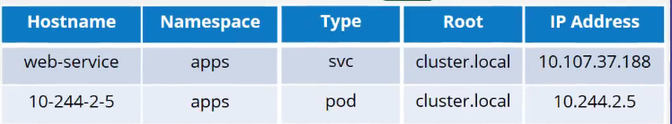

# 09 - Networking
## 09.1 - Prerequisite - Switching Routing
### 09.1.1 - Switching
Dos máquinas (A y B) pueden ser conectadas mediante un switch, a través de sus interfaces _eth0_

- Para ver las interfaces del host ejecutamos:
```sh
ip link
1: eth0: <BROADCAST,MULTICAST,UP,LOWER_UP> mtu 1500 qdisc mq state UP mode DORMANT group default qlen 1000
    link/ether 9c:b6:d0:9b:5f:f3 brd ff:ff:ff:ff:ff:ff
```

- La red que tenemos es la 192.168.1.0, y las máquinas tienen asignadas las IPs 192.168.1.10 (A) y 192.168.1.11 (B). Linkamos IP con interface eth0
```sh
# Node A
ip addr add 192.168.1.10/24 dev eth0
# Node B
ip addr add 192.168.1.11/24 dev eth0
```

Ahora podremos entrar paquetes entre las máquinas A y B.

### 09.1.2 - Routing
Queremos conectar dos redes con dos máquinas cada red, 192.168.1.0 y 192.168.2.0.
Un router permite comunicar estas dos redes. El enrutador posee una IP en cada red 192.168.1.1 y 192.168.2.1

Para que la red A pueda llegar a la red B, necesitamos añadir rutas de destino.
```sh
route

Kernel IP routing table
Destination     Gateway         GenmaskFlags Metric Ref    Use Iface

# Add new route
ip route add 192.168.2.0/24 via 192.168.1.1

# Show routes
route
Kernel IP routing table
Destination     Gateway         Genmask         Flags Metric Ref    Use Iface
192.168.2.0     192.168.1.1     255.255.255.0   UG    0      0        0 eth0
```

La siguiente cuestión, es comunicar el router con Internet, por ejemplo Google 172.217.194.0.
```
ip route add 172.217.194.0/24 via 192.168.2.1
```

Se le puede indicar que para las direcciones que no conozca, utilice una ruta por defecto
```
ip route add default via 192.168.2.1
```

Para las IPs no reconocidas lo mejor es añadir como destino 0.0.0.0/0


## 09.2 - Prerequisite - DNS

### 09.2.1 - Resolución en red local
Dadas dos máquinas A y B en la misma red, comprobamos que obtienen conexión por ping a través de sus IPs.
Para no recordar la IP podemos identificar el nodo mediante un nombre, por ejemplo __db__.

- No conoce ningún host llamado _db_
```
ping db
ping: db: Name or service not known
```

- Para decirle al sistema que nombre db corresponde con una IP, podemos añadir una entrada al fichero /etc/hosts
```sh
cat /etc/hosts

192.168.1.11    db
```

- Ahora nuestro sistema si reconoce el nombre del host
```sh
ping db

PING db(192.168.1.11) 56(84) bytes of data.
64 bytes from db(192.168.1.11): icmp_seq=1 ttl=64 time=0.052 ms
64 bytes from db(192.168.1.11): icmp_seq=2 ttl=64 time=0.079 m
```

- Nuestros se fia ciegamente de lo que indiquemos en nuestro fichero hosts, pero puede ser cierto o no. Podemos engañar al sistema indicando que la máquina A es Google.
```
cat /etc/hosts

192.168.1.11    db
192.168.1.11    www.google.com
```

- Ahora nuestro sistema si reconoce el nombre del host
```sh
ping www.google.com

PING www.google.com(192.168.1.11) 56(84) bytes of data.
64 bytes from www.google.com(192.168.1.11): icmp_seq=1 ttl=64 time=0.052 ms
64 bytes from www.google.com(192.168.1.11): icmp_seq=2 ttl=64 time=0.079 m
```

### 09.2.2 - Resolución con servidor DNS
Cuando un entorno crece y existen muchas máquinas, no es una buena forma, de mantener la conexión entre ellas.
Podemos utilizar una máquina demoninada DNS para que obtenga un listado de máquinas e IPs y desde nuestros hosts, podamos consultarle.

- En cada uno de los servidores se ubica un fichero que señala a un servidor de DNS.
```
cat /etc/resolv.conf

nameserver 192.168.1.100
```

Ya no es necesario que tengan los servidores entradas en el fichero /etc/hosts, pero esto no significa que no pueda tenerlas.
Mediante un archivo de configuración podemos indicar si queremos que resuelva primera con el fichero /etc/hosts o con el fichero /etc/resolv.conf.
Para ello la configuración se aplica en el fichero /etc/nsswitch.conf

Nuestros sistema desde este momento conoce las declaracionse en el fichero /etc/hosts y las declaraciones en el servidor de DNS. 
Pero si tratamos de llegar a una dirección que no conoce fallará.
Podemos agregar una nueva entrada a nuestro fichero /etc/resolv.conf, 8.8.8.8 DNS público alojado por Google que conoce todos los sitios webs de internet.
```
cat /etc/resolv.conf

nameserver 192.168.1.100
nameserver 8.8.8.8
```

> Una solución sería añadir una linea a nuestro servidor DNS para que todo lo desconocido lo reenvie a 8.8.8.8


### 09.2.3 - Domain Names
Se llama nombre de dominio a la traducción de una IP. La razón de que un dominio esté separado por puntos es para agrupar.

La última parte de un nombre de dominio .org, .com, .net, etc son los dominios de nivel superior, y representan la intención del sitio web.

El resto del nombre se entiende por subdominio. Por ejemplo: www.google.com, maps.google.com, drive.google.com.

### 09.2.4 - Search Domain
Cuando queremos acceder internamente a los servicios de una empresa, y queremos solamente utilizar el nombre de los servicios, podemos añadir a nuestro fichero:
```sh
cat /etc/resolv.conf

nameserver  192.168.1.100
search      mycompany.com   prod.mycompany.com
```

### 09.2.5 - Record Types
¿Como se almacenan los registros DNS?

| Types |                 |                                    | Description                                                            |
|-------|-----------------|------------------------------------|------------------------------------------------------------------------|
| A     | web-server      | 192.168.1.1                        | Vinculan un nombre con una IP                                          |
| AAAA  | web-server      | 2001:asdf:dfgh:9616:316651:fgh45   | Vinculan un nombre con una IPv6                                        |
| CNAME | foo.web-server  | eat.web-server, hungry.web-server  | Contiene un __alias__ o nombre alternativo para otro registro A o AAAA |

Otros registros:
| Types |                                                                       | Description                                                            |
|-------|-----------------------------------------------------------------------|------------------------------------------------------------------------|
| SOA   | ns1.dnsimple.com admin.dnsimple.com 2013022001 86400 7200 604800 300  | _Start of Authority_ Información sobre la zona que se organiza, importantes para la trasnferencia de zonas|
| MX    | ASPMX.L.GOOGLE.COM                                                    | __Mail Exchange__, intercambio que se produce mediante un servidor SMTP, es posible configurar varios con distintas prioridades para compensar fallos |
| PTR   | 34.216.184.93.in-addr.arpa. IN PTR example.org.                       | __Reverse lookup__, el servidor DNS puede indnicar quenombre de host pertenece a una IP  |
| NS    | ns1.subname.example.com                                               | Servidor de nombres de una zona, determina donde recae la responsabilidad de una zona concreta |
| TXT   | v=spf1 ip4:192.0.2.0/24 ip4:198.51.100.123 ip6:2620:0:860::/46 a -all | Contienen texto, como información para usuarios, también pueden añadirse detalles sobre la empresa |
| SRV   | _sip._tcp.example.com.                                                | Informa sobre los servicios disponibles del dominio |
| LOC   | LOC record statdns.net.   IN LOC   52 22 23.000 N 4 53 32.000 E -2.00m 0.00m 10000m 10m | Ubicación fisica del servidor |

### 09.2.6 - Tools for debug
* nslookup: consultar el nombre de host de un servidor DNS
```
nslookup www.google.es 
Server:		127.0.0.53
Address:	127.0.0.53#53

Non-authoritative answer:
Name:	www.google.es
Address: 74.125.193.94
Name:	www.google.es
Address: 2a00:1450:400b:c01::5e
```

* dig: comprueba la resolución de nombres.
```
dig www.google.es

; <<>> DiG 9.11.3-1ubuntu1.13-Ubuntu <<>> www.google.es
;; global options: +cmd
;; Got answer:
;; ->>HEADER<<- opcode: QUERY, status: NOERROR, id: 56212
;; flags: qr rd ra; QUERY: 1, ANSWER: 1, AUTHORITY: 0, ADDITIONAL: 1

;; OPT PSEUDOSECTION:
; EDNS: version: 0, flags:; udp: 65494
;; QUESTION SECTION:
;www.google.es.			IN	A

;; ANSWER SECTION:
www.google.es.		106	IN	A	74.125.193.94

;; Query time: 51 msec
;; SERVER: 127.0.0.53#53(127.0.0.53)
;; WHEN: Tue Nov 03 15:28:07 CET 2020
;; MSG SIZE  rcvd: 58
```

## 09.3 - Prerequisite - CoreDNS
In the previous lecture we saw why you need a DNS server and how it can help manage name resolution in large environments with many hostnames and Ips and how you can configure your hosts to point to a DNS server. In this article we will see how to configure a host as a DNS server.

We are given a server dedicated as the DNS server, and a set of Ips to configure as entries in the server. There are many DNS server solutions out there, in this lecture we will focus on a particular one – CoreDNS.

So how do you get core dns? CoreDNS binaries can be downloaded from their Github releases page or as a docker image. Let’s go the traditional route. Download the binary using curl or wget. And extract it. You get the coredns executable.

Run the executable to start a DNS server. It by default listens on port 53, which is the default port for a DNS server.

Now we haven’t specified the IP to hostname mappings. For that you need to provide some configurations. There are multiple ways to do that. We will look at one. First we put all of the entries into the DNS servers /etc/hosts file.

And then we configure CoreDNS to use that file. CoreDNS loads it’s configuration from a file named Corefile. Here is a simple configuration that instructs CoreDNS to fetch the IP to hostname mappings from the file /etc/hosts. When the DNS server is run, it now picks the Ips and names from the /etc/hosts file on the server.

CoreDNS also supports other ways of configuring DNS entries through plugins. We will look at the plugin that it uses for Kubernetes in a later section.

Read more about CoreDNS here:

https://github.com/kubernetes/dns/blob/master/docs/specification.md

https://coredns.io/plugins/kubernetes/


## 09.4 - Prerequisite - Network Namespaces
Los contenedores se separan del host mediante namespaces, lo cual permite que los procesos que corren dentro, no puedan acceder a los procesos de fuera, a menos que se indique lo contrario.
Sin embargo el host, si puede ver los procesos de todos los contendores que corren en el.
```
ps aux 
USER       PID %CPU %MEM    VSZ   RSS TTY      STAT START   TIME COMMAND
root         1  0.1  0.0 226388  9948 ?        Ss   08:00   0:46 /sbin/init splash
root         2  0.0  0.0      0     0 ?        S    08:00   0:00 [kthreadd]
root         4  0.0  0.0      0     0 ?        I<   08:00   0:00 [kworker/0:0H]
root         6  0.0  0.0      0     0 ?        I<   08:00   0:00 [mm_percpu_wq]
root         7  0.0  0.0      0     0 ?        S    08:00   0:00 [ksoftirqd/0]
root         8  0.1  0.0      0     0 ?        I    08:00   0:44 [rcu_sched]
root         9  0.0  0.0      0     0 ?        I    08:00   0:00 [rcu_bh]
root        10  0.0  0.0      0     0 ?        S    08:00   0:00 [migration/0]
```

## 09.5 - Prerequisite - Docker Networking
## 09.6 - Prerequisite - CNI
## 09.7 - Cluster Networking

## 09.8 - Pod Networking
Kubernetes espera que:
- Cada Pod obtenga su propia IP
- Cada Pod debería poder alcanzar cualquier otro Pod dentro del mismo nodo utilizando esa dirección IP, o de otro nodo.
- Cada Pod debería poder alcanzar cualquier otro Pod dentro de otro nodo sin usar NAT.

Existen muchas soluciones que permite esto:
- weave
- flannel
- cilium
- Network Namespaces
- CNI

Kubelet es el encargado de crear contenedores en los nodos. Cuando un contenedor se crea se invoca al CNI que actua como intermediario como argumentos, indicando:
```
--cni-conf-dir=/etc/cni/net.d
--cni-bin-dir=/etc/cni/bin
```

Los estandares de CNI indican como debe añadir y eliminar un contendor a nivel de red. Una visión del script podría ser la siguiente
```
ADD)
# Create veth pair
# Attach veth pair
# Assing IP Address
# Bring Up Interface
ip -n <namespace> link set ...

DEL)
# Delete veth pair
ip link del ...
```

La invocación del scrit podría ser algo así:
```
./net-script.sh add <container> <namespace>
```

## 09.9 - CNI in kubernetes
CNI define las responsabilidades del tiempo de ejcución del contenedor.
- Container Runtime must create network namespace
- Identify network the container must attach to
- Container Runtime to invoke Network Plugin (bridge) whtn container is ADDed
- Container Runtime to invoke Network Plugin (bridge) whtn container is DELeted.
- JSON format of the Network Configuration

El complemento CNI se configura en el servicio kubelet en cada nodo del cluster.
Si observamos el fichero de servicio de kubelet, podremos ver:
```
kubelet.service
...

--network-plugin=cni \\
--cni-bin-dir=/opt/cni/bin \\
--cni-conf-dir=/etc/cni/net.d \\

...
```

También es posible ver la configuración del proceso mediante:
```
ps -aux | grep kubelet


```

En el directorio cni/bin se ubican todos los complemtos CNI compatibles como ejecutables.
```sh
ls /opt/cni/bin

bridge dhcp flannel host-device host-local ipvlan loopback mcvlan ptp sample tunning vlan
```

En el directorio /etc/cni/net.d, se ubica la configuración a aplicar, si hubiera varios ficheros, se aplicaría en orden alfabetico.
Contiene configuraciones relacionadas con Bridge, enrutamiento y enmascaramiento NAT. También definie si la interfaz de red debe tener asignada una dirección IP, ...

```
ls /etc/cni/net.d

10-bridge.conf

# Show file
cat 10-bridge.conf

{
	"cniVersion": "0.2.0",
	"name": "mynet",
	"type": "bridge",
	"bridge": "cni0",
	"isGateway": true,
	"ipMasq": true,
	"ipam": {
		"type": "host-local",
		"subnet": "10.22.0.0/16",
		"routes": [
			{ "dst": "0.0.0.0/0" }
		]
	}
}
```

## 09.10 - CNI weave
La solución que inicialmente se exponía, utilizaba un enrutador para enviar el tráfico, esto funciona cuando la red es muy pequeña y simple. 
Para entornos granes con cientos de nodos, y cientos de PODs en cada nodo no es práctico, ya que es posible que la tabla de enrutamiento no adminta tantas entradas.

El complemento CNI Weave se implementa en cada nodo. Y se comunican entre si para intercambiar información sobre los nodos, la red y los PODs.
Cada agente conoce los PODs y sus IPs de los otros nodos.

Weave crea su propio puente sobre los nodos y lo nombra como Weave. Luego, asigna la dirección IP a cada red.
Un pod puede estar en varias redes, como por ejemplo en la red de Weave o en la red de docker, la ruta que toma un paquete para llegar al destino, depende de la ruta configurada en el contendor.

Weave se asegura de que todos los PODs obtengan la ruta correcta configurada para llegar al agente, cuando se envia un paquete de un pod a otro nodo, Weave intercepta el paquete e identifica que está en una red separada. Luego, encapsula el paquete en uno nuevo con nuevo origen y destino, y lo envia a traves de la red.

### 09.10.1 - Deploy Weave
Se puede implementar como servicios o daemon en cada nodo del cluster de forma manual. O si kubernetes ya está configurado se puede implementar como __daemonset__.

```
kubectlapply -f "https://cloud.weave.works/k8s/net?k8s-version=$(kubectl version | base64 | tr -d '\n')"
serviceaccount/weave-net created
clusterrole.rbac.authorization.k8s.io/weave-net created
clusterrolebinding.rbac.authorization.k8s.io/weave-net created
role.rbac.authorization.k8s.io/weave-net created
rolebinding.rbac.authorization.k8s.io/weave-net created
daemonset.extensions/weave-net created
```

### 09.10.2 - Weave peers
Si implementó su cluster con kubeadm, puede verlo en cada nodo:
```bash
kubectlget pods –n kube-system

NAME                             READY     STATUS    RESTARTS   AGE       IP            NODE      NOMINATED NODE
coredns-78fcdf6894-99khw         1/1       Running   0          19m       10.44.0.2     master    <none>
coredns-78fcdf6894-p7dpj         1/1       Running   0          19m       10.44.0.1     master    <none>
etcd-master                      1/1       Running   0          18m       172.17.0.11   master    <none>
kube-apiserver-master            1/1       Running   0          18m       172.17.0.11   master    <none>
kube-scheduler-master            1/1       Running   0          17m       172.17.0.11   master    <none>
weave-net-5gcmb                  2/2       Running   1          19m       172.17.0.30   node02    <none>
weave-net-fr9n9                  2/2       Running   1          19m       172.17.0.11   master    <none>
weave-net-mc6s2                  2/2       Running   1          19m       172.17.0.23   node01    <none>
weave-net-tbzvz                  2/2       Running   1          19m       172.17.0.52   node03    <none>
```

```
kubectllogs weave-net-5gcmb weave –n kube-system

INFO: 2019/03/03 03:41:08.643858 Command line options: map[status-addr:0.0.0.0:6782 http-addr:127.0.0.1:6784 ipalloc-range:10.32.0.0/12 name:9e:96:c8:09:bf:c4 nickname:node02 conn-limit:30 datapath:datapathdb-prefix:/weavedb/weave-net host-root:/host port:6783 docker-api: expect-npc:trueipalloc-init:consensus=4 no-dns:true]
INFO: 2019/03/03 03:41:08.643980 weave  2.2.1
INFO: 2019/03/03 03:41:08.751508 Bridge type is bridged_fastdp
INFO: 2019/03/03 03:41:08.751526 Communication between peers is unencrypted.
INFO: 2019/03/03 03:41:08.753583 Our name is 9e:96:c8:09:bf:c4(node02)
INFO: 2019/03/03 03:41:08.753615 Launch detected -using supplied peer list: [172.17.0.11 172.17.0.23 172.17.0.30 172.17.0.52]
INFO: 2019/03/03 03:41:08.753632 Checking for pre-existing addresses on weave bridge
INFO: 2019/03/03 03:41:08.756183 [allocator 9e:96:c8:09:bf:c4] No valid persisted data
INFO: 2019/03/03 03:41:08.761033 [allocator 9e:96:c8:09:bf:c4] Initialisingvia deferred consensus
INFO: 2019/03/03 03:41:08.761091 Sniffing traffic on datapath(via ODP)
INFO: 2019/03/03 03:41:08.761659 ->[172.17.0.23:6783] attempting connection
INFO: 2019/03/03 03:41:08.817477 overlay_switch->[8a:31:f6:b1:38:3f(node03)] using fastdp
INFO: 2019/03/03 03:41:08.819493 sleeve ->[172.17.0.52:6783|8a:31:f6:b1:38:3f(node03)]: Effective MTU verified at 1438
INFO: 2019/03/03 03:41:09.107287 Weave version 2.5.1 is available; please update at https://github.com/weaveworks/weave/releases/download/v2.5.1/weave
INFO: 2019/03/03 03:41:09.284907 Discovered remote MAC 8a:dd:b5:14:8f:a3 at 8a:dd:b5:14:8f:a3(node01)
INFO: 2019/03/03 03:41:09.331952 Discovered remote MAC 8a:31:f6:b1:38:3f at 8a:31:f6:b1:38:3f(node03)
INFO: 2019/03/03 03:41:09.355976 Discovered remote MAC 8a:a5:9c:d2:86:1f at 8a:31:f6:b1:38:3f(node0
```

## 09.11 - IP Address Management - Weave
Esta sección cubre la herramienta que elimina redes y los nodos a asignados a una subred.

CNI dice que el responsabilidad del proveedor se soluciones de red ocuparse de asignar IPs a los contendores.

En el fichero de configuración de CNI, tiene una sección llamada __"ipam"__ donde se indica el tipo de complemento y la ruta que utilizará.

```json
cat  /etc/cni/net.d/10-bridge.conf
{
	"cniVersion": "0.2.0",
	"name": "mynet",
	"type": "bridge",
	"bridge": "cni0",
	"isGateway": true,
	"ipMasq": true,
	"ipam": {
		"type": "host-local",
		"subnet": "10.22.0.0/16",
		"routes": [
			{ "dst": "0.0.0.0/0" }
		]
	}
}
```


## 09.12 - Service Networking
Recapitulando anteriores temas, rara vez configuraremos dos pods para comunicarse directamente entre si.
Si necesitamos que un pod acceda a servicios de otro pod, siempre utilizará un objecto SERVICE. El objecto Service se crea "delante" de un POD, y obtiene una dirección IP y un nombre, otros PODs, accederán mediante la IP o el nombre del Service.

### 09.12.1 - Cluster IP
Cuando se crea un service es accesible desde todo el cluster, independientemente del nodo en el que se encuentren.

### 09.12.2 - NodePort
Cuando necesitemos que un servicio se accesible desde fuera del cluster, utilizamos Service de tipo NodePort.
También se le asigna una dirección IP y un nombre y es accesible desde el cluster, pero además expone la aplicación en un puerto en todos los nodos.

### 09.12.3 - Networking
El servicio kubelet es el encargado de crear los PODs, y observa los cambios del cluster a través del API Server.
Cada vez que se crea un POD se invoca al complemento CNI para configurar la red para ese POD.

Del mismo modo, cada nodo ejecuta otro componente kube-proxy. Kube-proxy observa los cambios en el cluster a través del API Server, y cada vez que se crea  un nuevo servicio, kube-proxy entra en acción.

Cuando se crea un service, se le asigna una IP de un rango predefinido. Los componentes de kube-proxy que se ejecutan en cada nodo, obtienen esa IP y crean las reglas de reenvio a cada nodo del cluster, indicando que cada tráfico que llegue a la IP del Service debe ir a la IP del POD.

Kube-proxy, adminte diferentes formas de crear reglas:
- Como el userspace donde kube-proxy escucha en un puerto para cada servicio y conecta las conexiones de proxy a los pods.
- Reglas ipvs, tablas IPs.
- Iptables

El valor predeterminado es __iptables__. Podría verse el valor establecido visualizando los logs de los PODs de kube-proxy.
Puedes ver las reglas ejecutando:

```bash
iptables -L -t net | grep <service-name>

KUBE-SVC-XA5OGUC7YRHOS3PU	tcp	--	anywhere 	10.103.132.104	/*	default/db-service:		cluster IP 	*/ 	tcp   dpt:3306
DNAT						tcp --	anywhere 	anywhere		/*	default/db-service:		*/ 	tcp 	to:10.244.1.2:3306
KUBE-SEP-JBWCWHHQM57V2WN7	tcp -- 	anywhere	anywhere		/*	default/db-service:		*/
```

También es posible ver, como kube-proxy crea estas reglas de entrada:
```bash
cat /var/log/kube-proxy.log

I0307 04:29:29.883941	1	server_others.go:140] Using iptables Proxier.
I0307 04:29:29.912037	1	server_others.go:174] Tearing down inactive rules.
I0307 04:29:30.027360	1	server.go:448] Version: v1.11.8
I0307 04:29:30.049773	1	conntrack.go:98] Set sysctl 'net/netfilter/nf_conntrack_max' to 131072
I0307 04:29:30.049945	1	conntrack.go:52] Setting nf_conntrack_max to 131072
I0307 04:29:30.050701	1	conntrack.go:83] Setting conntrack hashsize to 32768
I0307 04:29:30.050701	1	proxier.go:294] Adding new service “default/db-service:3306" at 10.103.132.104:3306/TCP
```


# 09.13 - DNS in kubernetes
Kubernetes integra un servicio de DNS predeterminado. Cada vez que se crea un objecto Service, se crea un registro con nombre y IP del servicio.
Por ello cualquier pod, puede llegar al servicio utilizando su nombre.

Para cada namespace, el servicio de DNS crea un subdominio. Todos los servicio se agrupan en otro subdominio __SVC__.

```bash
curl http://web-service.apps
Welcome to NGINX!

curl http://web-service.apps.svc
Welcome to NGINX!

curl http://web-service.apps.svc.cluster.local
Welcome to NGINX!
```

Con los PODs, ocurre lo mismo, sin embargo kubernetes sustituye los puntos de la IP por guiones.



# 09.14 - CoreDNS in kubernetes
En las versionse previas a v1.12, kubernetes implementaba un servicio llamado kube-dns, desde esa versión hacia delante, el sevicio es llamado CoreDNS.

El servidor CoreDNS se implementan como POD en el namespace kube-system.

Utiliza un fichero de configuración `/etc/coredns/Corefile`, obtenido a través de un ConfigMap, y su contenido es el siguiente:
```yaml
apiVersion: v1
kind: ConfigMap
metadata:
  name: coredns
  namespace: kube-system
data:
  Corefile: |
    .:53 {
        errors
        health {
            lameduck 5s
        }
        ready
        kubernetes cluster.local in-addr.arpa ip6.arpa {
            pods insecure
            fallthrough in-addr.arpa ip6.arpa
            ttl 30
        }
        prometheus :9153
        forward . /etc/resolv.conf
        cache 30
        loop
        reload
        loadbalance
    }
```

Cuando se crea un POD, se registra una nueva entrada, sustituyendo los puntos por guiones, para su resolución
```bash
10-244-1-5	10.224.1.5
10-244-2-5	10.224.2.5
```

CoreDNS también despliega un SERVICE, y permite que los PODs apunten a este SERVICE en su configuración, el encargado de crear esta configuración en los PODs es __kubelet__:
```bash
cat /etc/resolv.conf

nameserver	10.96.0.10
```

Si observamos el archivo de configuración de kubelet, podremos ver la IP del servidor DNS y el dominio:
```bash
cat /var/lib/kubelet/config

...
clusterDNS:
- 10.96.0.10
clusterDomain: cluster.local
```


Desde un POD puedes obtener el FQDN de un SERVICE:
```bash
host web-service
web-service.default.svc.cluster.local has address 10.97.206.196
```

Porque en el fichero /etc/resolv.conf se indica el nombre del cluster:
```bash
cat /etc/resolv.conf

nameserver 	10.96.0.10
search		default.svc.cluster.local	  svc.cluster	 cluster.local
```

Pero esto solo ocurre con los SERVICE, para un pod, debe indicar el FQDN:
```bash
host 10-224-2-5
Host 10-224-2-5 not found: 3(NXDOMAIN)

# FQDN
host 10-224-2-5.default.pod.cluster.local
10-224-2-5.default.pod.cluster.local has address 10.224.2.5
```


# 09.15 - Ingress
Los Ingress ayudan a los usuarios a llegar a su aplicación, usando una única URL accesible externamente, que puede configurar para enrutar a diferente servicios dentro de su cluster. La ruta URL al mismo tiempo, implementa seguridad SSL, un Ingress es como un Loadl Balancer capa 7.

Aún utilizando Ingress necesita exponerlo para que sea accesible desde fuera del cluster.

Kubernetes despliega una solución compatible, como pueden ser Nginx, HAProxy o Traefik, luego configura un conjunto de reglas para configurar el Ingress. Estas soluciones se llaman __Ingress Controller__, y el conjunto de reglas __Ingress Resources__ (Objeto que desplegamos con nuestras aplicaciones).

Por defecto, nuestro cluster no viene con ningún _Ingress Controller_.

## Ingress Controller
Existen varias soluciones disponibles:
- GCP HTTP(S) Load Balancer	 (apoyado y mantenido por el proyecto Kubernetes)
- Nginx (apoyado y mantenido por el proyecto Kubernetes)
- Contour
- HAProxy
- Traefik
- Istio

Ejemplo de definición de Ingress Controller, para una versión de Nginx creada específicamnte como Ingress Controller para kubernetes.
- Necesitaremos un ConfigMap con la configuración el Ingres (puede estar vacío), en el que se configura el path para los logs, configuración SSL, etc;

```yaml
apiVersion: v1
kind: ConfigMap
metadata:
  name: ingress-nginx-controller
data:
  proxy-connect-timeout: "10"
  proxy-read-timeout: "120"
  proxy-send-timeout: "120"
```

- Objeto Deployment para el Ingress Controller:
```yaml
apiVersion: extensions/v1beta1
kind: Deployment
metadata:
  name: nginx-ingress-controller
  labels:
    app.kubernetes.io/name: ingress-nginx
spec:
  replicas: 1
  selector:
    matchLabels:
      app.kubernetes.io/name: ingress-nginx
  template:
    metadata:
      labels:
        app.kubernetes.io/name: ingress-nginx
    spec:
      containers:
	  - name: nginx-ingress-controller
	    image: quay.io/kubernetes-ingress-controller/nginx-ingress-controller:0.33.0
    
        args:
		- /nginx-ingress-controller
		- --configmap=$(POD_NAMESPACE)/nginx-configuration

		env:
          - name: POD_NAME
            valueFrom:
              fieldRef:
                fieldPath: metadata.name
          - name: POD_NAMESPACE
            valueFrom:
              fieldRef:
				fieldPath: metadata.namespace
		
		ports:
        - containerPort: 80
          hostPort: 80
        - containerPort: 443
          hostPort: 443
```

- Necesitaremos un SERVICE para exponer el Ingress Controller:
```yaml
apiVersion: v1
kind: Service
metadata:
  name: nginx-ingrress
spec:
  type: NodePort
  selector:
	name: nginx-ingress
  ports:
	- name: http
	  port: 80
	  targetPort: 80
	  protocol: TCP
	- name: https
	  port: 443
	  targetPort: 443
	  protocol: TCP
```

El Ingress Controller tiene inteligencia adicional para monitorear el cluster en busca de Ingress Resources y configurar el servidor Nginx.
Para que el Ingress Controller pueda hacer todo esto, necesita una _Service Account_, con un conjunto de permisos.
```yaml
apiVersion: v1
kind: ServiceAccount
metadata:
  name: nginx-ingress-serviceaccount

---

apiVersion: rbac.authorization.k8s.io/v1
kind: ClusterRole
metadata:
  name: nginx-ingress-clusterrole
rules:
  - apiGroups:
      - ""
    resources:
      - configmaps
      - endpoints
      - nodes
      - pods
      - secrets
    verbs:
      - list
      - watch
  - apiGroups:
      - ""
    resources:
      - nodes
    verbs:
      - get
  - apiGroups:
      - ""
    resources:
      - services
    verbs:
      - get
      - list
      - update
      - watch
  - apiGroups:
      - extensions
      - "networking.k8s.io" # k8s 1.14+
    resources:
      - ingresses
    verbs:
      - get
      - list
      - watch
  - apiGroups:
      - ""
    resources:
      - events
    verbs:
      - create
      - patch
  - apiGroups:
      - extensions
      - "networking.k8s.io" # k8s 1.14+
    resources:
      - ingresses/status
    verbs:
      - update
  - apiGroups:
      - "networking.k8s.io" # k8s 1.14+
    resources:
      - ingressclasses
    verbs:
      - get
      - list
	  - watch
	  
---

apiVersion: rbac.authorization.k8s.io/v1
kind: ClusterRoleBinding
metadata:
  name: nginx-controller-clusterrolebinding
roleRef:
  apiGroup: rbac.authorization.k8s.io
  kind: ClusterRole
  name: nginx-ingress-clusterrole
subjects:
  - kind: ServiceAccount
    name: nginx-ingress-serviceaccount
```

## 09.15.1 - Ingress Resource
Un _Ingress Resource_ es un conjunto de reglas y configuraciones aplicadas en el _Ingress Controller_.

Puede configurar reglas simplemente para reenviar todo el tráfico entrante a una sola aplicación o enrutar el tráfico a difrentes apilicaciones basado en URLs.

Se crea mediante un archivo de definición de kubernetes:
```yaml
apiVersion: extensions/v1beta1
kind: Ingress
metadata:
  name: ingress-wear
spec:
  backend:
      serviceName: wear-service
      servicePort: 80
```

- Ingress para diferentes paths
```yaml
apiVersion: extensions/v1beta1
kind: Ingress
metadata:
  name: ingress-wear-watch
spec:
  rules:
    - http:
        paths:
          - path: /wear
            backend:
			  serviceName: wear-service
			  servicePort: 80
		  - path: /watch
            backend:
			  serviceName: watch-service
			  servicePort: 80
```

- Otro tipo de configuración, partiendo de dos dominios:
```yaml
apiVersion: extensions/v1beta1
kind: Ingress
metadata:
  name: ingress-wear-watch
spec:
  rules:
	- host: wear.my-online-store.com
	  http:
        paths:
          - backend:
			  serviceName: wear-service
			  servicePort: 80
	- host: watch.my-online-store.com
	  http:
        paths:
          - backend:
			  serviceName: watch-service
			  servicePort: 80
```


## 09.15.2 - Ingress Annotations and rewrite-target
Los diferentes Ingress Controller tienen difrentes opciones que pueden ser utilizadas para personalizar su comportamiento. 
- Rewrite Target

Una web muestra su contenido en: `http://<watch-service>:<port>/`

Y la otra muestra su contenido en `http://<wear-service>:<port>/`

Para lograr lo anterior, necesitamos configurar el Ingress Controller para que podamos reenviar el tráfico al backendo correcto. Las aplicaciones no poseen ese path:

```sh
http://<ingress-service>:<ingress-port>/watch --> http://<watch-service>:<port>/

http://<ingress-service>:<ingress-port>/wear --> http://<wear-service>:<port>/

Without the rewrite-target option, this is what would happen:
```

Sin la opción rewrite-target, lo que pasaría sería lo siguiente:
```sh
http://<ingress-service>:<ingress-port>/watch --> http://<watch-service>:<port>/watch

http://<ingress-service>:<ingress-port>/wear --> http://<wear-service>:<port>/wear
```

Ejemplo de rewrite-target:

```yaml
    apiVersion: extensions/v1beta1
    kind: Ingress
    metadata:
      name: test-ingress
      namespace: critical-space
      annotations:
        nginx.ingress.kubernetes.io/rewrite-target: /
    spec:
      rules:
      - http:
          paths:
          - path: /pay
            backend:
              serviceName: pay-service
			  servicePort: 8282
```

In another example given here, this could also be:
`replace("/something(/|$)(.*)", "/$2")`
```yaml
    apiVersion: extensions/v1beta1
    kind: Ingress
    metadata:
      annotations:
        nginx.ingress.kubernetes.io/rewrite-target: /$2
      name: rewrite
      namespace: default
    spec:
      rules:
      - host: rewrite.bar.com
        http:
          paths:
          - backend:
              serviceName: http-svc
              servicePort: 80
            path: /something(/|$)(.*)
```