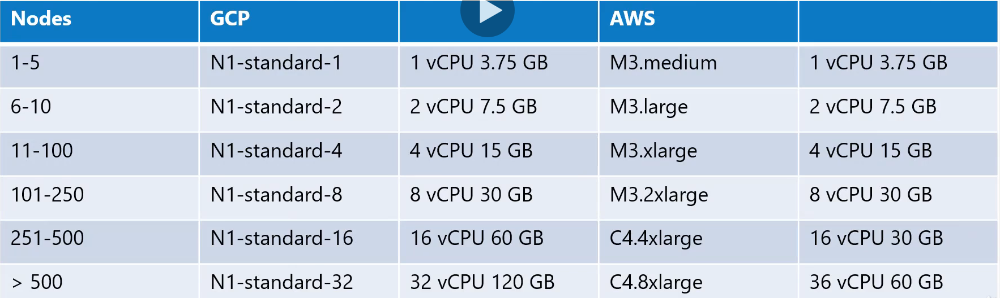
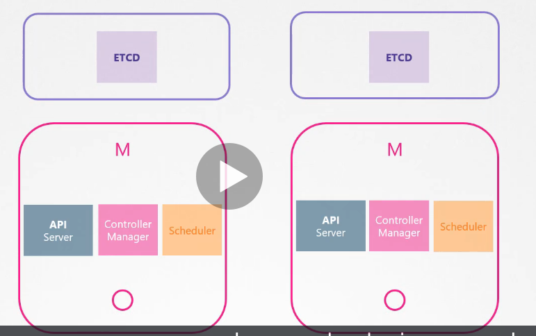

# 10 - Desing a Kubernetes Cluster
Algunas preguntas que debe realizar para poder diseñar un cluster.
- ¿Propósito?
  - Aprendizaje
  - Desarrollo y testeo
  - Producción
- Cloud o OnPrem?
- ¿Que cargas va a soportar el cluster?
  - ¿Cuantas aplicaciones se alojarán?
  - Tipo de aplicaciones
    - Aplicaciones web
    - Big Data / Analítica
  - Requisitos
    - CPU
    - Memoria
  - Tráfico
    - Continuo
    - Pesado

## 10.1 - Propósito
* Soluciones para fines educativos:
  * Minikube
  * Mono-nodo con kubeadm/GCP/AWS
  
* Soluciones para fines de desarrollo y testeo:
  * Multi-nodo con un Master y multiples workers
  * Setup usando kubeadm tool o provisión mediante GKE(Google Cloud), EKS(AWS) o AKS(Azure)

* Soluciones para fines productivos:
  * HA Multi-nodo con múltiples masters
  * kubeamd, GCP, Kops con AWS o plataformas soportadas
  * Hasta 5000 nodos
  * Hasta 150K PODs en el cluster
  * Hasta 300K contenedores
  * Hasta 100 PODs por nodo.



## 10.2 - Cloud o OnPrem
Para cloud hay multitud de herramientas para implementar un cluster. Pero para clusters _OnPrem_, _kubeadm_ es una herramienta muy util.

### 10.2.1 - Storage
Dependiendo de las cargas de trabajo configuradas, sus configuraciones de nodo y disco serán diferentes.
- High Perfomance - SSD Backed storage
- Multiple Concurrent connections - Network based storage
- Persistent shared volumes for shared access across multiple PODs
- Label nodes with specific disk types
- Use Node Selector to assing applications to nodes with specific disk types

### 10.2.2 - Nodes
- Virtual o physical Machines
- Minimum of 4 Node Cluster (size based on workload)
- Master vs Worker Nodes
- Linux X86_64 Architecture
  
### 10.2.3 - Master Nodes
En clusters pequeños es posible que almacene todos los componentes del plano de control en los masters, sin embargo en cluster grandes, es conveniente separar ETCD del nodo maestro




# 10.3 - Configure HA
Si tuvieramos dos masters, cada API Server tendría una dirección distinta:
```sh
https://master1:6443

https://master2:6443
```

Desde el fichero kubeconfig, apuntabamos a un master, cuando existe más de uno utilizamos un Balanceador de carga por delante y este equilibra la carga.

Con respecto al __Scheduler__ o al __Controller Manager__, no se ejecutan en todos los Master Nodes activamente. Cuando se programa algún objecto, uno de ellos se vuelve pasivo, y se bloquea hasta para no aceptar la misma solicitud.
Para configurar el estado de estos servicios
```sh
kube-controller-manager --leader-elect true                 # Posibilidad de ser lider
                        --leader-elect-lease-duration 15s   # Si otro master, se vuelve en lider, se bloquea durante 15s
                        --leader-elect-renew-deadline 10s   # El proceso se renueva cada 10s
                        --leader-elect-retry-period 2s      # Tratan de convertirse en lider cada 2s
                        [other options]
```

Sobre ETCD, es interesante desacoplarlo de los masters, permitiendo así tener un menor riesgo a peder redudancia de datos si un nodo cae.


# 10.4 - ETCD en HA
ETCD es un sistema distribuido clave-valor, simple seguro y rápido.

* Distribuido
Es posible tener sus datos almacenamos en varias replicas en ETCD, todos mantienen una copia idéntica.
* Consistencia
ETCD asegura tener una copia consistenten en cada servidor. Puede leer de todas las instancias pero ETCD no procesa las escrituras en cada nodo, solo una de las intancias es responsable del procesamiento de las escrituras, de todos los nodos disponibles, uno es el lider, y el resto se convierten en seguidores. El lider asegura que todos los nodos posean los mismos datos.internamente se reenvian las operacionse de escritura al lider.

Para la elección del lider se implementa consenso distribuido utilizando el protocolo RAFT.

RAFT utiliza temporizadoresa aleatorios para iniciar solicitudes en cada nodo, el primero en terminar envia una solicitud al resto pidiendo ser el lider, el resto responden la solicitud, y el nodo principal asume su rol de Lider. En caso de caer uno de los nodos, los restantes vuelven a evaluar quien será lider.

En el caso de que un nodo caiga, cuando el nodo Lider, evalue si las copias enviadas al resto de nodos han sido enviadas correctamente, se evalua un número _MAJORITY_ (quorum), mínimo de nodos disponibles para que el cluster pueda funcionar. Por ello se recomienda tener al menos 3 nodos, o números impares para evitar posibles problemas con la segmentación de redes:
```sh
Quorum = N/2 + 1

# Examples
Quorum of 2 = 2/2 +1 = 2

Quorum of 3 = 3/2 +1 = 2.5 ~= 2
Quorum of 5 = 5/3 +1 = 3.5 ~= 3
```