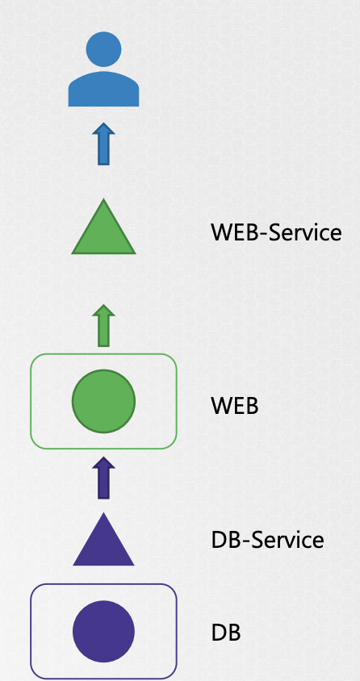

# Troubleshooting
## Fallos de aplicación
Partiendo de una aplicación web con dos componentes: Servidor Web y BBDD. Debemos comprender todos los componentes/objetos que existen en todo el flujo.



1. Compruebe que su aplicación es accesible, por ejemplo con un curl.

```bash
curl http://web-service-ip:node-port
curl: (7) Failed to connect to web-service-ip port node-port: Connection timed out
```

2. Compruebe el servicio (Service aka SVC), fijese si contiene Endpoints asociados y los selectores del servicio y del pod.
```bash

kubectl describe service web-service

Name: web-service
Namespace: default
Labels: <none>
Annotations: <none>
Selector: name=webapp-mysql
Type: NodePort
IP: 10.96.0.156
Port: <unset> 8080/TCP
TargetPort: 8080/TCP
NodePort: <unset> 31672/TCP
Endpoints: 10.32.0.6:8080
Session Affinity: None
External Traffic Policy: Cluster
Events: <none>
```

```yaml
apiVersion: v1
kind: Pod
metadata:
name: webapp-mysql
labels:
app: example-app
name: webapp-mysql
spec:
containers:
- name: webapp-mysql
image: simple-webapp-mysql
ports:
- containerPort: 8080
```

3. Compruebe el estado del Pod, fijese en el número de reinicios, realice un describe al pod, y compruebe los logs

```bash
kubectl get pod
NAME     READY   STATUS   RESTARTS   AGE
Web      1/1     Running  5          50m
```

```bash
kubectl describe pod web
Events:
Type    Reason     Age   From               Message
----    ------     ----  ----               -------
Normal  Scheduled  52m   default-scheduler  Successfully assigned webapp-mysql to worker-1
Normal  Pulling    52m   kubelet, worker-1  pulling image "simple-webapp-mysql"
Normal  Pulled     52m   kubelet, worker-1  Successfully pulled image "simple-webapp-mysql"
Normal  Created    52m   kubelet, worker-1  Created container
Normal  Started    52m   kubelet, worker-1  Started container
```

```bash
kubectl logs web -f(same tail -f) --previous (show previous pod)
...
10.32.0.1 - - [01/Apr/2019 12:51:55] "GET / HTTP/1.1" 200 -
10.32.0.1 - - [01/Apr/2019 12:51:55] "GET /static/img/success.jpg HTTP/1.1" 200 -
10.32.0.1 - - [01/Apr/2019 12:51:55] "GET /favicon.ico HTTP/1.1" 404 -
10.32.0.1 - - [01/Apr/2019 12:51:57] "GET / HTTP/1.1" 200 -
10.32.0.1 - - [01/Apr/2019 12:51:57] "GET / HTTP/1.1" 200 -
10.32.0.1 - - [01/Apr/2019 12:51:58] "GET / HTTP/1.1" 200 -
10.32.0.1 - - [01/Apr/2019 12:51:58] "GET / HTTP/1.1" 200 –
10.32.0.1 - - [01/Apr/2019 12:51:55] "GET / HTTP/1.1" 200 -
10.32.0.1 - - [01/Apr/2019 12:51:55] "GET /static/img/success.jpg HTTP/1.1" 200 -
10.32.0.1 - - [01/Apr/2019 12:51:55] "GET /favicon.ico HTTP/1.1" 404 -
10.32.0.1 - - [01/Apr/2019 12:51:57] "GET / HTTP/1.1" 200 -
10.32.0.1 - - [01/Apr/2019 12:51:57] "GET / HTTP/1.1" 200 -
10.32.0.1 - - [01/Apr/2019 12:51:58] "GET / HTTP/1.1" 200 -
10.32.0.1 - - [01/Apr/2019 12:51:58] "GET / HTTP/1.1" 200 –
10.32.0.1 - - [01/Apr/2019 12:51:58] "GET / HTTP/1.1" 400 – Some Database Error application exiting!
```

4. Continuando con el análisis, compruebe el servicio de la BBDD y el Pod que contiene la BBDD.
5. Puede consultar la página de Kubernetes (https://kubernetes.io/docs/tasks/debug-application-cluster/debug-application/), aparcen algunos ejemplos más sobre troubleshooting de aplicaciones.

## Fallos en Control Plane (Plano de control)
En este punto veremos comprobar fallos en los componentes del Plano de Control (Control Plane).

1. Comprobaremos el estado de los nodos

```sh
kubectl get nodes

NAME     STATUS ROLES   AGE VERSION
worker-1 Ready  <none>  8d  v1.13.0
worker-2 Ready  <none>  8d  v1.13.0
```

2. Comprobaremos el estado de los pods del Cluster

```sh
kubectl get pods

NAME         READY STATUS  RESTARTS AGE
mysql        1/1   Running 0        113m
webapp-mysql 1/1   Running 0        113m
```

```sh
kubectl get pods -n kube-system

NAME                           READY STATUS  RESTARTS AGE
coredns-78fcdf6894-5dntv       1/1   Running 0        1h
coredns-78fcdf6894-knpzl       1/1   Running 0        1h
etcd-master                    1/1   Running 0        1h
kube-apiserver-master          1/1   Running 0        1h
kube-controller-manager-master 1/1   Running 0        1h
kube-proxy-fvbpj               1/1   Running 0        1h
kube-proxy-v5r2t               1/1   Running 0        1h
kube-scheduler-master          1/1   Running 0        1h
weave-net-7kd52                2/2   Running 1        1h
weave-net-jtl5m                2/2   Running 1        1h
```

3. Si tiene los componentes del Plano de Control como servicio, compruebe su estado

```sh
service kube-apiserver status

● kube-apiserver.service - Kubernetes API Server
Loaded: loaded (/etc/systemd/system/kube-apiserver.service; enabled; vendor preset: enabled)
Active: active (running) since Wed 2019-03-20 07:57:25 UTC; 1 weeks 1 days ago
Docs: https://github.com/kubernetes/kubernetes
Main PID: 15767 (kube-apiserver)
Tasks: 13 (limit: 2362)
```

```sh
service kube-controller-manager status

● kube-controller-manager.service - Kubernetes Controller Manager
Loaded: loaded (/etc/systemd/system/kube-controller-manager.service; enabled; vendor preset: enabled)
Active: active (running) since Wed 2019-03-20 07:57:25 UTC; 1 weeks 1 days ago
Docs: https://github.com/kubernetes/kubernetes
Main PID: 15771 (kube-controller)
Tasks: 10 (limit: 2362)
```

```sh
service kube-scheduler status

● kube-scheduler.service - Kubernetes Scheduler
Loaded: loaded (/etc/systemd/system/kube-scheduler.service; enabled; vendor preset: enabled)
Active: active (running) since Fri 2019-03-29 01:45:32 UTC; 11min ago
Docs: https://github.com/kubernetes/kubernetes
Main PID: 28390 (kube-scheduler)
Tasks: 10 (limit: 2362)
```

```sh
service kubelet status

● kubelet.service - Kubernetes Kubelet
Loaded: loaded (/etc/systemd/system/kubelet.service; enabled; vendor preset: enabled)
Active: active (running) since Wed 2019-03-20 14:22:06 UTC; 1 weeks 1 days ago
Docs: https://github.com/kubernetes/kubernetes
Main PID: 1281 (kubelet)
Tasks: 24 (limit: 1152)
```

```sh
service kube-proxy status

● kube-proxy.service - Kubernetes Kube Proxy
Loaded: loaded (/etc/systemd/system/kube-proxy.service; enabled; vendor preset: enabled)
Active: active (running) since Wed 2019-03-20 14:21:54 UTC; 1 weeks 1 days ago
Docs: https://github.com/kubernetes/kubernetes
Main PID: 794 (kube-proxy)
Tasks: 7 (limit: 1152)
```

4. Comprueba los logs de los distintos pods del Plano de control.

```sh
kubectl logs kube-apiserver-master -n kube-system

I0401 13:45:38.190735 1 server.go:703] external host was not specified, using 172.17.0.117
I0401 13:45:38.194290 1 server.go:145] Version: v1.11.3
I0401 13:45:38.819705 1 plugins.go:158] Loaded 8 mutating admission controller(s) successfully in the following order:
NamespaceLifecycle,LimitRanger,ServiceAccount,NodeRestriction,Priority,DefaultTolerationSeconds,DefaultStorageClass,MutatingAdmissionWebhook.
I0401 13:45:38.819741 1 plugins.go:161] Loaded 6 validating admission controller(s) successfully in the following order:
LimitRanger,ServiceAccount,Priority,PersistentVolumeClaimResize,ValidatingAdmissionWebhook,ResourceQuota.
I0401 13:45:38.821372 1 plugins.go:158] Loaded 8 mutating admission controller(s) successfully in the following order:
NamespaceLifecycle,LimitRanger,ServiceAccount,NodeRestriction,Priority,DefaultTolerationSeconds,DefaultStorageClass,MutatingAdmissionWebhook.
I0401 13:45:38.821410 1 plugins.go:161] Loaded 6 validating admission controller(s) successfully in the following order:
LimitRanger,ServiceAccount,Priority,PersistentVolumeClaimResize,ValidatingAdmissionWebhook,ResourceQuota.
I0401 13:45:38.985453 1 master.go:234] Using reconciler: lease
W0401 13:45:40.900380 1 genericapiserver.go:319] Skipping API batch/v2alpha1 because it has no resources.
W0401 13:45:41.370677 1 genericapiserver.go:319] Skipping API rbac.authorization.k8s.io/v1alpha1 because it has no resources.
W0401 13:45:41.381736 1 genericapiserver.go:319] Skipping API scheduling.k8s.io/v1alpha1 because it has no resources.
```

```sh
sudo journalctl -u kube-apiserver

Mar 20 07:57:25 master-1 systemd[1]: Started Kubernetes API Server.
Mar 20 07:57:25 master-1 kube-apiserver[15767]: I0320 07:57:25.553377 15767 flags.go:33] FLAG: --address="127.0.0.1"
Mar 20 07:57:25 master-1 kube-apiserver[15767]: I0320 07:57:25.558273 15767 flags.go:33] FLAG: --admission-control="[]"
Mar 20 07:57:25 master-1 kube-apiserver[15767]: I0320 07:57:25.558325 15767 flags.go:33] FLAG: --admission-control-config-file=""
Mar 20 07:57:25 master-1 kube-apiserver[15767]: I0320 07:57:25.558339 15767 flags.go:33] FLAG: --advertise-address="192.168.5.11"
Mar 20 07:57:25 master-1 kube-apiserver[15767]: I0320 07:57:25.558353 15767 flags.go:33] FLAG: --allow-privileged="true"
Mar 20 07:57:25 master-1 kube-apiserver[15767]: I0320 07:57:25.558365 15767 flags.go:33] FLAG: --alsologtostderr="false"
Mar 20 07:57:25 master-1 kube-apiserver[15767]: I0320 07:57:25.558413 15767 flags.go:33] FLAG: --anonymous-auth="true"
Mar 20 07:57:25 master-1 kube-apiserver[15767]: I0320 07:57:25.558425 15767 flags.go:33] FLAG: --api-audiences="[]"
Mar 20 07:57:25 master-1 kube-apiserver[15767]: I0320 07:57:25.558442 15767 flags.go:33] FLAG: --apiserver-count="3"
Mar 20 07:57:25 master-1 kube-apiserver[15767]: I0320 07:57:25.558454 15767 flags.go:33] FLAG: --audit-dynamic-configuration="false"
Mar 20 07:57:25 master-1 kube-apiserver[15767]: I0320 07:57:25.558464 15767 flags.go:33] FLAG: --audit-log-batch-buffer-size="10000"
Mar 20 07:57:25 master-1 kube-apiserver[15767]: I0320 07:57:25.558474 15767 flags.go:33] FLAG: --audit-log-batch-max-size="1"
Mar 20 07:57:25 master-1 kube-apiserver[15767]: I0320 07:57:25.558484 15767 flags.go:33] FLAG: --audit-log-batch-max-wait="0s"
Mar 20 07:57:25 master-1 kube-apiserver[15767]: I0320 07:57:25.558495 15767 flags.go:33] FLAG: --audit-log-batch-throttle-burst="0"
Mar 20 07:57:25 master-1 kube-apiserver[15767]: I0320 07:57:25.558504 15767 flags.go:33] FLAG: --audit-log-batch-throttle-enable="false"
Mar 20 07:57:25 master-1 kube-apiserver[15767]: I0320 07:57:25.558514 15767 flags.go:33] FLAG: --audit-log-batch-throttle-qps="0"
Mar 20 07:57:25 master-1 kube-apiserver[15767]: I0320 07:57:25.558528 15767 flags.go:33] FLAG: --audit-log-format="json"
```

## Fallos en nodos Worker
Cuando experimentamos fallos en los Nodos Worker, es un buen comienzo, realizar el siguiente análisis.

1. Comprobamos el estado de los nodos
```sh
kubectl get nodes

NAME     STATUS   ROLES  AGE VERSION
worker-1 Ready    <none> 8d  v1.13.0
worker-2 NotReady <none> 8d  v1.13.0
```

2. Comprobamos el estado de nodo `NotReady` 
Cada nodo tiene una serie de condiciones, en la que pueden indicarnos el tipo de fallo, dependiendo del estado, se establecen `True`, `False` o `Unknown`.

> Cuando el nodo no tiene espacio `OutOfDisk` es `True`
> Cuando el nodo no tiene memoria `MemoryPressure` es `True`
> Cuando el nodo tiene poca capacidad `DiskPressure` es `True`
> Cuando en el nodo hay demasiados procesos `PIDPressure` es `True`
> Si el nodo en conjunto es saludable el indicador `Ready` se establece en `True`

```sh
kubectl describe node worker-1

...
Conditions:
Type           Status   LastHeartbeatTime                Reason                      Message
----           ------   -----------------                ------                      -------
OutOfDisk      False    Mon, 01 Apr 2019 14:30:33 +0000  KubeletHasSufficientDisk    kubelet has sufficient disk space available
MemoryPressure False    Mon, 01 Apr 2019 14:30:33 +0000  KubeletHasSufficientMemory  kubelet has sufficient memory available
DiskPressure   False    Mon, 01 Apr 2019 14:30:33 +0000  KubeletHasNoDiskPressure    kubelet has no disk pressure
PIDPressure    False    Mon, 01 Apr 2019 14:30:33 +0000  KubeletHasSufficientPID     kubelet has sufficient PID available
Ready          True     Mon, 01 Apr 2019 14:30:33 +0000  KubeletReady                kubelet is posting ready status. AppArmor enabled
```

Cuando los estados se muestran `Unknown`, puede deberse a una pérdida del nodo, o puede que esté bloqueado.
```sh
kubectl describe node worker-1

...
Conditions: 
Type           Status   LastHeartbeatTime                Reason                   Message
----           ------   -----------------                ------                   -------
OutOfDisk      Unknown  Mon, 01 Apr 2019 14:20:20 +0000  NodeStatusUnknown        Kubelet stopped posting node status.
MemoryPressure Unknown  Mon, 01 Apr 2019 14:20:20 +0000  NodeStatusUnknown        Kubelet stopped posting node status.
DiskPressure   Unknown  Mon, 01 Apr 2019 14:20:20 +0000  NodeStatusUnknown        Kubelet stopped posting node status.
PIDPressure    False    Mon, 01 Apr 2019 14:20:20 +0000  KubeletHasSufficientPID  kubelet has sufficient PID available
Ready          Unknown  Mon, 01 Apr 2019 14:20:20 +0000  NodeStatusUnknown        Kubelet stopped posting node status.
```

3. Compruebe el estado del nodo entrando en el, con comandos como `top`, `df -h`, `free -mta`

4. Compruebe el estado de kubelet
```sh
service kubelet status

● kubelet.service - Kubernetes Kubelet
Loaded: loaded (/etc/systemd/system/kubelet.service; enabled; vendor preset: enabled)
Active: active (running) since Wed 2019-03-20 14:22:06 UTC; 1 weeks 1 days ago
Docs: https://github.com/kubernetes/kubernetes
Main PID: 1281 (kubelet)
Tasks: 24 (limit: 1152)
```

```sh
sudo journalctl –u kubelet

-- Logs begin at Wed 2019-03-20 05:30:37 UTC, end at Mon 2019-04-01 14:42:42 UTC. --
Mar 20 08:12:59 worker-1 systemd[1]: Started Kubernetes Kubelet.
Mar 20 08:12:59 worker-1 kubelet[18962]: Flag --tls-cert-file has been deprecated, This parameter should be set via the config file specified by
the Kubele
Mar 20 08:12:59 worker-1 kubelet[18962]: Flag --tls-private-key-file has been deprecated, This parameter should be set via the config file
specified by the
Mar 20 08:12:59 worker-1 kubelet[18962]: I0320 08:12:59.915179 18962 flags.go:33] FLAG: --address="0.0.0.0"
Mar 20 08:12:59 worker-1 kubelet[18962]: I0320 08:12:59.918149 18962 flags.go:33] FLAG: --allow-privileged="true"
Mar 20 08:12:59 worker-1 kubelet[18962]: I0320 08:12:59.918339 18962 flags.go:33] FLAG: --allowed-unsafe-sysctls="[]"
Mar 20 08:12:59 worker-1 kubelet[18962]: I0320 08:12:59.918502 18962 flags.go:33] FLAG: --alsologtostderr="false"
Mar 20 08:12:59 worker-1 kubelet[18962]: I0320 08:12:59.918648 18962 flags.go:33] FLAG: --anonymous-auth="true"
Mar 20 08:12:59 worker-1 kubelet[18962]: I0320 08:12:59.918841 18962 flags.go:33] FLAG: --application-metrics-count-limit="100"
Mar 20 08:12:59 worker-1 kubelet[18962]: I0320 08:12:59.918974 18962 flags.go:33] FLAG: --authentication-token-webhook="false"
Mar 20 08:12:59 worker-1 kubelet[18962]: I0320 08:12:59.919096 18962 flags.go:33] FLAG: --authentication-token-webhook-cache-ttl="2m0s"
Mar 20 08:12:59 worker-1 kubelet[18962]: I0320 08:12:59.919299 18962 flags.go:33] FLAG: --authorization-mode="AlwaysAllow"
Mar 20 08:12:59 worker-1 kubelet[18962]: I0320 08:12:59.919466 18962 flags.go:33] FLAG: --authorization-webhook-cache-authorized-ttl="5m0s"
Mar 20 08:12:59 worker-1 kubelet[18962]: I0320 08:12:59.919598 18962 flags.go:33] FLAG: --authorization-webhook-cache-unauthorized-ttl="30s"
Mar 20 08:12:59 worker-1 kubelet[18962]: I0320 08:12:59.919791 18962 flags.go:33] FLAG: --azure-container-registry-config=""
Mar 20 08:12:59 worker-1 kubelet[18962]: I0320 08:12:59.919971 18962 flags.go:33] FLAG: --boot-id-file="/proc/sys/kernel/random/boot_id"
Mar 20 08:12:59 worker-1 kubelet[18962]: I0320 08:12:59.920102 18962 flags.go:33] FLAG: --bootstrap-checkpoint-path=""
```

5. Compruebes los certificados de kubelete, caducidad, CA correcta.

```sh
openssl x509 -in /var/lib/kubelet/worker-1.crt -text
Certificate:
Data:
Version: 3 (0x2)
Serial Number:
ff:e0:23:9d:fc:78:03:35
Signature Algorithm: sha256WithRSAEncryption
Issuer: CN = KUBERNETES-CA
Validity
Not Before: Mar 20 08:09:29 2021 GMT
Not After : Apr 29 08:09:29 2021 GMT
Subject: CN = system:node:worker-1, O = system:nodes
Subject Public Key Info:
Public Key Algorithm: rsaEncryption
Public-Key: (2048 bit)
Modulus:
00:b4:28:0c:60:71:41:06:14:46:d9:97:58:2d:fe:
a9:c7:6d:51:cd:1c:98:b9:5e:e6:e4:02:d3:e3:71:
58:a1:60:fe:cb:e7:9b:4b:86:04:67:b5:4f:da:d6:
6c:08:3f:57:e9:70:59:57:48:6a:ce:e5:d4:f3:6e:
b2:fa:8a:18:7e:21:60:35:8f:44:f7:a9:39:57:16:
4f:4e:1e:b1:a3:77:32:c2:ef:d1:38:b4:82:20:8f:
11:0e:79:c4:d1:9b:f6:82:c4:08:84:84:68:d5:c3:
e2:15:a0:ce:23:3c:8d:9c:b8:dd:fc:3a:cd:42:ae:
5e:1b:80:2d:1b:e5:5d:1b:c1:fb:be:a3:9e:82:ff:
a1:27:c8:b6:0f:3c:cb:11:f9:1a:9b:d2:39:92:0e:
47:45:b8:8f:98:13:c6:4d:6a:18:75:a4:01:6f:73:
f6:f8:7f:eb:5d:59:94:46:d8:da:37:75:cf:27:0b:
39:7f:48:20:c5:fd:c7:a7:ce:22:9a:33:4a:30:1d:
95:ef:00:bd:fe:47:22:42:44:99:77:5a:c4:97:bb:
37:93:7c:33:64:f4:b8:3a:53:8c:f4:10:db:7f:5f:
2b:89:18:d6:0e:68:51:34:29:b1:f1:61:6b:4b:c6:
...
```

## Troubleshooting de red
Kubernetes utiliza plugins CNI para configurar la red. El kubelet se encarga de ejecutar los plugins.

* `cni-bin-dir`: Kubelet busca este directorio en busca de plugins en el arranque
* `network-plugin`: El plugin de red a utilizar desde cni-bin-dir. Debe coincidir con el nombre reportado por un plugin del directorio de plugins.

Hay varios plugins disponibles y estos son algunos:

* Weave: Es el único plugin mencionado en la documentación de Kubernetes.
* Flannel: Por ahora no soporta las `Network Policies` de Kubernetes.
* Calico: Es el CNI más maduro.

> Nota: Si hay varios archivos de configuración CNI en el directorio,  kubelet utilizará el archivo de configuración que viene primero por nombre en orden lexicográfico.

### DNS en Kubernetes

Kubernetes utiliza `CoreDNS`, es un servidor DNS flexible y extensible que puede servir como DNS del clúster Kubernetes.

> En clusters Kubernetes a gran escala, el uso de memoria de CoreDNS se ve afectado predominantemente por el número de Pods y Servicios en el cluster. Otros factores incluyen el tamaño de la caché de respuestas DNS llena, y la tasa de consultas recibidas (QPS) por instancia CoreDNS.

Los recursos de Kubernetes para coreDNS son:
* Service Account, coredns
* ClusterRoles, coredns y kube-dns
* ClusterRoleBindings, coredns y kube-dns
* Deployment, coredns
* Configmap, coredns
* Service, kube-dns

Al analizar el despliegue de coreDNS se puede ver que el `plugin Corefile` consiste en una configuración importante que se define como un __configmap__.

El puerto 53 es el usado para la resolución DNS.

```json
kubernetes cluster.local in-addr.arpa ip6.arpa {
    pods insecure
    fallthrough in-addr.arpa ip6.arpa
    ttl 30
}
```

Este es el backend de k8s para cluster.local y dominios inversos.

`proxy . /etc/resolv.conf`

Reenvía los dominios fuera del clúster directamente al servidor DNS autoritativo correcto.


### Troubleshooting para coreDNS

1. Si encuentra pods `CoreDNS` en estado `Pending`, compruebe primero que el plugin de red está instalado.

2. Los Pods de `CoreDNS` tienen el estado `CrashLoopBackOff` o `Error`:

Si tiene nodos que ejecutan SELinux con una versión antigua de Docker puede experimentar un escenario en el que los pods de coredns no se inician. Para solucionarlo puedes probar una de las siguientes opciones:

* Actualizar a una versión más reciente de Docker.
* Desactivar SELinux.
* Modificar el despliegue de CoreDNSara establecer `allowPrivilegeEscalation` a `True`:

```sh
kubectl -n kube-system get deployment coredns -o yaml | \
  sed 's/allowPrivilegeEscalation: false/allowPrivilegeEscalation: true/g' | | \
  kubectl apply -f -
```

* Otra causa para que CoreDNS tenga `CrashLoopBackOff` es cuando un Pod CoreDNS desplegado en Kubernetes detecta un bucle.
Hay muchas maneras de solucionar este problema, algunas de ellas se enumeran aquí:

    * Añadir lo siguiente a su kubelet config yaml: __resolvConf: path-to-your-real-resolv-conf-file__ 
    Esta flag le dice a kubelet que pase un resolv.conf alternativo a Pods. Para los sistemas que utilizan __systemd-resolved__, `/run/systemd/resolve/resolv.conf` suele ser la ubicación del resolv.conf "real", aunque puede ser diferente dependiendo de su distribución.
    
    * Desactive la caché local de DNS en los nodos anfitriones, y restaure `/etc/resolv.conf `al original.
    
    * Una solución rápida es editar su __Corefile__, sustituyendo `forward . /etc/resolv.conf` por la dirección IP de su DNS de origen, por ejemplo `forward . 8.8.8.8`. 
    Pero esto sólo arregla el problema para CoreDNS, kubelet continuará reenviando el resolv.conf inválido a todos los Pods dnsPolicy por defecto, dejándolos incapaces de resolver DNS.

3. Si los pods CoreDNS y el servicio kube-dns están funcionando bien, compruebe que el servicio kube-dns tiene endpoints válidos.
```sh
kubectl -n kube-system get ep kube-dns
```
Si no hay `Endpoints` en el `Service`, inspeccionle y compruebe que utiliza `Selectors` y puertos correctos.

4. Compruebe la conectividad desde un pod al Service de CoreDNS.
5. Compruebe la resolución DNS del cluster desde un pod a un servicio.
```sh
nslookup <service-name>.<namespace>
```

### Troubleshooting para kube-proxy

`kube-proxy` es un proxy de red que se ejecuta en cada nodo del cluster y mantiene reglas de red en los nodos. 
Estas reglas de red permiten la comunicación de red a los Pods desde sesiones de red dentro o fuera del cluster.

> En un cluster configurado con kubeadm, puede encontrar kube-proxy como un daemonset.

kubeproxy se encarga de vigilar los servicios y el endpoint asociado a cada servicio. 
Cuando el cliente se va a conectar al servicio utilizando la IP virtual, el kubeproxy se encarga de enviar el tráfico a los pods reales.

Puede ver que el binario `kube-proxy` se ejecuta con el siguiente comando dentro del contenedor kube-proxy.

```sh
kubectl describe ds kube-proxy -n kube-system

...
    Command:
      /usr/local/bin/kube-proxy
      --config=/var/lib/kube-proxy/config.conf
      --hostname-override=$(NODE_NAME)
...
```

La configuración se obtiene del fichero `/var/lib/kube-proxy/config.conf` y podemos sustituir el nombre de host con el nombre del nodo en el que se está ejecutando el pod.
En el archivo de configuración definimos el `clusterCIDR`, el modo `kubeproxy`, `ipvs`, `iptables`, `bindaddress`, `kube-config`, etc.

Solución de problemas relacionados con kube-proxy
1. Compruebe que el Pod `kube-proxy` en el namespace `kube-system` se encuentra `Running`.
2. Compruebe los logs de `kube-proxy`.
3. Compruebe que el `Configmap` está correctamente definido y que el archivo de configuración para el binario kube-proxy en ejecución es correcto.
4. `kube-config `está definido en el `Confimap`.
5. Compruebe que `kube-proxy` se está ejecutando dentro del contenedor.

```sh
# netstat -plan | grep kube-proxy
tcp        0      0 0.0.0.0:30081           0.0.0.0:*               LISTEN      1/kube-proxy
tcp        0      0 127.0.0.1:10249         0.0.0.0:*               LISTEN      1/kube-proxy
tcp        0      0 172.17.0.12:33706       172.17.0.12:6443        ESTABLISHED 1/kube-proxy
tcp6       0      0 :::10256                :::*  
```