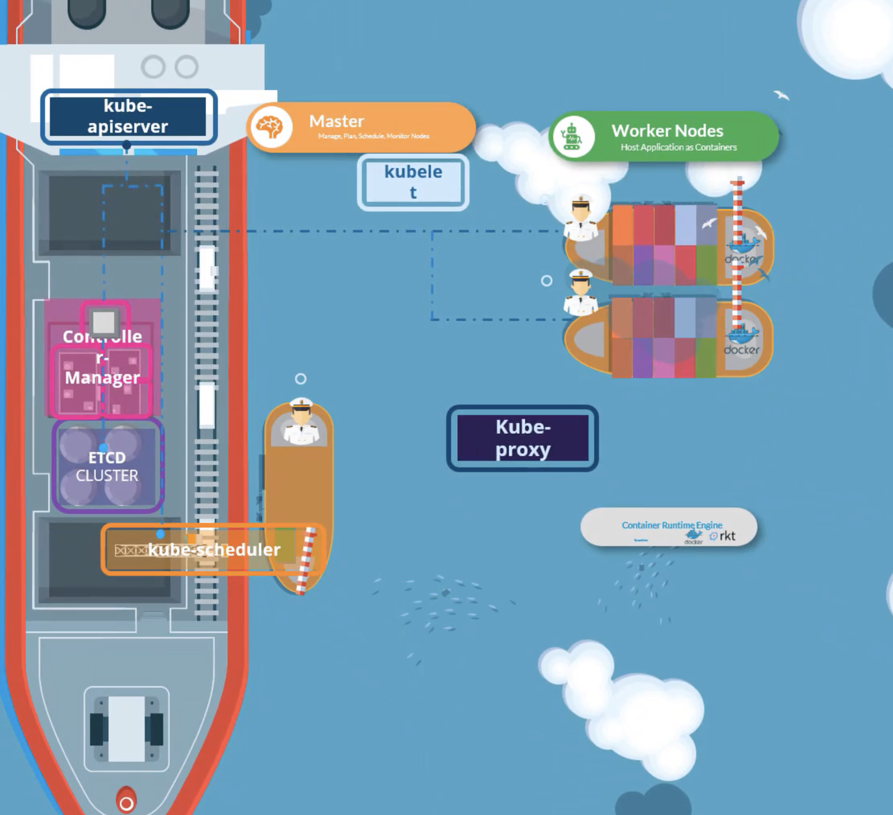
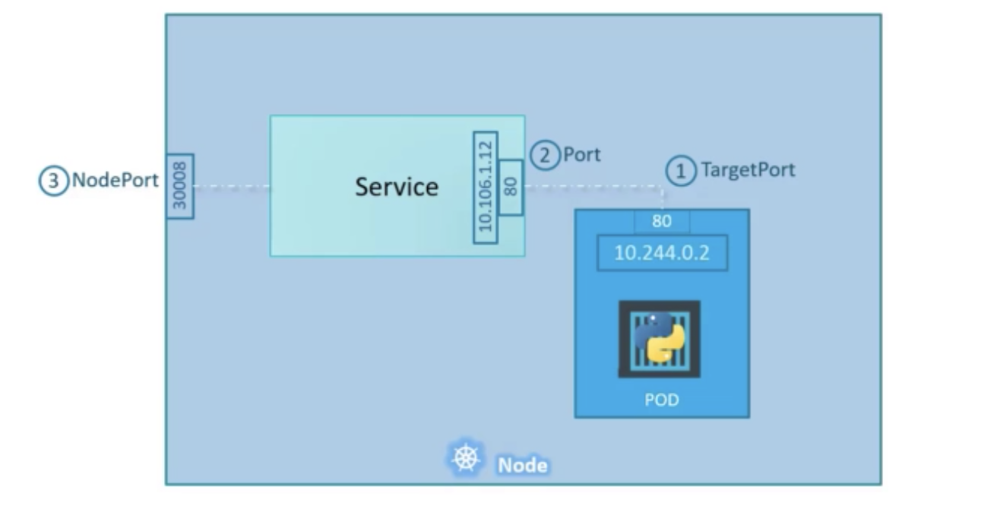
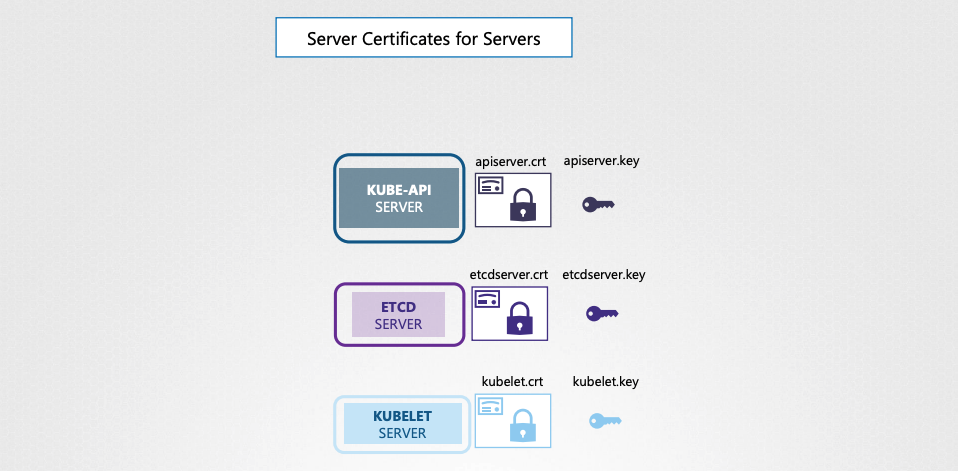
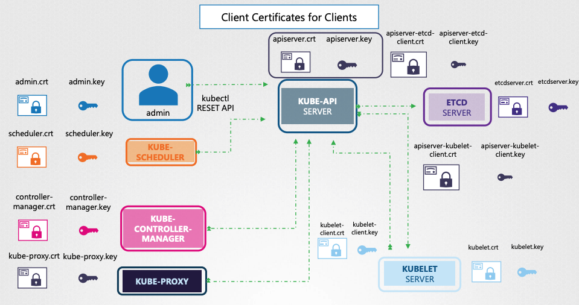
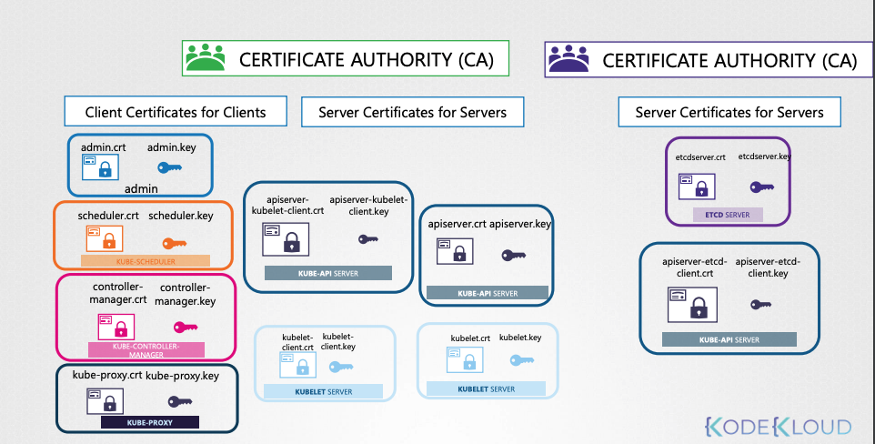
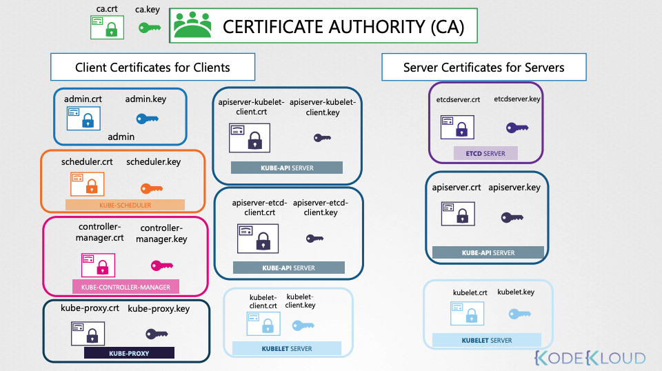

# k8s-cka-certified
## Tabla de contenidos
- [Tabla de contenidos](#tabla-de-contenidos)
- [01. Introduccion](#01---introduccion)
- [02. Core Concepts](#02---conceptos-principales)
- [03. Scheduling](#03---scheduling)
- [04. Logging & monitoring](#04---logging-monitoring)
- [05. Application Lifecycle Management](#05---application-lifecycle-management)
- [06. Cluster maintenance](#06---cluster-maintenance)
- [07. Security](#07---security)
- [08. Storage](#08---storage)
- [09. Networking](#09---networking)
- [10. Install kubernetes hard way](#10---install-kubernetes-hard-way)
- [11. Install kubernetes the kubeadm](#11---install-kubernetes-the-kubeadm)
- [12. End to End test on a Kubernetes cluster](#12---end-to-end-test-on-a-kubernetes-cluster)
- [13. Troubleshooting](#13---troubleshooting)
- [14. Other Topics](#14---other-topics)

## 01 - Introducción
La finalidad de este repositorio es tener una guia para obtener la certificación de Kubernetes __CKA__.

Introducción al curso:
* El examen se puede comprar en la siguiente web: https://www.cncf.io/certification/cka/
* En caso de examen fallido, podrá presentarse de nuevo sin coste, en un plazo máximo de 12 meses.
* No es un examen convencional, sino ejercicios que ponen a prueba sus conocimientos.
* Podrá consultar la documentación oficial de kubernetes en el examen


### 01.1 - Detalles de la certificación
Algunas referencias al examen:
* Administrador Certificado de Kubernetes: https://www.cncf.io/certification/cka/
* Plan de estudios del examen (temas): https://github.com/cncf/curriculum
* Manual del candidato: https://www.cncf.io/certification/candidate-handbook
* Consejos para el examen: http://training.linuxfoundation.org/go//Important-Tips-CKA-CKAD

Use the code - show code in Udemy - while registering for the CKA or CKAD exams at Linux Foundation to get a 15% discount.


## 02 - Conceptos principales
### 02.1 - Arquitectura del Cluster
El propósito de Kubernetes es alojar sus aplicaciones en forma de Pods de manera automatizada, para que pueda implementar tantas instancias como necesite, y facilitar la comunicación entre sus aplicaciones.

Un cluster de kubernetes consta de un conjunto de nodos (fisicos o virtuales), que alojan aplicaciones en forma de Pods.

* Los nodos __Masters__, son los responsables de administrar el cluster, y todas las tareas las lleva a través de un conjunto de componentes, llamados __Control Plane__ (Plano de Control).
* Los nodos __Workers__, están destinados a alojar los Pods.

Componentes del Plano de Control:
* __ETCD__: es una base de datos que almacena la información en un formato clave-valor (key-value).
* __kube-scheduler__: es un componente del cluster que se encarga de planificar donde se alojarán los Pods, en base a etiquetas del Nodo o del Pod, capacidad, políticas o restricciones, y afinidad entre el Nodo y el Pod.
* __Node-Controller__: se encarga de los Nodos, es el responsable de comprobar si los nodos están disponibles o no.
* __Replication-Controller__: se encarga de los Pods, y de que se estén ejecutando el número de Pods que indica su Replication-Groups.
* __kube-apiserver__: es el componente de gestión principal, es el responsable de orquestar todas las operaciones del cluster. Expone el API de Kubernetes que utilizan los usuarios externos para realizar operaciones de administración, asi como los distintos controladores para monitorizar el cluster.

> Dado que las aplicaciones se ejecutan en contendores, los nodos (Master y Workers) necesitarán tener un motor para ejecutarlos (Containe Runtime), uno popular es Docker. Kubernetes es compatible con otros Containers Runtime, como ContainerD o Rocket (RKT).

* __Kubelet__: es un servicio que se ejecuta en todos los nodos, escucha las intrucciones del kube-apiserver, y destruye o crea contenedores en base a la información que le proporciona el kube-apiserver.
* __kube-apiserver__: solicita información sobre el estado de los Pods que se encuentran en los nodos, a través de Kubelet.
* __kube-proxy__: es un servicio que corre en todos los nodos, y mantiene la comunicación entre nodos, para la comunicación entre Pods.



_Ejemplo de arquitectura con buques._


### 02.2 - ETCD
#### 02.2.1 - Que es ETCD
ETCD es una base de datos clave-valor distribuida que es simple, segura y rápida.

#### 02.2.1 - Como instalar ETCD
Puede usar ETCD ejecutando los siguientes pasos:
```sh
# Download file
curl -L https://github.com/coreos/etcd/releases/download/v3.3.1/etcd-v3.3.1-linux-amd64.tar.gz -o etcd-v3.3.1-linux-amd64.tar.gz

# decompress:
tar xzvf etcd-v3.3.1-linux-amd64.tar.gz

# Execute:
./etcd
```

Cuando ejecuta ETCD inicia un servicio que escucha en el __puerto 2380__ por defecto.

Existe un cliente de linea de comando que permite interactuar con la BBDD:
```sh
# Set value
./etcdctl set key1 value1

# Get value
./etcdctl get key1
```

#### 02.2.2 - ETCD en Kubernetes
ETCD almacena información sobre Nodos, Pods, Roles, Secrets, etc.

Toda la información que proviene de kubectl _(cliente de kubernetes en linea de comandos)_, proviene de ETCD.
Cada cambio que realicemos en el cluster actualiza el ETCD, solo una vez que se actualice ETCD, el cambio se considerará completo.

Puede configurar ETCD de distintas formas, en este caso configuraremos ETCD desde cero, y con kubeadm.

* Configuración manual:
```sh
# Descargamos el fichero
wget -q --https-only \ "https://github.com/coreos/etcd/releases/download/v3.3.9/etcd-v3.3.9-linux-amd64.tar.gz"

# Show etcd.service
etcd.service

ExecStart=/usr/local/bin/etcd \\
  --name ${ETCD_NAME} \\ 
  --cert-file=/etc/etcd/kubernetes.pem \\ 
  --key-file=/etc/etcd/kubernetes-key.pem \\ 
  --peer-cert-file=/etc/etcd/kubernetes.pem \\ 
  --peer-key-file=/etc/etcd/kubernetes-key.pem \\ 
  --trusted-ca-file=/etc/etcd/ca.pem \\ 
  --peer-trusted-ca-file=/etc/etcd/ca.pem \\ 
  --peer-client-cert-auth \\
  --client-cert-auth \\
  --initial-advertise-peer-urls https://${INTERNAL_IP}:2380 \\
  --listen-peer-urls https://${INTERNAL_IP}:2380 \\
  --listen-client-urls https://${INTERNAL_IP}:2379,https://127.0.0.1:2379 \\
  --advertise-client-urls https://${INTERNAL_IP}:2379 \\
  --initial-cluster-token etcd-cluster-0 \\
  --initial-cluster-controller-0=https://${CONTROLLER0_IP}:2380,controller-1=https://${CONTROLLER1_IP}:2380 \\ # ETCD Nodes IPs
  --initial-cluster-state new \\
  --data-dir=/var/lib/etcd
```

* Configuración con kubeadm:
```sh
# Implementación como pod
kubectl get pods -n kube-system | grep etc

NAMESPACE    NAME         READY  STATUS   RESTARTS  AGE
kube-system  etcd-master  1/1    Running  0         1h

# Interactua con la BBDD desde dentro del pod
kubectl exec etcd-master –n kube-system etcdctl get / --prefix –keys-only

/registry/apiregistration.k8s.io/apiservices/v1. 
/registry/apiregistration.k8s.io/apiservices/v1.apps 
/registry/apiregistration.k8s.io/apiservices/v1.authentication.k8s.io 
/registry/apiregistration.k8s.io/apiservices/v1.authorization.k8s.io 
/registry/apiregistration.k8s.io/apiservices/v1.autoscaling 
/registry/apiregistration.k8s.io/apiservices/v1.batch 
/registry/apiregistration.k8s.io/apiservices/v1.networking.k8s.io 
/registry/apiregistration.k8s.io/apiservices/v1.rbac.authorization.k8s.io 
/registry/apiregistration.k8s.io/apiservices/v1.storage.k8s.io
```

En un entorno de alta disponibilidad (HA), tendrá varios nodos Masters, y tendrá varias instancias de ETCD distribuidas entre los nodos Masters.
En ese caso, tendrá que configurar la declaración y conexión entre los nodos del cluster de ETCD
```sh
# Show etcd.service
etcd.service

ExecStart=/usr/local/bin/etcd \\
  --name ${ETCD_NAME} \\ 
  --cert-file=/etc/etcd/kubernetes.pem \\ 
  --key-file=/etc/etcd/kubernetes-key.pem \\ 
  --peer-cert-file=/etc/etcd/kubernetes.pem \\ 
  --peer-key-file=/etc/etcd/kubernetes-key.pem \\ 
  --trusted-ca-file=/etc/etcd/ca.pem \\ 
  --peer-trusted-ca-file=/etc/etcd/ca.pem \\ 
  --peer-client-cert-auth \\
  --client-cert-auth \\
  --initial-advertise-peer-urls https://${INTERNAL_IP}:2380 \\
  --listen-peer-urls https://${INTERNAL_IP}:2380 \\
  --listen-client-urls https://${INTERNAL_IP}:2379,https://127.0.0.1:2379 \\
  --advertise-client-urls https://${INTERNAL_IP}:2379 \\
  --initial-cluster-token etcd-cluster-0 \\
  --initial-cluster controller-0=https://${CONTROLLER0_IP}:2380,controller-1=https://${CONTROLLER1_IP}:2380 \\ 
  --initial-cluster-state new \\
  --data-dir=/var/lib/etcd
```

#### 02.2.3 - ETCD commands
`etcdctl` es la herramienta CLI utilizada para interactuar con ETCD.

ETCDCTL puede interactuar con el Servidor ETCD utilizando 2 versiones de la API - `Versión 2` y `Versión 3`.  
__Por defecto está configurado para usar la versión 2__. Cada versión tiene diferentes conjuntos de comandos.

Soporta los siguientes comandos:
```sh
# Version 2
etcdctl backup
etcdctl cluster-health
etcdctl mk
etcdctl mkdir
etcdctl set

# Version 3
etcdctl snapshot save 
etcdctl endpoint health
etcdctl get
etcdctl put

# Para establecer la versión correcta de la API establezca la variable de entorno ETCDCTL_API
export ETCDCTL_API=3
```

Debes especificar la ruta a los archivos de certificado para que ETCDCTL pueda autenticarse en el servidor de la API de ETCD. Los archivos de certificados están disponibles en el etcd-master en la siguiente ruta.

```bash
--cacert /etc/kubernetes/pki/etcd/ca.crt     
--cert /etc/kubernetes/pki/etcd/server.crt     
--key /etc/kubernetes/pki/etcd/server.key
```

Comando final:
```sh
kubectl exec etcd-master -n kube-system -- sh -c "ETCDCTL_API=3 
```


### 02.3 - Kube API Server
__API Server__, es el componente de adminstración principal del cluster de kubernetes.

Cuando ejecuta comandos con kubectl, la solicitud llega al APIServer, este primero autentica la solicitud y la valida, obtiene los datos del ETCD y responde con la información solicitada.

Flujo de creación de objetos (para realizar los cambios se sigue un flujo similar):
1. APIServer crea un Pod sin asignarlo a ningún nodo.
2. APIServer actualiza el estado del pod en cluster de ETCD.
3. APIServer responde al usuario sobre el estado de su solicitud.
4. Scheduler monitoriza el APIServer, y se da cuenta de que hay un nuevo Pod sin asignar a ningún nodo.
5. Scheduler identifica el nodo correcto, y se lo comunica al APIServer.
6. APIServer actualiza ETCD con la nueva información.
7. APIServer se comunica con el nodo donde se va colocar el pod, a través de kubelet.
8. Kubelet crea el pod y comunica al Container Runtime la imagen o imagenes del Pod.
9. Kubelet actualiza el estado del Pod al APIServer.
10. APIServer actualiza el estado del Pod a ETCD.

APIServer es el responsable de autenticar, validar solicitudes, recuperar y actualizar datos en el cluster de ETCD _(es el único componente que se comunica con el)_.

La arquitectura de Kubernetes consiste en una gran cantidad de componentes diferentes que trabajan entre si.

Depende como configure su cluster, podrá ver las opciones de kube-APIServer.
* Manifiesto YAML
```sh
cat /etc/kubernetes/manifests/kube-apiserver.yaml

...
spec:
  containers:
- command:
  - kube-apiserver
  - --authorization-mode=Node,RBAC
  - --advertise-address=172.17.0.32
  - --allow-privileged=true
  - --client-ca-file=/etc/kubernetes/pki/ca.crt
  - --disable-admission-plugins=PersistentVolumeLabel
  - --enable-admission-plugins=NodeRestriction
  - --enable-bootstrap-token-auth=true
  - --etcd-cafile=/etc/kubernetes/pki/etcd/ca.crt
  - --etcd-certfile=/etc/kubernetes/pki/apiserver-etcd-client.crt
  - --etcd-keyfile=/etc/kubernetes/pki/apiserver-etcd-client.key
  - --etcd-servers=https://127.0.0.1:2379
  - --insecure-port=0
  - --kubelet-client-certificate=/etc/kubernetes/pki/apiserver-kubelet-client.crt 
  - --kubelet-client-key=/etc/kubernetes/pki/apiserver-kubelet-client.key
  - --kubelet-preferred-address-types=InternalIP,ExternalIP,Hostname
  - --proxy-client-cert-file=/etc/kubernetes/pki/front-proxy-client.crt
  - --proxy-client-key-file=/etc/kubernetes/pki/front-proxy-client.key
  - --requestheader-allowed-names=front-proxy-client
  - --requestheader-client-ca-file=/etc/kubernetes/pki/front-proxy-ca.crt
  - --requestheader-extra-headers-prefix=X-Remote-Extra-
  - --requestheader-group-headers=X-Remote-Group
  - --requestheader-username-headers=X-Remote-User
...
```

* Como servicio:
```sh
cat /etc/systemd/system/kube-apiserver.service

[Service] ExecStart=/usr/local/bin/kube-apiserver \\
  --advertise-address=${INTERNAL_IP} \\ 
  --allow-privileged=true \\ 
  --apiserver-count=3 \\
  --audit-log-maxage=30 \\ 
  --audit-log-maxbackup=3 \\ 
  --audit-log-maxsize=100 \\ 
  --audit-log-path=/var/log/audit.log \\ 
  --authorization-mode=Node,RBAC \\ 
  --bind-address=0.0.0.0 \\ 
  --client-ca-file=/var/lib/kubernetes/ca.pem \\ 
  --enable-admission-plugins=Initializers,NamespaceLifecycle,NodeRestriction,LimitRanger,ServiceAccount,Defa ultStorageClass,ResourceQuota \\
  --enable-swagger-ui=true \\ 
  --etcd-cafile=/var/lib/kubernetes/ca.pem \\ 
  --etcd-certfile=/var/lib/kubernetes/kubernetes.pem \\ 
  --etcd-keyfile=/var/lib/kubernetes/kubernetes-key.pem \\ 
  --etcd-servers=https://10.240.0.10:2379,https://10.240.0.11:2379,https://10.240.0.12:2379 \\ 
  --event-ttl=1h \\ 
  --experimental-encryption-provider-config=/var/lib/kubernetes/encryption-config.yaml \\
  --kubelet-certificate-authority=/var/lib/kubernetes/ca.pem \\ 
  --kubelet-client-certificate=/var/lib/kubernetes/kubernetes.pem \\
```

* Como proceso:
```sh
ps -aux | grep kube-apiserver

root 2348 3.3 15.4 399040 315604 ? Ssl 15:46 1:22 kube-apiserver --authorization-mode=Node,RBAC -- advertise-address=172.17.0.32 --allow-privileged=true --client-ca-file=/etc/kubernetes/pki/ca.crt 
--disable- admission-plugins=PersistentVolumeLabel --enable-admission-plugins=NodeRestriction--enable-bootstrap-token- auth=true --etcd-cafile=/etc/kubernetes/pki/etcd/ca.crt 
--etcd-certfile=/etc/kubernetes/pki/apiserver-etcd- client.crt --etcd-keyfile=/etc/kubernetes/pki/apiserver-etcd-client.key --etcd-servers=https://127.0.0.1:2379 -- insecure-port=0 
--kubelet-client-certificate=/etc/kubernetes/pki/apiserver-kubelet-client.crt --kubelet-client- key=/etc/kubernetes/pki/apiserver-kubelet-client.key 
--kubelet-preferred-address-types=InternalIP,ExternalIP,Hostname --proxy-client-cert-file=/etc/kubernetes/pki/front-proxy-client.crt --proxy- client-key-file=/etc/kubernetes/pki/front-proxy-client.key--requestheader-allowed-names=front-proxy-client --requestheader-client-ca-file=/etc/kubernetes/pki/front-proxy-ca.crt 
--requestheader-extra-headers-prefix=X-Remote-Extra- --requestheader-group-headers=X-Remote-Group 
--requestheader-username-headers=X-Remote-User --secure- port=6443 --service-account-key-file=/etc/kubernetes/pki/sa.pub --service-cluster-ip-range=10.96.0.0/12 
--tls-cert-file=/etc/kubernetes/pki/apiserver.crt --tls-private-key-file=/etc/kubernetes/pki/apiserver.key
```

### 02.4 - Kube Controller Manager
En terminos de kubernetes, un controlador es un proceso que monitoriza el estado de varios componentes dentro del sistema y trabaja para llevar todo el sistema al estado deseado.

* __Node Controller:__ verifica el estado de los nodos cada 5 segundos. Si deja de recibir datos de un nodo, espera 40 segundos antes de marcarlo como inalcanzable. Después de marcarlo como inalcanzable, espera 5 minutos para ver que reconecte, si no lo hace elimina los Pods asignados a ese nodo, y lo hace en otro sano.
* __Replication Controller__: se encarga de monitorizar los ReplicaSets y garantiza el número deseados.

Hay muchos otros Controllers, y están empaquetados en un solo proceso conocido como __Controller Manager__.

* Puede encontrarlo como Pod:
```sh
kubectl get pods -n kube-system

NAMESPACE    NAME                             READY STATUS   RESTARTS AGE
kube-system  coredns-78fcdf6894-hwrq9         1/1   Running  0        1h
kube-system  coredns-78fcdf6894-rzhjr         1/1   Running  0        1h
kube-system  etcd-master                      1/1   Running  0        1h
kube-system  kube-apiserver-master            1/1   Running  0        1h
kube-system  kube-controller-manager-master   1/1   Running  0        1h
kube-system  kube-proxy-lzt6f                 1/1   Running  0        1h
kube-system  kube-proxy-lz1sf                 1/1   Running  0        1h
kube-system  kube-scheduler-master            1/1   Running  0        1h
kube-system  weave-net-12ffc                  1/1   Running  0        1h
```

* Como servicio:
```sh
cat /etc/kubernetes/manifests/kube-controller-manager.yaml

...
spec:
  containers:
  - command:
    - kube-controller-manager
    - --address=127.0.0.1
    - --cluster-signing-cert-file=/etc/kubernetes/pki/ca.crt
    - --cluster-signing-key-file=/etc/kubernetes/pki/ca.key
    - --controllers=*,bootstrapsigner,tokencleaner
    - --kubeconfig=/etc/kubernetes/controller-manager.conf
    - --leader-elect=true
    - --root-ca-file=/etc/kubernetes/pki/ca.crt
    - --service-account-private-key-file=/etc/kubernetes/pki/sa.key 
    - --use-service-account-credentials=true
...
```

### 02.5 - Kube Scheduler
El Scheduler, es el proceso que indica donde irá cada Pod, no los coloca el mismo, en este caso lo hace Kubelet.

El Scheduler pasa por dos fases para identificar el mejor nodo:
1. Filtra los nodos que no se ajustan al perfil del Pod. (Por ejemplo, descarta los nodos que no tienen suficientes recursos)
2. Con los nodos restantes, utiliza una función de prioridad puntuando a los nodos de 0 a 10. Calculando el espacio que quedará disponible en un nodo si el pod se desplegase en el _(a más espacio disponible - mejor puntuación)_.

> Hay más factores a que tener en cuenta como, Limits, Taints y Tolerations, NodeSelectors o Affinity.

* Instalando Scheduler como servicio:
```sh
kube-scheduler.service

ExecStart=/usr/local/bin/kube-scheduler \\ 
--config=/etc/kubernetes/config/kube-scheduler.yaml \\ 
--v=2
```

* Opciones de schuduler:
```bash
cat /etc/kubernetes/manifests/kube-scheduler.yaml

...
spec:
  containers:
  - command:
    - kube-scheduler
    - --address=127.0.0.1
    - --kubeconfig=/etc/kubernetes/scheduler.conf - --leader-elect=true
...
```


### 02.6 - Kubelet
Kubelet es el agente de Kubernetes en cada nodo. 
Se encarga de:
* Registar el nodo en cluster
* Cuando recibe la orden de crear un contenedor, se lo indica al Container Runtime (Docker, ContainerD, RLT, etc), para que baje la imagen y lo instancie en el nodo.
* Monitoriza los Pods, y le envía informes al API Server.

Kubelet no se instala automáticamente, el agente se instala en cada nodo como servicio.
```sh
kubelet.service

ExecStart=/usr/local/bin/kubelet \\ 
  --config=/var/lib/kubelet/kubelet-config.yaml \\ 
  --container-runtime=remote \\ 
  --container-runtime-endpoint=unix:///var/run/containerd/containerd.sock \\ 
  --image-pull-progress-deadline=2m \\ 
  --kubeconfig=/var/lib/kubelet/kubeconfig \\
  --network-plugin=cni \\
  --register-node=true \\
  --v=2
```

Las opciones de kubelet pueden verse si observamos el proceso:
```sh
ps -aux | grep kubelet

root 2095 1.8 2.4 960676 98788 ? Ssl 02:32 0:36 /usr/bin/kubelet --bootstrap- kubeconfig=/etc/kubernetes/bootstrap-kubelet.conf --kubeconfig=/etc/kubernetes/kubelet.conf -- config=/var/lib/kubelet/config.yaml --cgroup-driver=cgroupfs --cni-bin-dir=/opt/cni/bin --cni- conf-dir=/etc/cni/net.d --network-plugin=cni
```


### 02.7 - Kube-proxy
Dentro de un cluster de Kubernetes, cada Pod puede llegar a cualquier otro Pod.

Esto se logra mediante la implementación de una red entre los Pods. 
Una red virtual que se extiende por todo el cluster, a la que se conectan todos los Pods, cuando se crea un Service, kube-proxy lo escanea y crea las reglas necesarias, una forma de hacerlo es con Iptables. Kube-proxy se implementa como DaemonSet (Pod por nodo).

### 02.8 - Pods
Un Pod un conjunto de propiedades definidas en un fichero YAML, este fichero contiene la definición del objeto y agrupa uno o varios contenedores.

Un Pod, es la unidad más pequeña en Kubernetes.

```yaml
apiVersion: v1              #Versión de la API de Kubernetes que estás usando para crear el objeto (String). Es una propiedad obligatoria. Ej: apps/v1, v1, ...
kind: Pod                   #Tipo de objeto que tratamos de crear (String). Es una propiedad obligatoria. Ej: ReplicaSet, Deployment, Service, ...
metadata:                   #Permite indicar datos sobre el objecto (diccionario), como el nombre, namespace, labels, etc. Es una propiedad obligatoria.
  name: myapp-pod
  labels:                   #Permite identificar un objeto y relacionarlo con otros, por ejemplo un Service, podría apuntar a este pod a través de sus Labels.
    app: myapp
    type: front-end
spec:                       #Bajo esta propiedad se indican configuracaciones específicas para este Pod. Es una propiedad obligatoria
  containers:               #Propiedad que define los contenedores que se declaran en este Pod (List), dado que puede haber uno o más.
    - name: nginx-container
      image: nginx
```

Definimos algunos comando importantes relativos a los Pods.
* Crear a partir de la definición en un fichero
```bash
kubectl create -f pod.yaml

pod/myapp-pod created!
```

* Obtener todos los Pods de un namespace:
```bash
kubectl -n kube-system get pod

NAME                               READY   STATUS    RESTARTS   AGE
coredns-74ff55c5b-twd8d            1/1     Running   0          20s
etcd-minikube                      1/1     Running   0          31s
kube-apiserver-minikube            1/1     Running   0          31s
kube-controller-manager-minikube   1/1     Running   0          31s
kube-proxy-h29mh                   1/1     Running   0          20s
kube-scheduler-minikube            1/1     Running   0          31s
storage-provisioner                1/1     Running   0          33s
```

* Obtener información de los Pods:
```sh
kubectl -n kube-system get pod -o wide

NAME                               READY   STATUS    RESTARTS   AGE   IP             NODE       NOMINATED NODE   READINESS GATES
coredns-74ff55c5b-twd8d            1/1     Running   0          13m   172.17.0.2     node01     <none>           <none>
etcd-minikube                      1/1     Running   0          13m   192.168.49.2   node01     <none>           <none>
kube-apiserver-minikube            1/1     Running   0          13m   192.168.49.2   node01     <none>           <none>
kube-controller-manager-minikube   1/1     Running   0          13m   192.168.49.2   node01     <none>           <none>
kube-proxy-h29mh                   1/1     Running   0          13m   192.168.49.2   node01     <none>           <none>
kube-scheduler-minikube            1/1     Running   0          13m   192.168.49.2   node01     <none>           <none>
storage-provisioner                1/1     Running   1          13m   192.168.49.2   node01     <none>           <none>
```


* Obtener información sobre un Pod existente en el cluster (Etiquetas, variables, Contanedores, IP, volumenes, puntos de montaje, etc)
```bash
kubectl -n kube-system describe pod kube-proxy-h29mh

Name:                 kube-proxy-h29mh
Namespace:            kube-system
Priority:             2000001000
Priority Class Name:  system-node-critical
Node:                 minikube/192.168.49.2
Start Time:           Mon, 03 May 2021 15:39:13 +0200
Labels:               controller-revision-hash=b89db7f56
                      k8s-app=kube-proxy
                      pod-template-generation=1
Annotations:          <none>
Status:               Running
IP:                   192.168.49.2
IPs:
  IP:           192.168.49.2
Controlled By:  DaemonSet/kube-proxy
Containers:
  kube-proxy:
    Container ID:  docker://86b1f246816bd3fc3354df5e7d6ffcace8ba9826f240c3936e3cb2ccbf0c6445
    Image:         k8s.gcr.io/kube-proxy:v1.20.2
    Image ID:      docker-pullable://k8s.gcr.io/kube-proxy@sha256:326fe8a4508a5db91cf234c4867eff5ba458bc4107c2a7e15c827a74faa19be9
    Port:          <none>
    Host Port:     <none>
    Command:
      /usr/local/bin/kube-proxy
      --config=/var/lib/kube-proxy/config.conf
      --hostname-override=$(NODE_NAME)
    State:          Running
      Started:      Mon, 03 May 2021 15:39:14 +0200
    Ready:          True
    Restart Count:  0
    Environment:
      NODE_NAME:   (v1:spec.nodeName)
    Mounts:
      /lib/modules from lib-modules (ro)
      /run/xtables.lock from xtables-lock (rw)
      /var/lib/kube-proxy from kube-proxy (rw)
      /var/run/secrets/kubernetes.io/serviceaccount from kube-proxy-token-kntxm (ro)
Conditions:
  Type              Status
  Initialized       True
  Ready             True
  ContainersReady   True
  PodScheduled      True
Volumes:
  kube-proxy:
    Type:      ConfigMap (a volume populated by a ConfigMap)
    Name:      kube-proxy
    Optional:  false
  xtables-lock:
    Type:          HostPath (bare host directory volume)
    Path:          /run/xtables.lock
    HostPathType:  FileOrCreate
  lib-modules:
    Type:          HostPath (bare host directory volume)
    Path:          /lib/modules
    HostPathType:
  kube-proxy-token-kntxm:
    Type:        Secret (a volume populated by a Secret)
    SecretName:  kube-proxy-token-kntxm
    Optional:    false
QoS Class:       BestEffort
Node-Selectors:  kubernetes.io/os=linux
Tolerations:     op=Exists
                 CriticalAddonsOnly op=Exists
                 node.kubernetes.io/disk-pressure:NoSchedule op=Exists
                 node.kubernetes.io/memory-pressure:NoSchedule op=Exists
                 node.kubernetes.io/network-unavailable:NoSchedule op=Exists
                 node.kubernetes.io/not-ready:NoExecute op=Exists
                 node.kubernetes.io/pid-pressure:NoSchedule op=Exists
                 node.kubernetes.io/unreachable:NoExecute op=Exists
                 node.kubernetes.io/unschedulable:NoSchedule op=Exists
Events:
  Type    Reason     Age   From               Message
  ----    ------     ----  ----               -------
  Normal  Scheduled  2m    default-scheduler  Successfully assigned kube-system/kube-proxy-h29mh to minikube
  Normal  Pulled     119s  kubelet            Container image "k8s.gcr.io/kube-proxy:v1.20.2" already present on machine
  Normal  Created    119s  kubelet            Created container kube-proxy
  Normal  Started    119s  kubelet            Started container kube-proxy
```

* Crear Pods en linea de comandos:
```sh
kubectl run nginx --imagen=nginx
```

* Crear un manifiesto de un pod a través de kubectl
```yaml
kubectl run redis --image=redis --dry-run=client -o yaml > pod.yaml

# Mostramos el fichero generado
cat pod.yaml

apiVersion: v1
kind: Pod
metadata:
  creationTimestamp: null
  labels:
    run: redis
  name: redis
spec:
  containers:
  - image: redis
    name: redis
    resources: {}
  dnsPolicy: ClusterFirst
  restartPolicy: Always
status: {}
```

### 02.9 - ReplicaSet
El objeto ReplicaSet, garantiza que el número de replicas indicadas en el objeto, esté siempre disponibles. Permite escalar y balancear si fuera necesarios, creando más replicas en el mismo nodo, incluso en otros, de tal forma que para el usuario es transparente.

En Clusters con versiones más antiguas, podemos encontranos __Replication Controller__, y en cluster con versiones más modernas, __ReplicaSet__.

* Replication Controller:
```yaml
apiVersion: v1
kind: ReplicationController
metadata:             # Metadata para el ReplicationController.
  name: myapp-rc
  labels:
    app: myapp
    type: front-end
spec:                  # Especificaciones para el ReplicacionController.
  template:            # Definimos una plantilla para las réplicas que controlará este objeto. Que contendrá las mismas propiedades que un Pod.
    metadata:          # Metadata para el Pod.
      name: myapp-pod
      labels:
        app: myapp
        type: front-end
    spec:             # Especificaciones para el Pod.
      containers:
      - name: nginx-container
        image: nginx
  replicas: 3         # Número de réplicas del Pod.
```

* Creamos el Replication Controller definido:
```bash
kubectl create -f rc-definition.yaml
replicationconrtoller "myapp-rc" created!

# Listamos los Replication Controllers
kubectl get replicationcontrollers
NAME       DESIRED   CURRENT   READY   AGE
myapp-rc   3         3         3       72s

# Listamos los pods
kubectl get pod
NAME             READY   STATUS    RESTARTS   AGE
myapp-rc-gr4hm   1/1     Running   0          33s
myapp-rc-kwm72   1/1     Running   0          33s
myapp-rc-szjkd   1/1     Running   0          33s
```

* Replica Set:
```yaml
apiVersion: apps/v1   # apiVersion cambia con respecto a los RCs
kind: ReplicationSet
metadata:             # Metadata para el ReplicaSet.
  name: myapp-replicaset
  labels:
    app: myapp
    type: front-end
spec:                  # Especificaciones para el ReplicaSet.
  template:            # Definimos una plantilla para las réplicas que controlará este objeto. Que contendrá las mismas propiedades que un Pod.
    metadata:          # Metadata para el Pod.
      name: myapp-pod
      labels:
        app: myapp
        type: front-end
    spec:             # Especificaciones para el Pod.
      containers:
      - name: nginx-container
        image: nginx
  replicas: 3         # Número de réplicas del Pod.
  selector:           # Esta propiedad es la diferencia entre RS y RC, prmite identificar que partes se encuentran bajo el 
    matchLabels:
    type: front-end
```

* Creamos el ReplicationSet definido:
```bash
kubectl create -f rc-definition.yaml
replicationconrtoller "myapp-replicaset" created!

# Listamos los ReplicaSet
kubectl get replicaset
NAME               DESIRED   CURRENT   READY   AGE
myapp-replicaset   3         3         3       72s

# Listamos los pods
kubectl get pod
NAME                     READY   STATUS    RESTARTS   AGE
myapp-replicaset-gr4hm   1/1     Running   0          33s
myapp-replicaset-kwm72   1/1     Running   0          33s
myapp-replicaset-szjkd   1/1     Running   0          33s
```


> Los Labels, permiten identificar los objetos de kubernetes, a través de estas etiquetas proporcionamos un filtro para los ReplicaSets.


Podemos escalar las réplicas de distintas formas:
```bash
# Editar el manifiesto replicaset-definition.yaml
vim replicaset-definition.yaml # set a new value
kubectl replace -f replicaset-definition.yaml

# Editar el Replicaset and change replica property
kubectl edit myapp-replicaset

# Seteando nuevo valor con kubectl
kubectl scale --replicas=6 -f replicast-definition.yaml
kubectl scale --replicas=6 replicaset myapp-replicaset 
```


### 02.10 - Deployments
Los Deployments, son objectos de kubernetes, que permiten ejecutar Rolling update, Roll-backs, actualizar la versión de sus aplicaciones, cambiar asignaciones de recursos, variables de entorno, escalado, pausar y reanudar cambios según la necesidad, etc.

Para comprender que otros objectos controlan los Deployments observemos la siguiente imagen.
IMAGEN DEPLOYMENT

Un ejemplo de manifiesto de Deployment:
```yaml
apiVersion: apps/v1
# Con respecto a los RS, cambia la propiedad Kind
kind: Deployment        
metadata:
  name: myapp-deployment
  labels:
    app: myapp
    type: front-end
spec:
  template:
    metadata:
      name: myapp-pod
      labels:
        app: myapp
        type: front-end
    spec:
      containers:
      - name: nginx-container
        image: nginx
  replicas: 3
  selector:
    matchLabels:
    type: front-end
```
* Creamos el Deployment definido:
```bash
kubectl create -f deployment-definition.yaml
deployment "myapp-deployment" created!

# Listamos los Deployments
kubectl get deployments
NAME               DESIRED   CURRENT   READY   AGE
myapp-deployment   3         3         3       72s

# Listamos los Replicationset
kubectl get replicaset
NAME                            DESIRED   CURRENT   READY   AGE
myapp-deployment-325423452345   3         3         3       72s

# Listamos los pods
kubectl get pod
NAME                                  READY   STATUS    RESTARTS   AGE
myapp-deployment-325423452345-gr4hm   1/1     Running   0          33s
myapp-deployment-325423452345-kwm72   1/1     Running   0          33s
myapp-deployment-325423452345-szjkd   1/1     Running   0          33s

# todos los objetos creados
kubectl get all
NAME                      DESIRED   CURRENT   READY   AGE
deploy/myapp-deployment   3         3         3       72s

NAME                               DESIRED   CURRENT   READY   AGE
rs/myapp-deployment-325423452345   3         3         3       72s

NAME                                     READY   STATUS    RESTARTS   AGE
po/myapp-deployment-325423452345-gr4hm   1/1     Running   0          33s
po/myapp-deployment-325423452345-kwm72   1/1     Running   0          33s
po/myapp-deployment-325423452345-szjkd   1/1     Running   0          33s
```

Algunos comando necesarios:
```bash
# Crear un pod
kubectl run nginx --image=nginx

# Crear el manifiesto de un pod a partir de kubectl
kubectl run nginx --image=nginx --dry-run=client -o yaml > pod.yaml

# Crear un deployment
kubectl create deploymetn --image=nginx nginx

# Crear manifiesto de un deployment a partir de kubectl
kubectl create deploymetn --image=nginx nginx --dry-run=client -o yaml > deployment.yaml

# Crear manifiesto de un deployment con 4 réplicas a partir de kubectl
kubectl create deployment nginx --image=nginx --replicas=4 --dry-run=client -o yaml > deployment.yaml
```


### 02.11 - Namespaces
Si varios usuarios y equipos utilizan el mismo clúster de Kubernetes podemos dividir el clúster en subclústeres virtuales utilizando __Namespaces__.
El nombre de los recursos/objetos creados dentro de un Namespace son únicos, pero no en los Namespaces del cluster.

Para listar todos los Namespaces, podemos ejecutar el siguiente comando:
```bash
$ kubectl get namespaces

NAME              STATUS       AGE
default           Active       11h
kube-node-lease   Active       11h
kube-public       Active       11h
kube-system       Active       11h
```

Generalmente, Kubernetes crea cuatro Namespaces por defecto:

* kube-system: Contiene los objetos creados por el sistema, principalmente los agentes del plano de control.
* kube-public: Es un namespace inseguro y legible por cualquiera, utilizado para la exposición de información pública no sensible sobre el cluster.
* default: Contiene los objetos y recursos creados por los administradores y desarrolladores.

Puede asignar Quota de recursos a cada uno de los Namespaces.

Los recursos en el mismo Namespace, puede referise entre si por sus nombres. Ej: una aplicación (app-a) se conectará con otra (app-b) a través de un Service (b-service).
```sh
mysql.connect("b-service")
```

Es posible conectar aplicaciones de Namespaces distintos.
```sh
mysql.connect("<service-name>.<namespace>.svc.cluster.local")
mysql.connect("b-service.dev.svc.cluster.local")
```

Objeto namespace en YAML:
```yaml
apiVersion: v1
kind: Namespace
metadata:
  name: dev
```

Algunos comandos:
```bash
# Listar Pods namespace por defecto
kubectl get pods

# Listar Pods nampespace específico
kubectl get pods --namespace kube-system

# Crear Pod a través de un manifiesto en el namespace por defecto
kubectl create -f pod-definition.yaml
pod/my-app created!

# Crear Pod a través de un manifiesto en un namespace específico
kubectl create -f pod-definition.yaml --namespace dev
pod/my-app created!

# Crear Namespace con kubectl
kubectl create namespace dev
namespace/dev created!

# Cambiar namespace por defecto
kubectl config set-context $(kubectl config current context) --namespace dev

# Listar Pods de todos los namespaces
kubectl get pods --all-namespaces
kubectl get pods -A
```

Para limitar los recursos asignados a su namespace, puede definir otro objeto llamado __ResourceQuota__:
```yaml
apiVersion: v1
kind: ResourceQuota
metadata:
  name: compute-quota
  namespace: dev
spec:
  hard:
    pods: "10"            # 10 Pods como máximo en el namespace 
    requests.cpu: "4"     # Request CPU. La suma de las request de todos los Pods del namespace, no puede exceder de 4.
    requests.memory: 5Gi  # Request Memory. La suma de las request de todos los Pods del namespace, no puede exceder de 5Gi
    limits.cpu: "10"      # Limits CPU. La suma de las limits de todos los Pods del namespace, no puede exceder de 10
    limits.memory: 10Gi   # Limits Memory. La suma de las limits de todos los Pods del namespace, no puede exceder de 10Gi
```

Creamos el objeto en kubernetes
```sh
kubectl create -f compute.quota.yaml
```


### 02.12 - Services
Los Services son objectos de Kubernetes que permiten la comunicación dentro y fuera del cluster.

#### 02.12.1 - NodePort
Los Service de tipo NodePort, permiten dedicar un puerto alto (30000-32767) en todos los nodos del cluster. 
El propio cluster detectará todos los Pods con las etiquetas indicadas y balancerá la carga entre todos ellos.

Se accedería a la aplicación 
```bash
http://node-ip:30008
```



* Ejemplo de manifiesto YAML:
```yaml
apiVersion: v1
kind: Service
metadata:
  name: myapp-service
spec:
  # Tipo de objeto, podría ser ClusterIP, LoadBalancer o NodePort
  type: NodePort
  selector:
    # Se declaran las mismas labels que contiene el Pod, para que el Service, apunte a la aplicación o aplicaciones correctas.
    app: myapp
    type: front-end
  # Puede tener uno o más puertos
  ports:
      # Si no se indica targePort, por defecto tendrá el mismo que el valor de Port
    - port: 80
      targetPort: 80
      # Si no se indica, el Control Plan de Kubernetes asignará un puerto alto del rango (default: 30000-32767)
      nodePort: 30007
```

Comprobamos que el SVC ha sido creado y realizamos una petición curl a todos los nodos con el mismo puerto proporcionado por el SVC:
```bash
kubectl get svc

NAME           TYPE        CLUSTER-IP      EXTERNAL-IP   PORT(S)   AGE
kubernetes     ClusterIP   10.96.0.1       <none>        443/TCP   14s
myapp-service  NodePort    10.106.127.123  <none>        80:30007  4s


# Realizamos una petición a las IPs y puertos de los nodos
curl http://192.168.1.2:30007
Hello World!

curl http://192.168.1.3:30007
Hello World!

curl http://192.168.1.4:30007
Hello World!
```


#### 02.12.2 - Services - ClusterIP
Pueden encontrarse distintos componentes, en una aplicación. Por ejemplo: Front-end, back-end y redis. Todos ellos son Pods de nuestro cluster y necesitarán tener conectividad.

Todos los Pods de nuestro cluster, tiene IP, pero, ¿que necesitariamos para conectar los Pods?


Necesitaremos un Service de tipo ClusterIP, permite la comunicación entre distintas capas. Cada capa puedes escalar sin afectar a la comunicación.
Estos servicios definene una IP dentro del cluster, a través del nombre proporcionado para el Service, se establece la comunicación.

* Ejemplo de definición de Service ClusterIP:
```yaml
apiVersion: v1
kind: Service
metadata:
  name: back-end
spec:
  type: ClusterIP
  selector:
    app: myapp
    type: back-end
  ports:
    - protocol: TCP
      port: 80
      targetPort: 80
```

* Creación del SVC:
```bash
kubectl get svc

NAME           TYPE        CLUSTER-IP      EXTERNAL-IP   PORT(S)   AGE
kubernetes     ClusterIP   10.96.0.1       <none>        443/TCP   14s
back-end       ClusterIP   10.106.127.123  <none>        80/TCP    4s
```

#### 02.12.3 - Services - LoadBalancer
Como hemos visto, si los usuarios quisieran acceder a una aplicación del cluster, podriamos utilizar un Service de tipo NodePort, les facilitariamos las IPs de los nodos y el puerto asignado, pero, ¿que ocurre si los nodos no son accesibles? ¿y si hay multitud de puertos para los mismos nodos?
Podriamos crear una máquina virtual con el propósito de equilibrar la carga entre todos los nodos con nginx, y enrutar hacia los nodos del cluster, pero esto puede ser una tarea tediosa.

Sin embargo, si estuvieramos en una plataforma Cloud, podriamos aprovechar los Load Balancer que nos proporcionan. 
Kubernetes, tiene soporte para integrase con los balanceadores de carga de estas plataformas, y configurarlo para nosotros.

* Definición de SVC LoadBalancer:
```yaml
apiVersion: v1
kind: Service
metadata:
  name: myapp-service
spec:
  selector:
    app: myapp
    type: front-end
  ports:
    - nodePort: 80
      port: 80
      targetPort: 30007
  type: LoadBalancer
```


### 02.13 - Imperativo Vs Declarativo
Los comandos imperativos realizan una tarea concreta, como por ejemplo crear o borrar un objecto en Kubernetes.
Los comandos declarativos son más inteligentes, permiten crear un objeto si no existe o actualizarlo si existe.

Los comandos imperativos, de cara al examen, le ayudan a realizar una tarea con mayor rapidez.
Algunos comandos:

* Imperativos:
```bash
# Crear un objeto a partir de un fichero
kubectl create -f nginx.yaml

# Edita un fichero alojado en memoria
kubectl edit deployment nginx

# Reemplaza un objeto a partir de un fichero
kubectl replace -f nginx.yaml

# Recrear objetos
kubectl replace --force -f nginx.yaml

# No permite crear un objeto que ya existe
kubectl create -f nginx.yaml
`Error from Server (AlreadyExists): error when creating "nginx.yaml": pods "myapp-pod" already exists`

# No permite reemplazar si el objeto no existe
kubectl replace -f nginx.yaml
`Error from Server (Conflict): error when replacing "nginx.yaml": Operation cannot be fulfilled on pods "myapp-pod"`
```

* Declarativos
```bash
# Crear un objeto si no existe
kubectl apply -f nginx.yaml

# Crear todos los objetos de un path
kubectl apply -f .

# Actualizar un objeto si existe
kubectl apply -f nginx.yaml
```

* Tips

```bash
# Mostar configuración de kubeconfig
kubectl config view

# Mostrar los contextos
kubectl config get-contexts

# Crear o actualizar objetos a partir de un fichero
kubectl apply -f file.yaml

# Crear un Pod
kubectl run nginx --image=nginx

# Crear un Deployment
kubectl create deployment nginx --image=nginx --replicas=4

# Exponer un Deployment
kubectl expose deployment nginx --port 80

# Editar un Deployment
kubectl edit deployment nginx

# Escalar un Deployment
kubectl scale deployment nginx --replicas=5

# Setear imagen en un Deployment
kubectl set image deployment nginx=nginx:1.18

# Crear un Job
kubectl create job hello --image=busybox -- echo "Hello World"

# Crear pod con shell interactiva
kubectl run -ti busybox --image=busybox -- sh

# Crear manifiesto para Pod
kubectl run nginx --image=nginx --dry-run=client -o yaml > pod.yaml

# Crear manifiesto para SVC
kubectl expose pod redis --port=6379 --name redis-service --dry-run=client -o yaml
kubeclt create service clusterip redis --tcp=6379:6379 --dry-run=client -o yaml
```


## 03 - Scheduling
### 03.1 - Manual Scheduling
En el manifiesto de Pods, hay una propiedad que normalmente no se especifica ,__nodeName__, si no se indica, Kubernetes lo agrega automáticamente si existe un Scheduler.

El Scheduler es el encargado de revisar los Pods buscando los que no tienen esta propiedad, estos serán programados, el Scheduler identitifica el nodo correcto, y añade esta propiedad.
`nodeName: node02`

Cuando no hay un Scheduler en el cluster, el estado de los Pods creados resultará _Pending_.
```bash
kubectl get pods

NAME           READY   STATUS       RESTARTS    AGE
nginx          0/1     Pending      0           3S
```

Puedes indicar manualmente esta propiedad en tu manifiesto, de esta forma provisionarás el Pod en el nodo indicado:
* Manifiesto:
```yaml
apiVersion: v1
kind: Pod
metadata:
  name: nginx
spec:
  containers:
  - name: nginx
    image: nginx
  nodeName: node02
```

```bash
kubectl get pods

NAME           READY   STATUS       RESTARTS    AGE   IP          NODE
nginx          1/1     Pending      0           3S    10.40.0.4   node02
```

Cuando asignas la propiedad manualmente, no permite su modificación.  

### 03.2 - Labels and Selectors
Las Labels son muy útiles para filtrar y ver diferentes objetos por diferentes categorías, como agrupar por su tipo o ver objetos por aplicación o por funcionalidad.

Puede agrupar objetos usando __Labels__ según el tipo de objeto, necesidad, función, etc.
En el manifiesto de su objeto, en la sección de _Metadata_, indique tantas _Labels_  como necesite con un formato _key-value_. 

```yaml
apiVersion: v1
kind: Pod
metadata:
  name: simple-webapp
  labels:
    app: App1
    function: Front-end
spec:
  containers:
  - name: simple-webapp
    image: nginx
    ports:
      - containerPort: 8080
```

Puede seleccionar objetos usando __Selectors__, para filtrar objetos específicos.
```bash
kubectl get pod --selector app=App1

NAME            READY   STATUS    RESTARTS   AGE
simple-webapp   1/1     Running   0          11s
```

Los objetos de Kubernetes utilizan Labels y Selectors internamente para conectar diferentes objetos entre si.
```yaml
apiVersion: apps/v1
kind: Deployment
metadata:
  name: simple-webapp
  # Labels definidas para el Deployment
  labels:
    app: App1
    function: Front-end
spec:
  replicas: 3
  # Sección que une el Deployment con los Pods que controlará. Añadir las mismas Labels que contiene el Pod.
  selector:
    matchLabels:
      app: App1
      function: Front-end
  template:
    metadata:
      # Labels definidas para los Pods.
      labels:
        app: App1
        function: Front-end
    spec:
      containers:
      - name: simple-webapp
        image: nginx
        ports:
        - containerPort: 80
```

Funciona igual con otros objetos:
```yaml
apiVersion: v1
kind: Service
metadata:
  name: my-service
spec:
  # Sección que une el Service con los Pods.
  selector:
    app: App1
    function: Front-end
  ports:
    - protocol: TCP
      port: 80
      targetPort: 9376
```

Mientras que las Labels y Selectors, se usan para agrupar y seleccionar, las __Annotations__ se usan para indicar cualquier dato, como detalles de herramientas, nombres, contactos, números de telefono, correos electrónicos, etc, que pueden usarse para algún tipo de propósito de integración.

```yaml
apiVersion: apps/v1
kind: Deployment
metadata:
  name: simple-webapp
  labels:
    app: App1
  # Annotations, permiten indicar datos, incluso la integración con terceros
  ## https://github.com/stakater/Reloader
  annotations:
    secret.reloader.stakater.com/reload: "foo-secret,bar-secret,baz-secret"
spec:
  replicas: 3
  selector:
    matchLabels:
      app: App1
  template:
    metadata:
      labels:
        app: App1
    spec:
      containers:
      - name: simple-webapp
        image: nginx
```

### 03.3 - Taints and Tolerations
Por defecto, no existen restricciones ni limitaciones en los Nodes, por lo tanto cualquier Pod puede ser ubicado en cualquier Node.

Para evitar que un Node, contenga Pods que no son deseados, se marca con la propiedad __Taint__, y para que ciertos recursos caigan sobre esos nodos, necesitan una propiedad __Tolerations__.

```bash
# Taints - Node
kubectl taint nodes node-name key=value:taint-effect
```

Existen distintos efectos sobre los Taints:
* __NoSchedule__: El sistema no provisionará ningún Pod sin Tolerations, en el Nodo.
* __PreferNoSchedule__: El sistema intentará evitar colocar un Pod en ese nodo, pero no lo garantiza.
* __NoExecute__: Los nuevos Pods provisionados en el cluster no se añadirán a este nodo, y si ya existen, drenará los Pods si no tienen el Toleration correcto.

```bash
# Taint con NoSchedule
kubectl taint nodes node1 app=blue:NoSchedule
```

```yaml
# Pod con Toleration
apiVersion: v1
kind: Pod
metadata:
  name: myapp-pod
spec:
  containers:
  - name: nginx
    image: nginx
    imagePullPolicy: IfNotPresent
  tolerations:
  - key: "app"
    operator: "Equal"
    value: "blue"
    effect: "NoSchedule"
```

Los Nodos Masters, también tienen capacidad para tener Pods, sin embargo no se recomienda programar Pods en el. Estos, tambíen tienen la propiedad __Taint__.
```bash
kubectl describe node master01 | grep Taint

Taints:         node-role.kubernetes.io/master:NoSchedule
```


### 03.4 - Node Selectors
Podemos indicar en los Pods, el Nodo en el que tienen que programarse. NodeSelector, es la propiedad que permite esto, es la unión entre un Pod y un Nodo.

Debe tener un Label en el Nodo

```bash
kubectl label nodes node01 size=Large
```

```yaml
# Pod
apiVersion: v1
kind: Pod
metadata:
  name: nginx
  labels:
    env: test
spec:
  containers:
  - name: nginx
    image: nginx
    imagePullPolicy: IfNotPresent
  nodeSelector:
    size: Large
```

### 03.5 - Node Affinity
Si quisieramos indicar al Scheduler que un Pod debe ser provisionado en un nodo con LAbel size=Large o size=Medium, necesitariamos utilizar otra propiedad, __nodeAffinity__.

```yaml
# Pod con affinity In
apiVersion: v1
kind: Pod
metadata:
  name: nginx
  labels:
    env: test
spec:
  containers:
  - name: nginx
    image: nginx
    imagePullPolicy: IfNotPresent
  affinity:
    nodeAffinity:
      requiredDuringSchedulingIgnoredDuringExecution:
        nodeSelectorTerms:
        - matchExpressions:
          - key: size
            operator: In # In, NotIn
            values:
            - Large
            - Medium

---

# Pod con Affinity NotIn
apiVersion: v1
kind: Pod
metadata:
  name: nginx
  labels:
    env: test
spec:
  containers:
  - name: nginx
    image: nginx
    imagePullPolicy: IfNotPresent
  affinity:
    nodeAffinity:
      requiredDuringSchedulingIgnoredDuringExecution:
        nodeSelectorTerms:
        - matchExpressions:
          - key: size
            operator: NotIn
            values:
            - Small

---

# Solo comprobar que existe una key
apiVersion: v1
kind: Pod
metadata:
  name: nginx
  labels:
    env: test
spec:
  containers:
  - name: nginx
    image: nginx
    imagePullPolicy: IfNotPresent
  affinity:
    nodeAffinity:
      requiredDuringSchedulingIgnoredDuringExecution:
        nodeSelectorTerms:
        - matchExpressions:
          - key: size
            operator: Exists
```

Existen tipos de Node Affinity:
* __requiredDuringSchedulingIgnoredDuringExecution__: No se provisionará cuando se crea, pero será ignorado si ya se encuentra provisinado.
* __preferredDuringSchedulingIgnoredDuringExecution__: Evitará provisionarse si se crea, y será ignorado si ya se encuentra provisinado.
* __requiredDuringSchedulingRequiredDuringExecution__: No se provisionará cuando se crea, si ya existe será drenado a otro nodo.

> _DuringScheduling_: estado donde no existe un Pod y se crea por primera vez.
> _DuringExecution_: estado donde ya existe un Pod programado.


### 03.6 - Resource Requirements and Limits
Cada Nodo tiene un conjunto de recursos de CPU, Memoria y Disco. Cada Pod consume un conjunto de recursos.

El Scheduler trata de programar el Pod en el Nodo con menos carga para balancear el uso de los nodos, pero además, también evalua el tamaño de los recursos del Pod, evitando los nodos que no pueden alojar el Pod por recursos insuficientes.

Cuando un Pod no pueda ser alojado por motivos de recursos, podrá ver el siguiente log en el Pod:
```bash
Events:
  Reason                    Message
  ------                    -------
  FailedScheduling No nodes are available: Insufficient cpu (3).
```

Por defecto, Kubernetes supone que un Pod requiere __0.5CPU y 256Mi__. Pero se pueden indicar otros valores:

```yaml
apiVersion: v1
kind: Pod
metadata:
  name: nginx
  labels:
    env: test
spec:
  containers:
  - name: nginx
    image: nginx
    resources:
      requests:
        memory: "1Gi"
        cpu: 1
```

Los recursos de un Pod se pueden establecer:
* CPU: 1m (valor mínimo), 100m, 0.1, 1, etc
* Memory: 1Mi(1,048,576 bytes), 1M(1,000,000 bytes), 1G, 1Gi, 

También puede establecer un límite de recursos para el Pod
```yaml
apiVersion: v1
kind: Pod
metadata:
  name: nginx
  labels:
    env: test
spec:
  containers:
  - name: nginx
    image: nginx
    resources:
      requests:
        memory: "1Gi"
        cpu: 1
      limits:
        memory: "2Gi"
        cpu: 2
```

Si no define límites en sus Pods, podrán utilizar si en algún momento lo requieren, toda la CPU o Memoria del nodo, sin embargo, puede limitar el uso a través de los Limits.

Para la CPU, el nodo limitará al Pod, sin embargo para el consumo de memoria, si el Pod excede del límite, el Pod será eliminado.

Puede establecer el límite por defecto para un Pod, creando objetos __LimitRange__.

```yaml
# Default Memory
apiVersion: v1
kind: LimitRange
metadata:
  name: default-mem-limits
spec:
  limits:
  - default:
      memory: 512Mi
    defaultRequest:
      memory: 256Mi
    type: Container

---

# Default CPU
apiVersion: v1
kind: LimitRange
metadata:
  name: default-cpu-limits
spec:
  limits:
  - default:
      cpu: 1
    defaultRequest:
      cpu: 0.5
    type: Container
```

Además, podemos limitar la asignación de recursos en un Namespace.

```yaml
# Min Max Memory
apiVersion: v1
kind: LimitRange
metadata:
  name: mem-min-max
spec:
  limits:
  - max:
      memory: 500Mi
    min:
      memory: 128Mi
    type: Container

---

# Min Max CPU
apiVersion: v1
kind: LimitRange
metadata:
  name: cpu-min-max
spec:
  limits:
  - max:
      cpu: "500m"
    min:
      cpu: "100m"
    type: Container
```

### 03.7 - DaemonSets
Un __DaemonSets__ es un objeto de Kubernetes, que a su vez, contiene un ReplicaSet. Permite programar una réplica del Pod gestionado en cada Nodo del cluster, además de asegurar de añadir nuevas réplicas en los nuevos nodos que se añadan al cluster.

Kube-proxy o Calico, son ejemplos de DaemonSet, se programan en cada nodo.

```yaml
# Ejemplo con algunas de las propiedades descritas
apiVersion: apps/v1
kind: DaemonSet
metadata:
  name: monitoring-daemon
  namespace: kube-system
  labels:
    k8s-app: monitoring
spec:
  selector:
    matchLabels:
      name: monitoring-agent
  template:
    metadata:
      labels:
        name: monitoring-agent
    spec:
      containers:
      - name: fluentd
        image: gcr.io/fluentd-elasticsearch/fluentd:v2.5.1
        resources:
          limits:
            memory: 200Mi
          requests:
            cpu: 100m
            memory: 200Mi
```

Para garantizar que cada nodo contiene las réplicas del DaemonSet, se le añade la propiedad __NodeName__.


### 03.8 - Static Pods
Si no hubiese Control Planne, un nodo podría funcionar por si mismo a través de Kubelet. Sabemos que la única misión de kubelet, es crear Pods, pero en este caso no tenemos API Server para comunicarle la creación de Pods. Podemos configurar kubelet para leer los ficheros de una ruta en el nodo __/etc/kubernetes/manifest/__, kubelet revisará periódicamente este diretorio y creará los Pods (solo puede crear Pods) que alli se encuentren definidos, también se ocupará de que se mantenga vivos.

```bash
[Service]
ExecStart=/usr/local/bin/kubelet \\
  --container-runtime=remote \\
  --container-runtime-endpoint=unix://var/run/containerd/containerd.sock \\
  # Con esta propiedad se define donde se encuentran los Statics Pods
  --pod-manifest-path=/etc/kubernetes/manifest \\
  --kubeconfig=/var/lib/kubelet/kubeconfig \\
  --network-plugin=cni \\
  --register-node=true \\
  --v=2
```

También puede indicarse en el fichero kubeconfig
```bash
cat /var/lib/kubelet/kubeconfig

...
staticPodPath: /etc/kubernetes/manifest
...

```

Una vez creados, podriamos visualizar nuestros Statics Pods a través de Docker, recordemos que no tenemos un API Server.

Si tuvieramos un API Server, podriamos ver los Statics Pods creados pero no podriamos editarlos a través de kubectl.


### 03.9 - Multiple Scheduler
Un caso de uso para tener múltiples Schedulers, es que el algoritmo y comprobraciones que hace el actual Scheduler no satisfacen sus necesidades.

```bash
# kube-scheduler.service
ExecStart=/usr/local/bin/kube-scheduler \\
  --config=/etc/kubernetes/config/kube-scheduler.yaml \\
  --scheduler-name= default-scheduler

# my-custom-scheduler.service
ExecStart=/usr/local/bin/kube-scheduler \\
  --config=/etc/kubernetes/config/kube-scheduler.yaml \\
  --scheduler-name= default-scheduler
```

Podemos copiar el Pod del actual Scheduler y añadirle algunos parámetros más:
```yaml
# /etc/kubernetes/manifest/kube-scheduler.yaml
apiVersion: v1
kind: Pod
metadata:
  name: kube-scheduler
  namespace: kube-system
spec:
  containers:
  - command:
      - kube-scheduler
      - --address=127.0.0.1
      - --kubeconfig=/etc/kubernetes/scheduler.conf
      - --leader-elect=true
    image: k8s.gcr.io/kube-scheduler-amd64:v1.11.3
    name: kube-scheduler

---

# my-custom-scheduler.yaml
apiVersion: v1
kind: Pod
metadata:
  name: my-custom-scheduler
  namespace: kube-system
spec:
  containers:
  - command:
      - kube-scheduler
      - --address=127.0.0.1
      - --kubeconfig=/etc/kubernetes/scheduler.conf
      - --leader-elect=true
      - --scheduler-name=my-custom-scheduler
      - --lock-object-name=my-custom-scheduler
    image: k8s.gcr.io/kube-scheduler-amd64:v1.11.3
    name: kube-scheduler
```

```bash
NAME                            READY   STATUS    RESTARTS  AGE
coredns-78fcdf6894-bk4ml        1/1     Running   0         1h
coredns-78fcdf6894-ppr6m        1/1     Running   0         1h
etcd-master                     1/1     Running   0         1h
kube-apiserver-master           1/1     Running   0         1h
kube-controller-manager-master  1/1     Running   0         1h
kube-proxy-dgbgv                1/1     Running   0         1h
kube-proxy-fptbr                1/1     Running   0         1h
kube-scheduler-master           1/1     Running   0         1h
my-custom-scheduler             1/1     Running   0         9s
weave-net-4tfpt                 2/2     Running   1         1h
weave-net-6j6zs                 2/2     Running   1         1h
```

Para usar el nuevo Scheduler, basta con indicarselo al Pod:
```yaml
apiVersion: v1
kind: Pod
metadata:
  name: annotation-default-scheduler
  labels:
    name: multischeduler-example
spec:
  # Define la propiedad schedulerName
  schedulerName: my-custom-scheduler
  containers:
  - name: pod-with-default-annotation-container
    image: k8s.gcr.io/pause:2.0
```

Mostramos los eventos del namespace donde corre el pod
```bash
kubectl get events -n default

LAST SEEN   COUNT   NAME      KIND  TYPE      REASON      SOURCE                MESSAGE
9s          1       nginx.15   Pod   Normal   Scheduled   my-custom-scheduler   Successfully assigned default/nginx to node01
8s          1       nginx.15   Pod   Normal   Pulling     kubelet, node01       pulling image "nginx"
2s          1       nginx.15   Pod   Normal   Pulled      kubelet, node01       Successfully pulled image "nginx"
```


## 04 - Logging and Monitoring
### 04.1 - Monitorizar componentes del Cluster
Kubernetes no facilita por defecto un sistema de monitorización, existen multitud de ellos
* Metrics Server
* Prometheus
* Elastic Stack
* DataDog
* DynaTrace

Heapster fue uno de los proyectos originales que habilitó las funciones de monitorización, cuando realice búsquedas, verá muchas referencias a este componente.
Sin embargo, se encuentra deprecada. Se formó una versión reducida como __Metrics Server__.

Metrics-server recupera las métricas de cada uno de los Nodos y Pods en memoria, no puede ver el histórico.

Kubelete tiene un subcomponente conocido como __cAdvisor__ o __Container Advisor__, es el responsable de recuperar las métricas de rendimiento, y exponerlas a través de la API de kubelet.

Puede instalar este servicio instalando los objetos que lo componen:
```bash
kubectl apply -f https://github.com/kubernetes-sigs/metrics-server/releases/latest/download/components.yaml
```

Una vez creado metrics-server, podemos obtener métricas de los nodos y de los Pods:
```bash
# Nodes
kubectl top node
NAME          CPU(cores)  CPU%  MEMORY(bytes)   MEMORY%
kubemaster    166m        8%    1337Mi          70%
kubenode1     36m         1%    1046Mi          55%
kubenode2     39m         1%    1048Mi          55%

# Pods
kubectl top pod
NAME    CPU(cores)  CPU%  MEMORY(bytes)   MEMORY%
nginx   166m        8%    1337Mi          70%
redis   36m         1%    1046Mi          55%
```


### 04.2 - Manejar logs de aplicación
Al igual que Docker, Kubernetes nos permite visualizar los logs de nuestras aplicaciones.

```bash
# -f logs en tiempo real
# -c seleccionar un contenedor si nuestro Pod contiene más de uno.
kubectl logs –f event-simulator-pod -c event-simulator

2018-10-06 15:57:15,937 - root - INFO - USER1 logged in
2018-10-06 15:57:16,943 - root - INFO - USER2 logged out
2018-10-06 15:57:17,944 - root - INFO - USER2 is viewing page2
2018-10-06 15:57:18,951 - root - INFO - USER3 is viewing page3
2018-10-06 15:57:19,954 - root - INFO - USER4 is viewing page1
2018-10-06 15:57:20,955 - root - INFO - USER2 logged out
2018-10-06 15:57:21,956 - root - INFO - USER1 logged in
2018-10-06 15:57:22,957 - root - INFO - USER3 is viewing page2
2018-10-06 15:57:23,959 - root - INFO - USER1 logged out
2018-10-06 15:57:24,959 - root - INFO - USER2 is viewing page2
2018-10-06 15:57:25,961 - root - INFO - USER1 logged in
2018-10-06 15:57:26,965 - root - INFO - USER4 is viewing page3
2018-10-06 15:57:27,965 - root - INFO - USER4 is viewing page3
2018-10-06 15:57:28,967 - root - INFO - USER2 is viewing page1
2018-10-06 15:57:29,967 - root - INFO - USER3 logged out
2018-10-06 15:57:30,972 - root - INFO - USER1 is viewing page2
2018-10-06 15:57:31,972 - root - INFO - USER4 logged out
2018-10-06 15:57:32,973 - root - INFO - USER1 logged in
2018-10-06 15:57:33,974 - root - INFO - USER1 is viewing page3
```


## 05 - Application Lifecycle Management
### 05.1 - Rolling Updates and Rollbacks
Cuando se crea un Deployment, se crea una versión (PE: v1) (replicaSet), en el futuro cuando el Deployment es actualizado, las versiones también son actualizadas. 
Esto nos ayuda a realizar el seguimiento de nuestro Deploymente, y retroceder a una versión anterior si fuera necesario.

```bash
# Conocer el estado de un Deployment
kubectl rollout status deployment/myapp-deployment

Waiting for rollout to finish: 0 of 10 updated replicas are available...
Waiting for rollout to finish: 1 of 10 updated replicas are available...
Waiting for rollout to finish: 2 of 10 updated replicas are available...
Waiting for rollout to finish: 3 of 10 updated replicas are available...
Waiting for rollout to finish: 4 of 10 updated replicas are available...
Waiting for rollout to finish: 5 of 10 updated replicas are available...
Waiting for rollout to finish: 6 of 10 updated replicas are available...
Waiting for rollout to finish: 7 of 10 updated replicas are available...
Waiting for rollout to finish: 8 of 10 updated replicas are available...
Waiting for rollout to finish: 9 of 10 updated replicas are available...
deployment "myapp-deployment" successfully rolled out

# Conocer el historial de estado de un Dployment
kubectl rollout history deployment/myapp-deployment
deployments "myapp-deployment"
REVISION CHANGE-CAUSE
1 <none>
2 kubectl apply --filename=deployment-definition.yml --record=true
```

Existen dos tipos de estrategias de despliegues:
* __Recreate__: destruir primero los Pods, e implementar la nueva versión. Utilizar este método causa que la aplicación no esté disponible.
* __Rolling Update__: destruir y crear la nueva versión Pod a Pod, sin causar que la aplicación no esté disponible.

```yaml
# Recreate
...
spec:
  replicas: 3
  strategy:
    type: Recreate
...

# RollingUpdate
...
spec:
  replicas: 3
  strategy:
    type: RollingUpdate
    rollingUpdate:
      maxSurge: 2        # Cuantos Pods se añaden al mismo tiempo
      maxUnavailable: 0  # Cuantos Pods puede no estar disponibles durante la actualización
...
```


Cuando una actualización no funciona como esperabamos, podemos utilizar la estrategia de __Rollback__,

```bash
kubectl rollout undo deployment/myapp-deployment
deployment "deployment/myapp-deployment" rolled back

# Alternativamente puedes indicarle la revisión a la que quieres volver
kubectl rollout undo deployment/myapp-deployment --to-revision=2
deployment "deployment/myapp-deployment" rolled back
```


### 05.2 - Commands and Arguments

Una imagen pueden contener parámetros que indiquen como se comportará el contendor cuando se lanza:
```bash
# Dockerfile ubuntu-sleeper
FROM Ubuntu          # imagen
ENTRYPOINT ["sleep"] # Comando que se lanza 
CMD ["5"]            # argumento para el comando por defecto

# Ejecución
docker run ubuntu-sleeper 10
```

La misma imagen, usada en un Pod:
```yaml
apiVersion: v1
kind: Pod
metadata:
  name: ubuntu-sleeper-pod
spec:
  containers:
    - name: ubuntu-sleeper
      image: ubuntu-sleeper   # imagen
      command: ["sleep2.0"]   # Reemplazamos el ENTRYPOINT de la imagen
      args: ["10"]            # Indicamos un argumento
```

### 05.3 - Configurar ENVs en aplicaciones

Podemos proporcionar variables a un Pod de distintas formas.

* Texto plano:
```yaml
apiVersion: v1
kind: Pod
metadata:
  name: simple-webapp
spec:
  containers:
    - name: simple-webapp
      image: simple-webapp
      ports:
        - containerPort: 8080
      env:
        - name: APP_COLOR
          value: green
```

* Carga de variables a través de Configmap
```yaml
apiVersion: v1
kind: Pod
metadata:
  name: simple-webapp
spec:
  containers:
    - name: simple-webapp
      image: simple-webapp
      ports:
        - containerPort: 8080
      env:
        - name: APP_COLOR
          valueFrom:
            configMapKeyRef:
              name: configmap-color
              key: color
```

* Carga de variables a través de Secrets
```yaml
apiVersion: v1
kind: Pod
metadata:
  name: simple-webapp
spec:
  containers:
    - name: simple-webapp
      image: simple-webapp
      ports:
        - containerPort: 8080
      env:
        - name: APP_COLOR
          valueFrom:
            secretKeyRef:
              name: secret-color
              key: color
```

### 05.4 - Configurar ConfigMaps en aplicaciones
Si tenemos muchos datos que pasar a un Pod, podemos configurar objetos __configMaps__ para almacenarlos.

* Crear configMap:
```bash
# Sintaxis Imperativa
kubectl create configmap <config-name> --from-literal=<key>=<value>

# Ejemplos
## Configmap con una clave
kubectl create configmap \
        app-config --from-literal=APP_COLOR=blue

## Configmap con varias claves
kubectl create configmap \
        app-config --from-literal=APP_COLOR=blue \
                   --from-literal=ENVIRONMENT=pro \
                   --from-literal=email=test@test.test

## Configmap a partir de un fichero
kubectl create configmap \
        app-config --from-file=app_config.properties
```

* Componer manifiesto configMap:
```yaml
# app-config
apiVersion: v1
kind: ConfigMap
metadata:
  name: app-config
data:
  APP_COLOR: blue
  APP_MODE: prod
```

Para referenciarlos basta con detallarlo en el Pod:
```yaml
apiVersion: v1
kind: Pod
metadata:
  name: simple-webapp
spec:
  containers:
    - name: simple-webapp
      image: simple-webapp
      ports:
        - containerPort: 8080
      env:
        - name: APP_COLOR
          valueFrom:
            configMapKeyRef:
              name: app-config
```

Existen distintas formas de pasar un ConfigMap a un Pod:
```yaml
# Carga como variable de entorno
envForm:
  - configMapRef:
      name: app-config

# Carga como variable simple
env:
  - name: APP_COLOR
    valueFrom:
      configMapRefKey:
        name: app-config
        key: APP_COLOR

# Carga de variables como un volumen
volumes:
- name: app-config-volume
  configMap:
    name: app-config
```

### 05.5 - Configurar Secrets en aplicaciones
Los Secrets de Kubernetes, son objetos que codifican su contenido en base64, son útiles para almacenar datos sensibles, que posteriormente se utilizarán en los servicios que implementen.

```bash
# Sintaxis creación de secretos
kubectl create secret generic \
        <secret-name> --from-literal=<key>=<value>

# Ejemplos
## Crear secreto con una clave
kubectl create secret generic \
        app-secret --from-literal=DB_PASS=pass

## Crear secreto con múltiples claves
kubectl create secret generic \
        app-secret --from-literal=DB_PASS=pass \
        app-secret --from-literal=DB_HOST=host


## Crear secreto a partir de un fichero
kubectl create secret generic \
        app-secret --from-file=db.properties
```

Cuando se crea el secreto a través de comando imperativo, el contenido se codifica en Base64.
```bash
kubectl describe secret app-secret

...
DB_PASS: ZXMgdW4gc2VjcmV0bwo=
...
```

Crear un manifiesto de un secreto se vería así, debemos indicar el contenido codificado:
```yaml
apiVersion: v1
kind: Secret
metadata:
  name: app-secret
data:
  DB_PASS: ZXMgdW4gc2VjcmV0bwo=    # base64
```

Para pasar un secreto a un Pod, lo hacemos:
```yaml
apiVersion: v1
kind: Pod
metadata:
  name: simple-webapp
spec:
  containers:
    - name: simple-webapp
      image: simple-webapp
      ports:
        - containerPort: 8080
      envFrom:
        - secretRef:
            name: app-secret
```

```yaml
# Secreto como variables
envFrom:
  - secretRef:
      name: app-secret

# Secreto como única variable
env:
  - name: DB_PASSWORD
    valueFrom:
      secretKeyRef:
        name: app-secret
        key: DB_Pass

# Secreto como volumen (se crearán en el punto de montaje tantos ficheros como keys contenta el screto)
volumes:
- name: app-secret-volume
  secret:
    secretName: app-secret
```

Para codificar y decodificar un texto:
```bash
echo "pass" | base64 #Codificar
echo "ZXMgdW4gc2VjcmV0bwo=" | base 64 -d
```


### 05.6 - Escalar aplicaciones
En ocasiones puede necesitar más de un contenedor en un Pod, por ejemplo, puede necesitar un contenedor para recoger los logs.
```yaml
apiVersion: v1
kind: Pod
metadata:
  name: multiple-container
spec:
  containers:
    - name: simple-webapp
      image: simple-webapp
      ports:
        - containerPort: 8080
    - name: agent-log
      image: agent-lob
```

### 05.7 - Init Containers

En un Pod con múltiples contenedores, se espera que cada uno ejecute un proceso que permanezca vivo mientras dure el ciclo de vida del POD. 

Los initContainer, es un contendor que se inicia cuando el Pod es provisionado, permite ejecutar tareas antes de que la aplicación principal esté disponible, un caso de uso puede ser un proceso que espera a que un servicio externo o una base de datos esté disponible antes de que se inicie la aplicación real. Es posible declarar múltiples initContainers y su ejecución es secuencial.

```yaml
apiVersion: v1
kind: Pod
metadata:
  name: myapp-pod
  labels:
    app: myapp
spec:
  containers:
  - name: myapp-container
    image: busybox:1.28
    command: ['sh', '-c', 'echo The app is running! && sleep 3600']
  initContainers:
  - name: init-myservice
    image: busybox
    command: ['sh', '-c', 'git clone <some-repository-that-will-be-used-by-application> ; done;']
```


## 06 - Cluster Maintenance
### 06.1 - OS upgrades
Existe múltiples tareas de mantenimiento sobre los nodos de un cluster, pero estos nodos es posible que estén dando servicio.
Kubectl, permite indicar a kubernetes el drenado de Pods de un nodo.
```bash
kubectl drain node01
```

Cuando drenamos un nodo, lo que estamos haciendo es acordonarlo (ningún Pod será programado en el nodo), y terminar los Pods que están programados en el. Kubernetes los recreará en otro nodo.

Una vez terminemos las tareas de mantenimiento sobre el nodo, podrá volver a estar disponible para el programar Pods.
```bash
# Permite programar Pods en el nodo
kubectl uncordon node01

# Evita que se programen Pods en el nodo
kubectl cordon node01
```


### 06.2 - Cluster Upgrade process
Existe diferentes estrategias para la actualización de las versiones que corren en los nodos. Los primeros nodos a actualizar, sería los Master. Partiendo de que tenemos los Master, actualizados:
* Todos a la vez, supone que ninguna de sus aplicaciones estarán disponibles durante el proceso de actualización.
* Uno a uno, moviendo los Pods entre nodos para evitar que no estén disponibles las aplicaciones.
* Agregar nuevos nodos actualizados, moviendo los Pods a estos, y eliminando los desactualizados.

Con Kubeadm podemos actualizar los nodos con el siguente comando:
```bash
# Mostramos el plan de actualización
$ kubeadm upgrade plan

[preflight] Running pre-flight checks.
[upgrade] Making sure the cluster is healthy:
[upgrade/config] Making sure the configuration is correct:
[upgrade] Fetching available versions to upgrade to
[upgrade/versions] Cluster version: v1.11.8
[upgrade/versions] kubeadm version: v1.11.3
[upgrade/versions] Latest stable version: v1.13.4
[upgrade/versions] Latest version in the v1.11 series: v1.11.8

Components that must be upgraded manually after you have
upgraded the control plane with 'kubeadm upgrade apply':

COMPONENT     CURRENT         AVAILABLE
Kubelet       3 x v1.11.3     v1.13.4

Upgrade to the latest stable version:
COMPONENT             CURRENT         AVAILABLE
API Server            v1.11.8         v1.13.4
Controller Manager    v1.11.8         v1.13.4
Scheduler             v1.11.8         v1.13.4
Kube Proxy            v1.11.8         v1.13.4
CoreDNS               1.1.3           1.1.3
Etcd                  3.2.18          N/A

You can now apply the upgrade by executing the following command:
kubeadm upgrade apply v1.13.4

apt-get upgrade -y kubeadm=1.12.0-00

kubeadm upgrade apply v1.12.0

[upgrade/successful] SUCCESS! Your cluster was upgraded to "v1.12.0". Enjoy!
[upgrade/kubelet] Now that your control plane is upgraded, please proceed with
upgrading your kubelets if you havent already done so.

# Mostramos la versión de nuestros nodos
kubectl get nodes

NAME      STATUS    ROLES   AGE     VERSION
master    Ready     master  1d      v1.11.3
node-1    Ready     <none>  1d      v1.11.3
node-2    Ready     <none>  1d      v1.11.3

$ apt-get upgrade -y kubelet=1.12.0-00

$ systemctl restart kubelet

$ kubectl get nodes
NAME      STATUS  ROLES   AGE   VERSION
master    Ready   master  1d    v1.12.0
node-1    Ready   <none>  1d    v1.11.3
node-2    Ready   <none>  1d    v1.11.3
```

### 06.3 - Backup and restore methods
* Configuraciones
Lo más seguro es almacenar todos nuestos manifiestos de Kubernetes en un sistema de control de versiones, de esta forma será mantenido más facilmente por un equipo.

Si alguien ha creado algún recurso de forma imperativa, puede obtener un backup consultando al API Server.
`kubectl get all --all-namespaces -o yaml > all-deploy-services.yaml`

Algunos sitemas se encarga de realizar estas tareas [Velero](https://velero.io/)

* ETCD
ETCD cuenta con un comando para realizar snapshots de sus datos
`ETCD_API=3 etcdctl snapshot save snapshot.db`

Restaurar una copia de ETCD
```bash
# Para el servicio kube-apiserver
$ service kube-apiserver stop
Service kube-apiserver stopped

# Restauramos la copia en una ruta
ETCDCTL_API=3 etcdctl \
              snapshot restore snapshot.db \
              --data-dir /var/lib/etcd-from-backup \

# Configuramos el servicio para que obtenga los datos de la nueva ruta
etcd.service
ExecStart=/usr/local/bin/etcd \\
    --name ${ETCD_NAME} \\
    --cert-file=/etc/etcd/kubernetes.pem \\
    --key-file=/etc/etcd/kubernetes-key.pem \\
    --peer-cert-file=/etc/etcd/kubernetes.pem \\
    --peer-key-file=/etc/etcd/kubernetes-key.pem \\
    --trusted-ca-file=/etc/etcd/ca.pem \\
    --peer-trusted-ca-file=/etc/etcd/ca.pem \\
    --peer-client-cert-auth \\
    --client-cert-auth \\
    --initial-advertise-peer-urls https://${INTERNAL_IP}:2380
    --listen-peer-urls https://${INTERNAL_IP}:2380 \\
    --listen-client-urls https://${INTERNAL_IP}:2379,https://127.0.0.1:2379
    --advertise-client-urls https://${INTERNAL_IP}:2379 \\
    --initial-cluster-token etcd-cluster-0 \\
    --initial-cluster controller-0=https://${CONTROLLER0_IP}:2380,controller
    --initial-cluster-state new \\
    --data-dir=/var/lib/etcd-from-backup

# Reiniciamos el demonio
$ systemctl daemon-reload
$ systemctl etcd restart

# Finalmente, inicie el servicio kube-apiserver
$ service kube-apiserver start
Service kube-apiserver started

# Recuerde indicar todos los parámetros necesario para interactuar con ETCD
ETCDCTL_API=3 etcdctl \
    snapshot restore snapshot.db \
    --data-dir /var/lib/etcd-from-backup \
    --initial-cluster master-1=https://192.168.5.11:2380,master-2=https://192.168.5.12:2380 \
    --initial-cluster-token etcd-cluster-1 \
    --initial-advertise-peer-urls https://${INTERNAL_IP}:2380
```

### 06.4 - Working with ETCD
`etcdctl` es un cliente de línea de comandos para etcd.

Cuando realice acciones sobre ETCD v3, asegurse de indicar la versión: `export ETCDCTL_API=3`.

Puede pasar el flag -h para conocer todas las opciones de un comando.


## 07 - Security
### 07.1 - Kubernetes Security Primivite
Algunos puntos a tener en cuenta con respecto a la seguridad en kubernetes, son los siguientes:

#### 07.1.1 - Securización de Hosts
Debe deshabilitar el acceso al usuario root, deshabilitar la password de usuarios y permitir solo la autenticación solo por clave ssh.

#### 07.1.2 - Securización de Kubernetes
Para comenzar, necesitamos tomar dos tipos de decisiones: quien puede acceder al cluster y que puede hacer.

* Autenticación: los mecanismos de autenticación definen quien puede acceder al API Server. Existen diferentes formas de autenticarse contra el API Server.
  * Usuario y password
  * Usuario y token
  * Certificados
  * Provedores externos - LDAP
  * Service Accounts

* Autorización: los mecanismos de autorización definen que puede hacer una vez se han autenticado en el sistema:
  * RBAC Authorization
  * ABAC Authorization
  * Node Authorization
  * Webhook Mode

Todas las comunicaciones entre los distintos componentes del clusters, se garantiza mediante el cifrado TLS.

Las Pods del cluster, tienen conectividad entre si. Pero es posible restringir el acceso entre ellos utilizando __Network Policies__.


### 07.2 - Authentication
Kubernetes no administra usuario de forma nativa, se basa en fuentes externas como un archivo con detalles de usuarios, certificados o cuentas de identidad de terceros.

Por lo tanto, no puede crear usuarios.

#### 7.2.3 - Auth Basic
Puede crear una lista de usuarios y sus contraseñas en formato CSV.

```bash
# User details
## password,user,ID_user,group(optional)
password123,user1,u0001
password123,user2,u0002
password123,user3,u0003
password123,user4,u0004
```

Dentro el servicio kube-apiserver, puede indicar lo siguiente:

```bash
# kube-apiserver.service
ExecStart=/usr/local/bin/kube-apiserver \\
  --advertise-address=${INTERNAL_IP} \\
  --allow-privileged=true \\
  --apiserver-count=3 \\
  --authorization-mode=Node,RBAC \\
  --bind-address=0.0.0.0 \\
  --enable-swagger-ui=true \\
  --etcd-servers=https://127.0.0.1:2379 \\
  --event-ttl=1h \\
  --runtime-config=api/all \\
  --service-cluster-ip-range=10.32.0.0/24 \\
  --service-node-port-range=30000-32767 \\
  --v=2 \\
  --basic-auth-file=user-details.csv
```

```json
curl -v -k https://master-node-ip:6443/api/v1/pods -u "user1:password123"

{
  "kind": "PodList",
  "apiVersion": "v1",
  "metadata": {
    "selfLink": "/api/v1/pods",
    "resourceVersion": "3594"
  },
  "items": [
  {
    "metadata": {
      "name": "nginx-64f497f8fd-krkg6",
      "generateName": "nginx-64f497f8fd-",
      "namespace": "default",
      "selfLink": "/api/v1/namespaces/default/pods/nginx-64f497f8fd-krkg6",
      "uid": "77dd7dfb-2914-11e9-b468-0242ac11006b",
      "resourceVersion": "3569",
      "creationTimestamp": "2019-02-05T07:05:49Z",
      "labels": {
        "pod-template-hash": "2090539498",
        "run": "nginx"
...
```

De manera similar, podemos tener un fichero con tokens estáticos.

```bash
# User details
## token,user,ID_user,group(optional)
ad34gdfg66hn&7MK,user1,u0001
ad34gdfg66hnffad,user2,u0002
ad34gdfg66hasdfn,user3,u0003
ad34gdfg66hn4rff,user4,u0004
```

La linea a indicar en el servicio kube-apiserver.service sería:
```bash
--token-auth-file=user-details.csv
```

Para realizar la petición al API server:
```bash
curl -v -k https://master-node-ip:6443/api/v1/pods --header "Authorization: Bearer ad34gdfg66hasdfn"
```

Estos dos tipos de autenticación no son seguras, por lo tanto no es recomendable usarlas.


### 07.3 - TLS Basic
Se utiliza un certificado para garantizar la confianza entre dos partes durante una transacción.

#### 07.3.1 - HTTP
Tenemos una web a la que accedemos con usuario y contraseña, pero esta, no utiliza __HTTPS__. Cuando enviamos nuestras credenciales a través de la red, van en texto plano, por lo que si alguien escucha el tráfico de la red, puede obtener el usuario y la contraseña.

Los datos se cifran utilizando una clave, que basicamente es un conjunto de números y letras aleatorias. Si alguien que está escuchando el tráfico de red obtiene estos datos no sabrá descifrarlos, pero esto mismo le ocurre al servidor destino, por ello tenemos que enviar también una copia de la clave, y del mismo modo, si el atacante la obtiene, podrá descifrar nuestros datos.

Esto se conoce como __encriptación simétrica__. Es una forma segura de cifrado, pero dado que se usa la misma clave para cifrar y descifrar datos y que la clave debe intercambiarse entre el remitente y el receptor, existe un riesgo.

El __cifrado asimétrico__, utiliza un par de claves, __Private Key y Public Key__. Si algo es cifrado con la Public Key, solo podrá ser descifrado con la Private Key, por ello nunca debe compartirse.


#### 07.3.2 SSH:
Asegurar acceso ssh a un servidor
Lo primero, será generar el par de claves:
```bash
ssh-keygen

id_rsa      # private key 
id_rsa.pub  # public key
```

Asegure su servidor para que el acceso solo pueda ser por clave.

Añada su clave pública en el servidor, normalmente se añade al fichero __.ssh/authorized_keys__

Si más usuarios necesitan acceder al servidor, podrán generar sus propias claves y añadirlas al fichero del servidor.

#### 07.3.3 -  HTTPS
Aqui utilizamos el comando openssl para generar un par de claves pública y privada.

```bash
# Genera clave privada
openssl genrsa -out my-bank.key 1024

# Genera clave pública
openssl rsa -in my-bank.key -pubout > mybank.pem
```

Cuando el usuario accede por primera vez al servidor web, mediante https, obtiene la clave pública del servidor, como el pirata informático está escuchando la red, el también recibe una copia de la clave pública.

El navegador del usuario encripta la clave simétrica, utilizando la clave pública proporcionada por el servidor. La clave simétrica ahora es segura, el usuario la envía al servidor.

Sin embargo no tiene la clave privada del servidor para descifrar el mensaje.

### 07.4 - TLS in Kubernetes
Puede ser muy confuso saber que ficheros son claves públicas o privadas.

| Certificate (Public Key)  | Private Key  |
|---------------------------|--------------|
| *.crt *.pem               | *.key *-key.pem  |
| server.crt                | server.key  |
| server.pem                | server-key.pem  |
| client.crt                | client.key  |
| client.pem                | cliente-key.pem  |

Un cluster se compone de nodos Master y nodos Worker, y la comunicación entre ellos debe ser segura y debe estar encriptada.

Dos requisitos principales son tener todos los ervicios dentro del cluster para usar __Server Certificates for Servers__ y que todos los clientes usen __Client Certificates for Clients__.









### 07.5 - TLS in Kubernetes - Certificate creation
Crearemos los certificados para el cluster.
* Certificate Authority (CA):
```bash
# Clave privada
openssl genrsa -out ca.key 2048

# Solicitud de firma con la clave privada
openssl req -new ca.key -subj "/CN=KUBERNETES-CA" -out ca.csr

# Firmamos el certificado (autofirmado)
openssl x509 -req -in ca.csr -signkey ca.key -out ca.crt
```

* Admin User
```bash
# Clave privada
openssl genrsa -out admin.key 2048

# Solicitud de firma con la clave privada
openssl req -new -key admin.key -subj "CN=kube-admin" -out admin.csr

# Firma de certificado con la clave privada de la CA
openssl x509 -req -in admin.csr -CA ca.crt -CAkey ca.key -out admin.crt
```

* Certificados de clientes, ejecutamos lo mismo para los distintos componentes:
  * SYSTEM:KUBE-SCHEDULER
  * SYSTEM:KUBE-CONTROLLER-MANAGER
  * SYSTEM:KUBE-PROXY


* Server Certificates for Servers:
  * ETCD:
    * ETCD-SERVER
    * ETCD-PEER (conexión entre las réplicas)
  * API-SEVER
  * KUBELET
  
### 07.6 - View Certificate Details
```bash
# Ver los detalles del certificado
openssl x509 -in /etc/kubernetes/pki/apiserver.crt -text -noout

Certificate:
  Data:
    Version: 3 (0x2)
    Serial Number: 3147495682089747350 (0x2bae26a58f090396)
  Signature Algorithm: sha256WithRSAEncryption
    Issuer: CN=kubernetes                         # CA que emitió el certificado
    Validity
      Not Before: Feb 11 05:39:19 2019 GMT
      Not After : Feb 11 05:39:20 2020 GMT        # Validez
    Subject: CN=kube-apiserver                    # Nombre del certificado
    Subject Public Key Info:
      Public Key Algorithm: rsaEncryption
      Public-Key: (2048 bit)
      Modulus:
        00:d9:69:38:80:68:3b:b7:2e:9e:25:00:e8:fd:01:
      Exponent: 65537 (0x10001)
    X509v3 extensions:
      X509v3 Key Usage: critical
        Digital Signature, Key Encipherment
      X509v3 Extended Key Usage:
        TLS Web Server Authentication
      X509v3 Subject Alternative Name:
        DNS:master, DNS:kubernetes, DNS:kubernetes.default,                           #
        DNS:kubernetes.default.svc, DNS:kubernetes.default.svc.cluster.local, IP      ## Nombre alternativos
        Address:10.96.0.1, IP Address:172.17.0.27                                     #
```


### 07.7 - Certificates API
Necesitamos darle acceso al cluster a un nuevo compañero. 
Crea su clave privada, y genera una solicitud de firma para la CA lo firme, nos lo envía porque somos los únicos administradores, lo firmamos y se lo devolvemos, y entonces puede acceder al cluster.

Kubernetes tiene una API de Certificados que puede realizar estas tareas. Puede enviar un __CertificateSigningRequest__, a través de la API de kubernetes. Las peticiones pueden ser revisadas por los administradores y ser aprobadas con kubectl.

```bash
# El usuario crea una clave
openssl genrsa -out jane.key 2048

# Solicitud de firma
openssl req -new -key jane.key -subj "/CN=jane" -out jane.csr

# cifra el contenido de la solicitud en base64
cat jane.csr | base64
```

Crea el fichero para kubernetes
```yaml
apiVersion: certificates.k8s.io/v1beta1
kind: CertificateSigningRequest
metadata:
  name: jane
spec:
  groups:
  - system:authenticated
  usages:
  - digital signature
  - key encipherment
  - server auth
  request:
    LS0tLS1CRUdJTiBDRVJUSUZJQ0FURSBSRVFVRVNULS0
    tLS0KTUlJQ1dEQ0NBVUFDQVFBd0V6RVJNQThHQTFVRU
    F3d0libVYzTFhWelpYSXdnZ0VpTUEwR0NTcUdTSWIzR
    FFFQgpBUVVBQTRJQkR3QXdnZ0VLQW9JQkFRRE8wV0pX
    K0RYc0FKU0lyanBObzV2UklCcGxuemcrNnhjOStVVnd
    rS2kwCkxmQzI3dCsxZUVuT041TXVxOTlOZXZtTUVPbn
```

Puedes visualizar y aprobar las solicitudes:
```bash
kubectl get csr

NAME  AGE   REQUESTOR           CONDITION
jane  10m   admin@example.com   Pending

kubectl certificate approve jane

jane approved!
```

El comando genera un certificado para el usuario, este puede ser extraido y compartido con el ususario.

### 07.8 -  Kubeconfig
We have seen that the k8s API Server can be accessed:
```bash
curl https://my-kube:6443/api/v1/pods \
    --key admin.key
    --cert admin.crt
    --cacert ca.crt
```

With kubectl we can do the following:
```bash
kubectl get pods 
    --server my-kube:6443
    --client-key admin.key
    --client-certificate admin.crt
    --certificate-authority ca.crt
```

This is a tedious task, so we can use the kubeconfig file, which by default is located in the `$HOME/.kube/config`

```bash
kubectl get pods --kubeconfig config
```

```yaml
apiVersion: v1
kind: Config
# Current context
current-context: my-kube-dev@my-kube-admin 
# Cluster definition
clusters:
# Cluster DEV definition
- name: my-kube-dev                                     
  cluster:
    # Relative path
    certificate-authority: ca.crt                       
    server: https://my-kuybe-dev:6443
# Cluster PRE definition
- name: my-kube-pre                                     
  cluster:
    # Absolute path
    certificate-authority: /etc/kubernetes/pki/ca.crt
    server: https://my-kuybe-pre:6443
# Cluster PRO definition
- name: my-kube-pro                                     
  cluster:
    # Base64 certificate
    certificate-authority-data: Y2VydGlmaWNhdGVhc2RmYXNkZmFkc2Zhc2RmYWRzZmFzZGZhc2RmYXNkZmFzZGZhc2RmYWRzZmFzZGZhc2RmYXNkZmFzZGZ3cmV3MzRydDI=
    server: https://my-kuybe-pro:6443
# Link between cluster and user
contexts:                                               
- name: my-kube-dev@my-kube-admin-dev
  context:
    cluster: my-kube-dev
    user: my-kube-admin-dev
    # Set default namespace from context
    namespace: finance                                  
- name: my-kube-pre@my-kube-admin-pre
  context:
    cluster: my-kube-pre
    user: my-kube-admin-pre
    namespace: marketing                                
- name: my-kube-pro@my-kube-admin-pro
  context:
    cluster: my-kube-pro
    user: my-kube-admin-pro
    namespace: devops                                   
# Users definition
users:                                                  
# User DEV definition
- name: my-kube-admin-dev                               
  user:
    client-certificate: admin.crt
    client-key: admin.key
# User DEV definition
- name: my-kube-admin-dev                               
  user:
    client-certificate: admin.crt
    client-key: admin.key
# User PRO definition
- name: my-kube-admin-pro                               
  user:
    client-certificate: admin.crt
    client-key: admin.key
```

There are many commands to interact with the kubeconfig file:
- Help:
```
kubectl config -h
```
- Viewing the file:
```
kubectl config view
```
- Change of context:
```
kubectl config use-context my-kube-pro@my-kube-admin-pro
```

### 07.11 -  RBAC
To use RBAC, the first thing we need is a Role:
```yaml
apiVersion: rbac.authorization.k8s.io/v1
kind: Role
metadata:
  # Role name
  name: developer
  # Namespace to role apply
  namespace: develop
# Rules list
rules:
- apiGroups: [""]
  # Resources name. Example: pods, ConfigMap, Deployment, etc.
  resources: ["pods"]
  # Actions from resoureces. Example: list, watch, delete, get, etc.
  verbs: ["list", "get", "create", "update", "delete"]

- apiGroups: [""]
  resources: ["ConfigMap"]
  verbs: ["create"]
  # Allows you to limit the name of the resources on which you can perform actions.
  resourceNames: ["develop", "test"]
```

Next step, link role with user to the RoleBinding object:
```yaml
apiVersion: rbac.authorization.k8s.io/v1
kind: RoleBinding
metadata:
  # RoleBinding name
  name: devuser-developer-binding
  # Namespace to RoleBinding apply
  namespace: develop
subjects:
# User definition
- kind: User
  name: dev-user 
  apiGroup: rbac.authorization.k8s.io
# Role definition
roleRef:
  kind: Role
  # Role name definition
  name: developer
  apiGroup: rbac.authorization.k8s.io
```

We can execute the following actions:
- Get Roles
```bash
kubectl get roles
```
- Get RoleBindings
```bash
kubectl get rolebindings
```
- Obtain role details
```bash
kubectl describe role developer
```
- Obtain rolebindings details
```bash
kubectl describe rolebinding devuser-developer-binding
```
- Check access from my user
```bash
kubectl auth can-i create deployments
```
- Check access as user in namespace
```bash
kubectl auth can-i delete nodes --as dev-user --namespace test
```
- Know what authorization the cluster uses:
```bash
kubectl -n kube-system get pod kube-api -oyaml | grep -i auth
```


### 07.12 -  ClusterRole - ClusterRoleBinding
We can identify two types of levels for the 'api-groups'.
- At the level of namespace. The 'Role' and 'RoleBinding' resources are used, and applied to resources at the level of namespace (pods, replicasets, jobs, deployments, PVC, etc).
- At cluster level. The 'ClusterRole' and 'ClusterRoleBinding' resources are used and applied to resources at cluster level (nodes, PV, namespaces, etc).

A list of the resources can be obtained:
- At namespace level.
```bash
kubectl api-resources --namespaced=true
```
- At cluster level.
```bash
kubectl api-resources --namespaced=false
```

Example of the creation of `ClusterRole` y `ClusterRoleBinding`:
- ClusterRole.
```yaml
apiVersion: rbac.authorization.k8s.io/v1
kind: ClusterRole
metadata:
  # Role name
  name: role-admin
  # Namespace to role apply
  namespace: admin
# Rules list
rules:
- apiGroups: [""]
  # Resources name. Example: nodes, namespaces, etc.
  resources: ["nodes"]
  # Actions from resoureces. Example: list, watch, delete, get, etc.
  verbs: ["list", "get", "create", "delete"]
```

- ClusterRoleBinding.
```yaml
apiVersion: rbac.authorization.k8s.io/v1
kind: ClusterRoleBinding
metadata:
  # RoleBinding name
  name: cluster-admin-role-binding
  # Namespace to RoleBinding apply
  namespace: admin
subjects:
# User definition
- kind: User
  name: cluster-admin 
  apiGroup: rbac.authorization.k8s.io
# Role definition
roleRef:
  kind: ClusterRole
  # Role name definition
  name: role-admin
  apiGroup: rbac.authorization.k8s.io
```


### 07.13 - Image Security
Sometimes we may need to access images from a private registry. 
By default kubernetes points to Docker Hub's public registry.

- Docker Hub nginx pull:
```yaml
apiVersion: v1
kind: Pod
metadata:
  name: nginx
spec:
  containers:
  - name: nginx
    image: nginx
```

- Another Registry:
* Secret
```yaml
apiVersion: v1
kind: Secret
metadata:
  name: myregistrykey
data:
  .dockerconfigjson: UmVhbGx5IHJlYWxseSByZWVlZWVlZWVlZWFhYWFhYWFhYWFhYWFhYWFhYWFhYWFhYWFhYWxsbGxsbGxsbGxsbGxsbGxsbGxsbGxsbGxsbGxsbGx5eXl5eXl5eXl5eXl5eXl5eXl5eSBsbGxsbGxsbGxsbGxsbG9vb29vb29vb29vb29vb29vb29vb29vb29vb25ubm5ubm5ubm5ubm5ubm5ubm5ubm5ubmdnZ2dnZ2dnZ2dnZ2dnZ2dnZ2cgYXV0aCBrZXlzCg==
type: kubernetes.io/dockerconfigjson
```
* Pod
```yaml
apiVersion: v1
kind: Pod
metadata:
  name: nginx
spec:
  containers:
  - name: nginx
    image: nginx
  imagePullSecrets:                     # Property to indicate how you will download images from a registry
  - name: myregistrykey
```


### 07.14 -  Security Context
You can choose to configure the safety settings at pod or container level.
- Pod. Will be transferred to all containers.
```yaml
apiVersion: v1
kind: Pod
metadata:
  name: security-context-pod
spec:
  securityContext:
    runAsUser: 1000                     # Run all container as UID 1000
    runAsGroup: 3000
  containers:
  - name: testing
    image: busybox
    command: [ "sh", "-c", "sleep 1h" ]
    securityContext:
      allowPrivilegeEscalation: false
```
- Container
```yaml
apiVersion: v1
kind: Pod
metadata:
  name: security-context-container
spec:
  containers:
  - name: testing
    image: busybox
    command: [ "sh", "-c", "sleep 1h" ]
    securityContext:
      runAsUser: 1000                   # Run this container as UID 1000
      allowPrivilegeEscalation: false   # Dont allow privilege escalation
      capabilities:                     # Allos capabilities
        add: ["MAC_ADMIN"]
```
### 07.15 - Network policy
By default in kubernetes all traffic is allowed between pods. You can indicate by means of `Network policies`, from where a pod is reachable.
It is assigned the same as other kuberrnetes objects, through `Selectors` and `Labels`.
```yaml
apiVersion: networking.k8s.io/v1
kind: NetworkPolicy
metadata:
  name: db-policy
spec:
  podSelector:
    matchLabels:
      role: db
  policyTypes:
  - Ingress
  ingress:
  - from:
    - podSelector:
        matchLabels:
          role: api-pod
    ports:
    - protocol: TCP
      port: 3306
```


## 08 Storage
### 08.1 - Volumes
The containers are intended to last for a short period of time.
They are requested when they are needed to die, and their data are destroyed with the container.
To ensure that the data persists, we attach volumes when they are created, preventing their loss even if the container is disposed of.
Kubernetes has the same sharing.

This configuration is not recommended when there is more than one node.
- POD with host path
```yaml
apiVersion: v1
kind: Pod
metadata:
  name: test-pd
spec:
  containers:
  - image: alpine
    name: alpine
    command: ["/bin/sh","-c"]
    args: ["shuf -i 0-100 -n 1 >> /opt/number.out;"]
    volumeMounts:                                       # Allows a volume to be mounted
    - mountPath: /opt                                   # Indicates the mounting point in POD
      name: test-volume                                 # Name of the volume
  volumes:                                              # Declaration of volumes
  - name: test-volume                                   # Name of the volume
    hostPath:                                           # It is created on a path of the host
      path: /data                                       # Directory location on host
      type: Directory
```

- POD with AWS EBS:
```yaml
apiVersion: v1
kind: Pod
metadata:
  name: test-pd
spec:
  containers:
  - image: alpine
    name: alpine
    command: ["/bin/sh","-c"]
    args: ["shuf -i 0-100 -n 1 >> /opt/number.out;"]
    volumeMounts:                                       # Allows a volume to be mounted                      
    - mountPath: /opt                                   # Indicates the mounting point in POD                         
      name: test-volume                                 # Name of the volume                       
  volumes:                                              # Declaration of volumes              
  - name: test-volume                                   # Name of the volume                 
    awsElasticBlockStore:                               # Volume type: hostPath, awsElasticBlockStore, gcePersistentiDisk, etc                                
      volumeID: <volume-id>                               
      fsType: ext4
```


### 08.2 - Persistent Volumes
When the kernel environment is very large, it is not recommended to apply the previous configuration, it would imply creating a volume for each POD.
A POD is a set of volumes for the entire cluster. Users can select the storage of this group through volume claims.

- HostPath PV example:
```yaml
apiVersion: v1
kind: PersistentVolume
metadata:
  name: pv-vol-host-path
spec:
  accessModes:                              # Access Mode: `ReadOnlyMany`, `ReadWriteOnce` and `ReadWriteMany`.
    - ReadWriteOnce
  capacity:                                 
    storage: 1Gi                            # Storage capacity
  hostPath:                                 # Host Path Volume type
    path: /opt/data
```

- AWS EBS PV example:
```yaml
apiVersion: v1
kind: PersistentVolume
metadata:
  name: pv-vol1-aws
spec:
  accessModes:                              # Access Mode: `ReadOnlyMany`, `ReadWriteOnce` and `ReadWriteMany`.
    - ReadWriteOnce
  capacity:                                 
    storage: 1Gi                            # Storage capacity
  awsElasticBlockStore:                     # AWS EBS Volume type
    volumeID: <volumen-id>
    fsType: ext4
```


### 08.3 - Persistent Volume Claims
PVCs are storage claims to PVs. They are requested by users.
Kubernetes will try to assign the correct PV according to the request (capacity, access mode, volume mode, storage class, etc).
If you want to use a specific PV for a particular type of feature You can configure `selectors` and `labels`.

- PV labels/selector
```yaml
apiVersion: v1
kind: PersistentVolume
metadata:
  name: pv-vol1-aws
  labels:
    name: my-pv
spec:
  accessModes:                              # Access Mode: `ReadOnlyMany`, `ReadWriteOnce` and `ReadWriteMany`.
    - ReadWriteOnce
  persistentVolumeReclaimPolicy: Retain     # Options:
                                            #   Retain: It will be removed by the administrator
                                            #   Delete: will be automatically removed
                                            #   Recycle: The content will be removed before it can be reused
  capacity:                                 
    storage: 1Gi                            # Storage capacity
  awsElasticBlockStore:                     # AWS EBS Volume type
    volumeID: <volumen-id>
    fsType: ext4
```

- PVC labels/selector
```yaml
apiVersion: v1
kind: PersistentVolumeClaim
metadata:
  name: myclaim
spec:
  accessModes:
    - ReadWriteOnce
  resources:
    requests:
      storage: 500Mi
  selector:
    matchLabels:
      name: my-pv
```

If there are no better options, a PVC can be linked to a PV with a larger size. 
There is a one-to-one relationship, so no other claim can use the remaining capacity. 
It will remain pending until there is a PV to be linked to.
- PVC
```yaml
apiVersion: v1
kind: PersistentVolumeClaim
metadata:
  name: myclaim
spec:
  accessModes:
    - ReadWriteOnce
  resources:
    requests:
      storage: 500Mi
```


### 08.4 - PVCs in PODs
Once you create a PVC use it in a POD definition file by specifying the PVC Claim name under persistentVolumeClaim section in the volumes section like this.
The same is true for ReplicaSets or Deployments. Add this to the pod template section of a Deployment on ReplicaSet.

```yaml
    apiVersion: v1
    kind: Pod
    metadata:
      name: mypod
    spec:
      containers:
        - name: myfrontend
          image: nginx
          volumeMounts:
          - mountPath: "/var/www/html"
            name: mypd
      volumes:
        - name: mypd
          persistentVolumeClaim:
            claimName: myclaim
```


### 08.7 - Storage Class
Storage Class, allows the creation of a proxy between kubernetes and the cloud. Let's take Google Cloud as an example.

- Static
Each time an application requires storage, it must first be manually provisioned.

```bash
gcloud beta compute disk create \
    --size 1GB
    --region us-east1
    pd-disk
```

- GCE PersistentDisk PV example:
```yaml
apiVersion: v1
kind: PersistentVolume
metadata:
  name: pv-vol1-gce
spec:
  accessModes:                              # Access Mode: `ReadOnlyMany`, `ReadWriteOnce` and `ReadWriteMany`.
    - ReadWriteOnce
  capacity:                                 
    storage: 1Gi                            # Storage capacity
  gcePersistentiDisk:                       # GCE Volume type
    pdName: pd-disk                         # PD Name
    fsType: ext4
```

- Dynamic
For dynamic provisioning we created a Storage Class for GCE
```yaml
apiVersion: storage.k8s.io/v1
kind: StorageClass
metadata:
  name: google-storage
provisioner: kubernetes.io/gce-pd           # Provisioner type. Example: kubernetes.io/aws-ebs, kubernetes.io/no-provisioner (local), etc
```

- PVC
```yaml
apiVersion: v1
kind: PersistentVolumeClaim
metadata:
  name: myclaim
spec:
  accessModes:
    - ReadWriteOnce
  storageClassName: google-storage
  resources:
    requests:
      storage: 500Mi
```

- POD
```yaml
    apiVersion: v1
    kind: Pod
    metadata:
      name: mypod
    spec:
      containers:
        - name: myfrontend
          image: nginx
          volumeMounts:
          - mountPath: "/var/www/html"
            name: mypd
      volumes:
        - name: mypd
          persistentVolumeClaim:
            claimName: myclaim
```


## 09 - Networking
### 09.1 - Prerequisite - Switching Routing
#### 09.1.1 - Switching
Dos máquinas (A y B) pueden ser conectadas mediante un switch, a través de sus interfaces _eth0_

- Para ver las interfaces del host ejecutamos:
```bash
ip link
1: eth0: <BROADCAST,MULTICAST,UP,LOWER_UP> mtu 1500 qdisc mq state UP mode DORMANT group default qlen 1000
    link/ether 9c:b6:d0:9b:5f:f3 brd ff:ff:ff:ff:ff:ff
```

- La red que tenemos es la 192.168.1.0, y las máquinas tienen asignadas las IPs 192.168.1.10 (A) y 192.168.1.11 (B). Linkamos IP con interface eth0
```bash
# Node A
ip addr add 192.168.1.10/24 dev eth0
# Node B
ip addr add 192.168.1.11/24 dev eth0
```

Ahora podremos entrar paquetes entre las máquinas A y B.

#### 09.1.2 - Routing
Queremos conectar dos redes con dos máquinas cada red, 192.168.1.0 y 192.168.2.0.
Un router permite comunicar estas dos redes. El enrutador posee una IP en cada red 192.168.1.1 y 192.168.2.1

Para que la red A pueda llegar a la red B, necesitamos añadir rutas de destino.
```bash
route

Kernel IP routing table
Destination     Gateway         GenmaskFlags Metric Ref    Use Iface

# Add new route
ip route add 192.168.2.0/24 via 192.168.1.1

# Show routes
route
Kernel IP routing table
Destination     Gateway         Genmask         Flags Metric Ref    Use Iface
192.168.2.0     192.168.1.1     255.255.255.0   UG    0      0        0 eth0
```

La siguiente cuestión, es comunicar el router con Internet, por ejemplo Google 172.217.194.0.
```
ip route add 172.217.194.0/24 via 192.168.2.1
```

Se le puede indicar que para las direcciones que no conozca, utilice una ruta por defecto
```
ip route add default via 192.168.2.1
```

Para las IPs no reconocidas lo mejor es añadir como destino 0.0.0.0/0


### 09.2 - Prerequisite - DNS

#### 09.2.1 - Resolución en red local
Dadas dos máquinas A y B en la misma red, comprobamos que obtienen conexión por ping a través de sus IPs.
Para no recordar la IP podemos identificar el nodo mediante un nombre, por ejemplo __db__.

- No conoce ningún host llamado _db_
```
ping db
ping: db: Name or service not known
```

- Para decirle al sistema que nombre db corresponde con una IP, podemos añadir una entrada al fichero /etc/hosts
```bash
cat /etc/hosts

192.168.1.11    db
```

- Ahora nuestro sistema si reconoce el nombre del host
```bash
ping db

PING db(192.168.1.11) 56(84) bytes of data.
64 bytes from db(192.168.1.11): icmp_seq=1 ttl=64 time=0.052 ms
64 bytes from db(192.168.1.11): icmp_seq=2 ttl=64 time=0.079 m
```

- Nuestros se fia ciegamente de lo que indiquemos en nuestro fichero hosts, pero puede ser cierto o no. Podemos engañar al sistema indicando que la máquina A es Google.
```
cat /etc/hosts

192.168.1.11    db
192.168.1.11    www.google.com
```

- Ahora nuestro sistema si reconoce el nombre del host
```bash
ping www.google.com

PING www.google.com(192.168.1.11) 56(84) bytes of data.
64 bytes from www.google.com(192.168.1.11): icmp_seq=1 ttl=64 time=0.052 ms
64 bytes from www.google.com(192.168.1.11): icmp_seq=2 ttl=64 time=0.079 m
```

#### 09.2.2 - Resolución con servidor DNS
Cuando un entorno crece y existen muchas máquinas, no es una buena forma, de mantener la conexión entre ellas.
Podemos utilizar una máquina demoninada DNS para que obtenga un listado de máquinas e IPs y desde nuestros hosts, podamos consultarle.

- En cada uno de los servidores se ubica un fichero que señala a un servidor de DNS.
```
cat /etc/resolv.conf

nameserver 192.168.1.100
```

Ya no es necesario que tengan los servidores entradas en el fichero /etc/hosts, pero esto no significa que no pueda tenerlas.
Mediante un archivo de configuración podemos indicar si queremos que resuelva primera con el fichero /etc/hosts o con el fichero /etc/resolv.conf.
Para ello la configuración se aplica en el fichero /etc/nsswitch.conf

Nuestros sistema desde este momento conoce las declaracionse en el fichero /etc/hosts y las declaraciones en el servidor de DNS. 
Pero si tratamos de llegar a una dirección que no conoce fallará.
Podemos agregar una nueva entrada a nuestro fichero /etc/resolv.conf, 8.8.8.8 DNS público alojado por Google que conoce todos los sitios webs de internet.
```
cat /etc/resolv.conf

nameserver 192.168.1.100
nameserver 8.8.8.8
```

> Una solución sería añadir una linea a nuestro servidor DNS para que todo lo desconocido lo reenvie a 8.8.8.8


#### 09.2.3 - Domain Names
Se llama nombre de dominio a la traducción de una IP. La razón de que un dominio esté separado por puntos es para agrupar.

La última parte de un nombre de dominio .org, .com, .net, etc son los dominios de nivel superior, y representan la intención del sitio web.

El resto del nombre se entiende por subdominio. Por ejemplo: www.google.com, maps.google.com, drive.google.com.

#### 09.2.4 - Search Domain
Cuando queremos acceder internamente a los servicios de una empresa, y queremos solamente utilizar el nombre de los servicios, podemos añadir a nuestro fichero:
```bash
cat /etc/resolv.conf

nameserver  192.168.1.100
search      mycompany.com   prod.mycompany.com
```

#### 09.2.5 - Record Types
¿Como se almacenan los registros DNS?

| Types |                 |                                    | Description                                                            |
|-------|-----------------|------------------------------------|------------------------------------------------------------------------|
| A     | web-server      | 192.168.1.1                        | Vinculan un nombre con una IP                                          |
| AAAA  | web-server      | 2001:asdf:dfgh:9616:316651:fgh45   | Vinculan un nombre con una IPv6                                        |
| CNAME | foo.web-server  | eat.web-server, hungry.web-server  | Contiene un __alias__ o nombre alternativo para otro registro A o AAAA |

Otros registros:
| Types |                                                                       | Description                                                            |
|-------|-----------------------------------------------------------------------|------------------------------------------------------------------------|
| SOA   | ns1.dnsimple.com admin.dnsimple.com 2013022001 86400 7200 604800 300  | _Start of Authority_ Información sobre la zona que se organiza, importantes para la trasnferencia de zonas|
| MX    | ASPMX.L.GOOGLE.COM                                                    | __Mail Exchange__, intercambio que se produce mediante un servidor SMTP, es posible configurar varios con distintas prioridades para compensar fallos |
| PTR   | 34.216.184.93.in-addr.arpa. IN PTR example.org.                       | __Reverse lookup__, el servidor DNS puede indnicar quenombre de host pertenece a una IP  |
| NS    | ns1.subname.example.com                                               | Servidor de nombres de una zona, determina donde recae la responsabilidad de una zona concreta |
| TXT   | v=spf1 ip4:192.0.2.0/24 ip4:198.51.100.123 ip6:2620:0:860::/46 a -all | Contienen texto, como información para usuarios, también pueden añadirse detalles sobre la empresa |
| SRV   | _sip._tcp.example.com.                                                | Informa sobre los servicios disponibles del dominio |
| LOC   | LOC record statdns.net.   IN LOC   52 22 23.000 N 4 53 32.000 E -2.00m 0.00m 10000m 10m | Ubicación fisica del servidor |

#### 09.2.6 - Tools for debug
* nslookup: consultar el nombre de host de un servidor DNS
```
nslookup www.google.es 
Server:		127.0.0.53
Address:	127.0.0.53#53

Non-authoritative answer:
Name:	www.google.es
Address: 74.125.193.94
Name:	www.google.es
Address: 2a00:1450:400b:c01::5e
```

* dig: comprueba la resolución de nombres.
```
dig www.google.es

; <<>> DiG 9.11.3-1ubuntu1.13-Ubuntu <<>> www.google.es
;; global options: +cmd
;; Got answer:
;; ->>HEADER<<- opcode: QUERY, status: NOERROR, id: 56212
;; flags: qr rd ra; QUERY: 1, ANSWER: 1, AUTHORITY: 0, ADDITIONAL: 1

;; OPT PSEUDOSECTION:
; EDNS: version: 0, flags:; udp: 65494
;; QUESTION SECTION:
;www.google.es.			IN	A

;; ANSWER SECTION:
www.google.es.		106	IN	A	74.125.193.94

;; Query time: 51 msec
;; SERVER: 127.0.0.53#53(127.0.0.53)
;; WHEN: Tue Nov 03 15:28:07 CET 2020
;; MSG SIZE  rcvd: 58
```

### 09.3 - Prerequisite - CoreDNS
In the previous lecture we saw why you need a DNS server and how it can help manage name resolution in large environments with many hostnames and Ips and how you can configure your hosts to point to a DNS server. In this article we will see how to configure a host as a DNS server.

We are given a server dedicated as the DNS server, and a set of Ips to configure as entries in the server. There are many DNS server solutions out there, in this lecture we will focus on a particular one – CoreDNS.

So how do you get core dns? CoreDNS binaries can be downloaded from their Github releases page or as a docker image. Let’s go the traditional route. Download the binary using curl or wget. And extract it. You get the coredns executable.

Run the executable to start a DNS server. It by default listens on port 53, which is the default port for a DNS server.

Now we haven’t specified the IP to hostname mappings. For that you need to provide some configurations. There are multiple ways to do that. We will look at one. First we put all of the entries into the DNS servers /etc/hosts file.

And then we configure CoreDNS to use that file. CoreDNS loads it’s configuration from a file named Corefile. Here is a simple configuration that instructs CoreDNS to fetch the IP to hostname mappings from the file /etc/hosts. When the DNS server is run, it now picks the Ips and names from the /etc/hosts file on the server.

CoreDNS also supports other ways of configuring DNS entries through plugins. We will look at the plugin that it uses for Kubernetes in a later section.

Read more about CoreDNS here:

https://github.com/kubernetes/dns/blob/master/docs/specification.md

https://coredns.io/plugins/kubernetes/


### 09.4 - Prerequisite - Network Namespaces
Los contenedores se separan del host mediante namespaces, lo cual permite que los procesos que corren dentro, no puedan acceder a los procesos de fuera, a menos que se indique lo contrario.
Sin embargo el host, si puede ver los procesos de todos los contendores que corren en el.
```
ps aux 
USER       PID %CPU %MEM    VSZ   RSS TTY      STAT START   TIME COMMAND
root         1  0.1  0.0 226388  9948 ?        Ss   08:00   0:46 /sbin/init splash
root         2  0.0  0.0      0     0 ?        S    08:00   0:00 [kthreadd]
root         4  0.0  0.0      0     0 ?        I<   08:00   0:00 [kworker/0:0H]
root         6  0.0  0.0      0     0 ?        I<   08:00   0:00 [mm_percpu_wq]
root         7  0.0  0.0      0     0 ?        S    08:00   0:00 [ksoftirqd/0]
root         8  0.1  0.0      0     0 ?        I    08:00   0:44 [rcu_sched]
root         9  0.0  0.0      0     0 ?        I    08:00   0:00 [rcu_bh]
root        10  0.0  0.0      0     0 ?        S    08:00   0:00 [migration/0]
```

### 09.5 - Prerequisite - Docker Networking
### 09.6 - Prerequisite - CNI
### 09.7 - Cluster Networking

### 09.8 - Pod Networking
Kubernetes espera que:
- Cada Pod obtenga su propia IP
- Cada Pod debería poder alcanzar cualquier otro Pod dentro del mismo nodo utilizando esa dirección IP, o de otro nodo.
- Cada Pod debería poder alcanzar cualquier otro Pod dentro de otro nodo sin usar NAT.

Existen muchas soluciones que permite esto:
- weave
- flannel
- cilium
- Network Namespaces
- CNI

Kubelet es el encargado de crear contenedores en los nodos. Cuando un contenedor se crea se invoca al CNI que actua como intermediario como argumentos, indicando:
```
--cni-conf-dir=/etc/cni/net.d
--cni-bin-dir=/etc/cni/bin
```

Los estandares de CNI indican como debe añadir y eliminar un contendor a nivel de red. Una visión del script podría ser la siguiente:
```
ADD)
# Create veth pair
# Attach veth pair
# Assing IP Address
# Bring Up Interface
ip -n <namespace> link set ...

DEL)
# Delete veth pair
ip link del ...
```

La invocación del scrit podría ser algo así:
```
./net-script.sh add <container> <namespace>
```

### 09.9 - CNI in kubernetes
CNI define las responsabilidades del tiempo de ejcución del contenedor.
- Container Runtime must create network namespace
- Identify network the container must attach to
- Container Runtime to invoke Network Plugin (bridge) whtn container is ADDed
- Container Runtime to invoke Network Plugin (bridge) whtn container is DELeted.
- JSON format of the Network Configuration

El complemento CNI se configura en el servicio kubelet en cada nodo del cluster.
Si observamos el fichero de servicio de kubelet, podremos ver:
```bash
kubelet.service
...

--network-plugin=cni \\
--cni-bin-dir=/opt/cni/bin \\
--cni-conf-dir=/etc/cni/net.d \\

...
```

También es posible ver la configuración del proceso mediante:
```bash
ps -aux | grep kubelet
```

En el directorio cni/bin se ubican todos los complemtos CNI compatibles como ejecutables.
```bash
ls /opt/cni/bin

bridge dhcp flannel host-device host-local ipvlan loopback mcvlan ptp sample tunning vlan
```

En el directorio /etc/cni/net.d, se ubica la configuración a aplicar, si hubiera varios ficheros, se aplicaría en orden alfabetico.
Contiene configuraciones relacionadas con Bridge, enrutamiento y enmascaramiento NAT. También definie si la interfaz de red debe tener asignada una dirección IP, ...

```bash
ls /etc/cni/net.d

10-bridge.conf

# Show file
cat 10-bridge.conf

{
	"cniVersion": "0.2.0",
	"name": "mynet",
	"type": "bridge",
	"bridge": "cni0",
	"isGateway": true,
	"ipMasq": true,
	"ipam": {
		"type": "host-local",
		"subnet": "10.22.0.0/16",
		"routes": [
			{ "dst": "0.0.0.0/0" }
		]
	}
}
```

### 09.10 - CNI weave
La solución que inicialmente se exponía, utilizaba un enrutador para enviar el tráfico, esto funciona cuando la red es muy pequeña y simple. 
Para entornos granes con cientos de nodos, y cientos de PODs en cada nodo no es práctico, ya que es posible que la tabla de enrutamiento no adminta tantas entradas.

El complemento CNI Weave se implementa en cada nodo. Y se comunican entre si para intercambiar información sobre los nodos, la red y los PODs.
Cada agente conoce los PODs y sus IPs de los otros nodos.

Weave crea su propio puente sobre los nodos y lo nombra como Weave. Luego, asigna la dirección IP a cada red.
Un pod puede estar en varias redes, como por ejemplo en la red de Weave o en la red de docker, la ruta que toma un paquete para llegar al destino, depende de la ruta configurada en el contendor.

Weave se asegura de que todos los PODs obtengan la ruta correcta configurada para llegar al agente, cuando se envia un paquete de un pod a otro nodo, Weave intercepta el paquete e identifica que está en una red separada. Luego, encapsula el paquete en uno nuevo con nuevo origen y destino, y lo envia a traves de la red.

#### 09.10.1 - Deploy Weave
Se puede implementar como servicios o daemon en cada nodo del cluster de forma manual. O si kubernetes ya está configurado se puede implementar como __daemonset__.

```bash
kubectlapply -f "https://cloud.weave.works/k8s/net?k8s-version=$(kubectl version | base64 | tr -d '\n')"

serviceaccount/weave-net created
clusterrole.rbac.authorization.k8s.io/weave-net created
clusterrolebinding.rbac.authorization.k8s.io/weave-net created
role.rbac.authorization.k8s.io/weave-net created
rolebinding.rbac.authorization.k8s.io/weave-net created
daemonset.extensions/weave-net created
```

#### 09.10.2 - Weave peers
Si implementó su cluster con kubeadm, puede verlo en cada nodo:
```bash
kubectlget pods –n kube-system

NAME                             READY     STATUS    RESTARTS   AGE       IP            NODE      NOMINATED NODE
coredns-78fcdf6894-99khw         1/1       Running   0          19m       10.44.0.2     master    <none>
coredns-78fcdf6894-p7dpj         1/1       Running   0          19m       10.44.0.1     master    <none>
etcd-master                      1/1       Running   0          18m       172.17.0.11   master    <none>
kube-apiserver-master            1/1       Running   0          18m       172.17.0.11   master    <none>
kube-scheduler-master            1/1       Running   0          17m       172.17.0.11   master    <none>
weave-net-5gcmb                  2/2       Running   1          19m       172.17.0.30   node02    <none>
weave-net-fr9n9                  2/2       Running   1          19m       172.17.0.11   master    <none>
weave-net-mc6s2                  2/2       Running   1          19m       172.17.0.23   node01    <none>
weave-net-tbzvz                  2/2       Running   1          19m       172.17.0.52   node03    <none>
```

```
kubectllogs weave-net-5gcmb weave –n kube-system

INFO: 2019/03/03 03:41:08.643858 Command line options: map[status-addr:0.0.0.0:6782 http-addr:127.0.0.1:6784 ipalloc-range:10.32.0.0/12 name:9e:96:c8:09:bf:c4 nickname:node02 conn-limit:30 datapath:datapathdb-prefix:/weavedb/weave-net host-root:/host port:6783 docker-api: expect-npc:trueipalloc-init:consensus=4 no-dns:true]
INFO: 2019/03/03 03:41:08.643980 weave  2.2.1
INFO: 2019/03/03 03:41:08.751508 Bridge type is bridged_fastdp
INFO: 2019/03/03 03:41:08.751526 Communication between peers is unencrypted.
INFO: 2019/03/03 03:41:08.753583 Our name is 9e:96:c8:09:bf:c4(node02)
INFO: 2019/03/03 03:41:08.753615 Launch detected -using supplied peer list: [172.17.0.11 172.17.0.23 172.17.0.30 172.17.0.52]
INFO: 2019/03/03 03:41:08.753632 Checking for pre-existing addresses on weave bridge
INFO: 2019/03/03 03:41:08.756183 [allocator 9e:96:c8:09:bf:c4] No valid persisted data
INFO: 2019/03/03 03:41:08.761033 [allocator 9e:96:c8:09:bf:c4] Initialisingvia deferred consensus
INFO: 2019/03/03 03:41:08.761091 Sniffing traffic on datapath(via ODP)
INFO: 2019/03/03 03:41:08.761659 ->[172.17.0.23:6783] attempting connection
INFO: 2019/03/03 03:41:08.817477 overlay_switch->[8a:31:f6:b1:38:3f(node03)] using fastdp
INFO: 2019/03/03 03:41:08.819493 sleeve ->[172.17.0.52:6783|8a:31:f6:b1:38:3f(node03)]: Effective MTU verified at 1438
INFO: 2019/03/03 03:41:09.107287 Weave version 2.5.1 is available; please update at https://github.com/weaveworks/weave/releases/download/v2.5.1/weave
INFO: 2019/03/03 03:41:09.284907 Discovered remote MAC 8a:dd:b5:14:8f:a3 at 8a:dd:b5:14:8f:a3(node01)
INFO: 2019/03/03 03:41:09.331952 Discovered remote MAC 8a:31:f6:b1:38:3f at 8a:31:f6:b1:38:3f(node03)
INFO: 2019/03/03 03:41:09.355976 Discovered remote MAC 8a:a5:9c:d2:86:1f at 8a:31:f6:b1:38:3f(node0
```

### 09.11 - IP Address Management - Weave
Esta sección cubre la herramienta que elimina redes y los nodos a asignados a una subred.

CNI dice que el responsabilidad del proveedor se soluciones de red ocuparse de asignar IPs a los contendores.

En el fichero de configuración de CNI, tiene una sección llamada __"ipam"__ donde se indica el tipo de complemento y la ruta que utilizará.

```json
cat  /etc/cni/net.d/10-bridge.conf
{
	"cniVersion": "0.2.0",
	"name": "mynet",
	"type": "bridge",
	"bridge": "cni0",
	"isGateway": true,
	"ipMasq": true,
	"ipam": {
		"type": "host-local",
		"subnet": "10.22.0.0/16",
		"routes": [
			{ "dst": "0.0.0.0/0" }
		]
	}
}
```


### 09.12 - Service Networking
Recapitulando anteriores temas, rara vez configuraremos dos pods para comunicarse directamente entre si.
Si necesitamos que un pod acceda a servicios de otro pod, siempre utilizará un objecto SERVICE. El objecto Service se crea "delante" de un POD, y obtiene una dirección IP y un nombre, otros PODs, accederán mediante la IP o el nombre del Service.

#### 09.12.1 - Cluster IP
Cuando se crea un service es accesible desde todo el cluster, independientemente del nodo en el que se encuentren.

#### 09.12.2 - NodePort
Cuando necesitemos que un servicio se accesible desde fuera del cluster, utilizamos Service de tipo NodePort.
También se le asigna una dirección IP y un nombre y es accesible desde el cluster, pero además expone la aplicación en un puerto en todos los nodos.

#### 09.12.3 - Networking
El servicio kubelet es el encargado de crear los PODs, y observa los cambios del cluster a través del API Server.
Cada vez que se crea un POD se invoca al complemento CNI para configurar la red para ese POD.

Del mismo modo, cada nodo ejecuta otro componente kube-proxy. Kube-proxy observa los cambios en el cluster a través del API Server, y cada vez que se crea  un nuevo servicio, kube-proxy entra en acción.

Cuando se crea un service, se le asigna una IP de un rango predefinido. Los componentes de kube-proxy que se ejecutan en cada nodo, obtienen esa IP y crean las reglas de reenvio a cada nodo del cluster, indicando que cada tráfico que llegue a la IP del Service debe ir a la IP del POD.

Kube-proxy, adminte diferentes formas de crear reglas:
- Como el userspace donde kube-proxy escucha en un puerto para cada servicio y conecta las conexiones de proxy a los pods.
- Reglas ipvs, tablas IPs.
- Iptables

El valor predeterminado es __iptables__. Podría verse el valor establecido visualizando los logs de los PODs de kube-proxy.
Puedes ver las reglas ejecutando:

```bash
iptables -L -t net | grep <service-name>

KUBE-SVC-XA5OGUC7YRHOS3PU	tcp	--	anywhere 	10.103.132.104	/*	default/db-service:		cluster IP 	*/ 	tcp   dpt:3306
DNAT						tcp --	anywhere 	anywhere		/*	default/db-service:		*/ 	tcp 	to:10.244.1.2:3306
KUBE-SEP-JBWCWHHQM57V2WN7	tcp -- 	anywhere	anywhere		/*	default/db-service:		*/
```

También es posible ver, como kube-proxy crea estas reglas de entrada:
```bash
cat /var/log/kube-proxy.log

I0307 04:29:29.883941	1	server_others.go:140] Using iptables Proxier.
I0307 04:29:29.912037	1	server_others.go:174] Tearing down inactive rules.
I0307 04:29:30.027360	1	server.go:448] Version: v1.11.8
I0307 04:29:30.049773	1	conntrack.go:98] Set sysctl 'net/netfilter/nf_conntrack_max' to 131072
I0307 04:29:30.049945	1	conntrack.go:52] Setting nf_conntrack_max to 131072
I0307 04:29:30.050701	1	conntrack.go:83] Setting conntrack hashsize to 32768
I0307 04:29:30.050701	1	proxier.go:294] Adding new service “default/db-service:3306" at 10.103.132.104:3306/TCP
```


### 09.13 - DNS in kubernetes
Kubernetes integra un servicio de DNS predeterminado. Cada vez que se crea un objecto Service, se crea un registro con nombre y IP del servicio.
Por ello cualquier pod, puede llegar al servicio utilizando su nombre.

Para cada namespace, el servicio de DNS crea un subdominio. Todos los servicio se agrupan en otro subdominio __SVC__.

```bash
curl http://web-service.apps
Welcome to NGINX!

curl http://web-service.apps.svc
Welcome to NGINX!

curl http://web-service.apps.svc.cluster.local
Welcome to NGINX!
```

Con los PODs, ocurre lo mismo, sin embargo kubernetes sustituye los puntos de la IP por guiones.


### 09.14 - CoreDNS in kubernetes
En las versionse previas a v1.12, kubernetes implementaba un servicio llamado kube-dns, desde esa versión hacia delante, el sevicio es llamado CoreDNS.

El servidor CoreDNS se implementan como POD en el namespace kube-system.

Utiliza un fichero de configuración `/etc/coredns/Corefile`, obtenido a través de un ConfigMap, y su contenido es el siguiente:
```yaml
apiVersion: v1
kind: ConfigMap
metadata:
  name: coredns
  namespace: kube-system
data:
  Corefile: |
    .:53 {
        errors
        health {
            lameduck 5s
        }
        ready
        kubernetes cluster.local in-addr.arpa ip6.arpa {
            pods insecure
            fallthrough in-addr.arpa ip6.arpa
            ttl 30
        }
        prometheus :9153
        forward . /etc/resolv.conf
        cache 30
        loop
        reload
        loadbalance
    }
```

Cuando se crea un POD, se registra una nueva entrada, sustituyendo los puntos por guiones, para su resolución
```bash
10-244-1-5	10.224.1.5
10-244-2-5	10.224.2.5
```

CoreDNS también despliega un SERVICE, y permite que los PODs apunten a este SERVICE en su configuración, el encargado de crear esta configuración en los PODs es __kubelet__:
```bash
cat /etc/resolv.conf

nameserver	10.96.0.10
```

Si observamos el archivo de configuración de kubelet, podremos ver la IP del servidor DNS y el dominio:
```bash
cat /var/lib/kubelet/config

...
clusterDNS:
- 10.96.0.10
clusterDomain: cluster.local
```


Desde un POD puedes obtener el FQDN de un SERVICE:
```bash
host web-service
web-service.default.svc.cluster.local has address 10.97.206.196
```

Porque en el fichero /etc/resolv.conf se indica el nombre del cluster:
```bash
cat /etc/resolv.conf

nameserver 	10.96.0.10
search		default.svc.cluster.local	  svc.cluster	 cluster.local
```

Pero esto solo ocurre con los SERVICE, para un pod, debe indicar el FQDN:
```bash
host 10-224-2-5
Host 10-224-2-5 not found: 3(NXDOMAIN)

# FQDN
host 10-224-2-5.default.pod.cluster.local
10-224-2-5.default.pod.cluster.local has address 10.224.2.5
```


### 09.15 - Ingress
Los Ingress ayudan a los usuarios a llegar a su aplicación, usando una única URL accesible externamente, que puede configurar para enrutar a diferente servicios dentro de su cluster. La ruta URL al mismo tiempo, implementa seguridad SSL, un Ingress es como un Loadl Balancer capa 7.

Aún utilizando Ingress necesita exponerlo para que sea accesible desde fuera del cluster.

Kubernetes despliega una solución compatible, como pueden ser Nginx, HAProxy o Traefik, luego configura un conjunto de reglas para configurar el Ingress. Estas soluciones se llaman __Ingress Controller__, y el conjunto de reglas __Ingress Resources__ (Objeto que desplegamos con nuestras aplicaciones).

Por defecto, nuestro cluster no viene con ningún _Ingress Controller_.

### 09.16 - Ingress Controller
Existen varias soluciones disponibles:
- GCP HTTP(S) Load Balancer	 (apoyado y mantenido por el proyecto Kubernetes)
- Nginx (apoyado y mantenido por el proyecto Kubernetes)
- Contour
- HAProxy
- Traefik
- Istio

Ejemplo de definición de Ingress Controller, para una versión de Nginx creada específicamnte como Ingress Controller para kubernetes.
- Necesitaremos un ConfigMap con la configuración el Ingres (puede estar vacío), en el que se configura el path para los logs, configuración SSL, etc;

```yaml
apiVersion: v1
kind: ConfigMap
metadata:
  name: ingress-nginx-controller
data:
  proxy-connect-timeout: "10"
  proxy-read-timeout: "120"
  proxy-send-timeout: "120"
```

- Objeto Deployment para el Ingress Controller:
```yaml
apiVersion: extensions/v1beta1
kind: Deployment
metadata:
  name: nginx-ingress-controller
  labels:
    app.kubernetes.io/name: ingress-nginx
spec:
  replicas: 1
  selector:
    matchLabels:
      app.kubernetes.io/name: ingress-nginx
  template:
    metadata:
      labels:
        app.kubernetes.io/name: ingress-nginx
    spec:
      containers:
      - name: nginx-ingress-controller
        image: quay.io/kubernetes-ingress-controller/nginx-ingress-controller:0.33.0
        args:
        - /nginx-ingress-controller
        - --configmap=$(POD_NAMESPACE)/nginx-configuration
        env:
        - name: POD_NAME
            valueFrom:
              fieldRef:
                fieldPath: metadata.name
          - name: POD_NAMESPACE
            valueFrom:
              fieldRef:
                fieldPath: metadata.namespace
        ports:
        - containerPort: 80
          hostPort: 80
        - containerPort: 443
          hostPort: 443
```

- Necesitaremos un SERVICE para exponer el Ingress Controller:
```yaml
apiVersion: v1
kind: Service
metadata:
  name: nginx-ingrress
spec:
  type: NodePort
  selector:
	name: nginx-ingress
  ports:
	- name: http
	  port: 80
	  targetPort: 80
	  protocol: TCP
	- name: https
	  port: 443
	  targetPort: 443
	  protocol: TCP
```

El Ingress Controller tiene inteligencia adicional para monitorear el cluster en busca de Ingress Resources y configurar el servidor Nginx.
Para que el Ingress Controller pueda hacer todo esto, necesita una _Service Account_, con un conjunto de permisos.
```yaml
apiVersion: v1
kind: ServiceAccount
metadata:
  name: nginx-ingress-serviceaccount

---

apiVersion: rbac.authorization.k8s.io/v1
kind: ClusterRole
metadata:
  name: nginx-ingress-clusterrole
rules:
  - apiGroups:
      - ""
    resources:
      - configmaps
      - endpoints
      - nodes
      - pods
      - secrets
    verbs:
      - list
      - watch
  - apiGroups:
      - ""
    resources:
      - nodes
    verbs:
      - get
  - apiGroups:
      - ""
    resources:
      - services
    verbs:
      - get
      - list
      - update
      - watch
  - apiGroups:
      - extensions
      - "networking.k8s.io" # k8s 1.14+
    resources:
      - ingresses
    verbs:
      - get
      - list
      - watch
  - apiGroups:
      - ""
    resources:
      - events
    verbs:
      - create
      - patch
  - apiGroups:
      - extensions
      - "networking.k8s.io" # k8s 1.14+
    resources:
      - ingresses/status
    verbs:
      - update
  - apiGroups:
      - "networking.k8s.io" # k8s 1.14+
    resources:
      - ingressclasses
    verbs:
      - get
      - list
	  - watch
	  
---

apiVersion: rbac.authorization.k8s.io/v1
kind: ClusterRoleBinding
metadata:
  name: nginx-controller-clusterrolebinding
roleRef:
  apiGroup: rbac.authorization.k8s.io
  kind: ClusterRole
  name: nginx-ingress-clusterrole
subjects:
  - kind: ServiceAccount
    name: nginx-ingress-serviceaccount
```

## 09.15.1 - Ingress Resource
Un _Ingress Resource_ es un conjunto de reglas y configuraciones aplicadas en el _Ingress Controller_.

Puede configurar reglas simplemente para reenviar todo el tráfico entrante a una sola aplicación o enrutar el tráfico a difrentes apilicaciones basado en URLs.

Se crea mediante un archivo de definición de kubernetes:
```yaml
apiVersion: extensions/v1beta1
kind: Ingress
metadata:
  name: ingress-wear
spec:
  backend:
      serviceName: wear-service
      servicePort: 80
```

- Ingress para diferentes paths
```yaml
apiVersion: extensions/v1beta1
kind: Ingress
metadata:
  name: ingress-wear-watch
spec:
  rules:
    - http:
        paths:
          - path: /wear
            backend:
			  serviceName: wear-service
			  servicePort: 80
		  - path: /watch
            backend:
			  serviceName: watch-service
			  servicePort: 80
```

- Otro tipo de configuración, partiendo de dos dominios:
```yaml
apiVersion: extensions/v1beta1
kind: Ingress
metadata:
  name: ingress-wear-watch
spec:
  rules:
	- host: wear.my-online-store.com
	  http:
        paths:
          - backend:
			  serviceName: wear-service
			  servicePort: 80
	- host: watch.my-online-store.com
	  http:
        paths:
          - backend:
			  serviceName: watch-service
			  servicePort: 80
```


## 09.15.2 - Ingress Annotations and rewrite-target
Los diferentes Ingress Controller tienen difrentes opciones que pueden ser utilizadas para personalizar su comportamiento. 
- Rewrite Target

Una web muestra su contenido en: `http://<watch-service>:<port>/`

Y la otra muestra su contenido en `http://<wear-service>:<port>/`

Para lograr lo anterior, necesitamos configurar el Ingress Controller para que podamos reenviar el tráfico al backendo correcto. Las aplicaciones no poseen ese path:

```bash
http://<ingress-service>:<ingress-port>/watch --> http://<watch-service>:<port>/

http://<ingress-service>:<ingress-port>/wear --> http://<wear-service>:<port>/

Without the rewrite-target option, this is what would happen:
```

Sin la opción rewrite-target, lo que pasaría sería lo siguiente:
```bash
http://<ingress-service>:<ingress-port>/watch --> http://<watch-service>:<port>/watch

http://<ingress-service>:<ingress-port>/wear --> http://<wear-service>:<port>/wear
```

Ejemplo de rewrite-target:

```yaml
    apiVersion: extensions/v1beta1
    kind: Ingress
    metadata:
      name: test-ingress
      namespace: critical-space
      annotations:
        nginx.ingress.kubernetes.io/rewrite-target: /
    spec:
      rules:
      - http:
          paths:
          - path: /pay
            backend:
              serviceName: pay-service
			  servicePort: 8282
```

In another example given here, this could also be:
`replace("/something(/|$)(.*)", "/$2")`
```yaml
    apiVersion: extensions/v1beta1
    kind: Ingress
    metadata:
      annotations:
        nginx.ingress.kubernetes.io/rewrite-target: /$2
      name: rewrite
      namespace: default
    spec:
      rules:
      - host: rewrite.bar.com
        http:
          paths:
          - backend:
              serviceName: http-svc
              servicePort: 80
            path: /something(/|$)(.*)
```


## 10 - Desing a Kubernetes Cluster
Algunas preguntas que debe realizar para poder diseñar un cluster.
- ¿Propósito?
  - Aprendizaje
  - Desarrollo y testeo
  - Producción
- Cloud o OnPrem?
- ¿Que cargas va a soportar el cluster?
  - ¿Cuantas aplicaciones se alojarán?
  - Tipo de aplicaciones
    - Aplicaciones web
    - Big Data / Analítica
  - Requisitos
    - CPU
    - Memoria
  - Tráfico
    - Continuo
    - Pesado

### 10.1 - Propósito
* Soluciones para fines educativos:
  * Minikube
  * Mono-nodo con kubeadm/GCP/AWS
  
* Soluciones para fines de desarrollo y testeo:
  * Multi-nodo con un Master y multiples workers
  * Setup usando kubeadm tool o provisión mediante GKE(Google Cloud), EKS(AWS) o AKS(Azure)

* Soluciones para fines productivos:
  * HA Multi-nodo con múltiples masters
  * kubeamd, GCP, Kops con AWS o plataformas soportadas
  * Hasta 5000 nodos
  * Hasta 150K PODs en el cluster
  * Hasta 300K contenedores
  * Hasta 100 PODs por nodo.


## 10.2 - Cloud o OnPrem
Para cloud hay multitud de herramientas para implementar un cluster. Pero para clusters _OnPrem_, _kubeadm_ es una herramienta muy util.

### 10.2.1 - Storage
Dependiendo de las cargas de trabajo configuradas, sus configuraciones de nodo y disco serán diferentes.
- High Perfomance - SSD Backed storage
- Multiple Concurrent connections - Network based storage
- Persistent shared volumes for shared access across multiple PODs
- Label nodes with specific disk types
- Use Node Selector to assing applications to nodes with specific disk types

### 10.2.2 - Nodes
- Virtual o physical Machines
- Minimum of 4 Node Cluster (size based on workload)
- Master vs Worker Nodes
- Linux X86_64 Architecture
  
### 10.2.3 - Master Nodes
En clusters pequeños es posible que almacene todos los componentes del plano de control en los masters, sin embargo en cluster grandes, es conveniente separar ETCD del nodo maestro


### 10.3 - Configure HA
Si tuvieramos dos masters, cada API Server tendría una dirección distinta:
```bash
https://master1:6443

https://master2:6443
```

Desde el fichero kubeconfig, apuntabamos a un master, cuando existe más de uno utilizamos un Balanceador de carga por delante y este equilibra la carga.

Con respecto al __Scheduler__ o al __Controller Manager__, no se ejecutan en todos los Master Nodes activamente. Cuando se programa algún objecto, uno de ellos se vuelve pasivo, y se bloquea hasta para no aceptar la misma solicitud.
Para configurar el estado de estos servicios
```bash
kube-controller-manager --leader-elect true                 # Posibilidad de ser lider
                        --leader-elect-lease-duration 15s   # Si otro master, se vuelve en lider, se bloquea durante 15s
                        --leader-elect-renew-deadline 10s   # El proceso se renueva cada 10s
                        --leader-elect-retry-period 2s      # Tratan de convertirse en lider cada 2s
                        [other options]
```

Sobre ETCD, es interesante desacoplarlo de los masters, permitiendo así tener un menor riesgo a peder redudancia de datos si un nodo cae.


### 10.4 - ETCD en HA
ETCD es un sistema distribuido clave-valor, simple seguro y rápido.

* Distribuido
Es posible tener sus datos almacenamos en varias replicas en ETCD, todos mantienen una copia idéntica.
* Consistencia
ETCD asegura tener una copia consistenten en cada servidor. Puede leer de todas las instancias pero ETCD no procesa las escrituras en cada nodo, solo una de las intancias es responsable del procesamiento de las escrituras, de todos los nodos disponibles, uno es el lider, y el resto se convierten en seguidores. El lider asegura que todos los nodos posean los mismos datos.internamente se reenvian las operacionse de escritura al lider.

Para la elección del lider se implementa consenso distribuido utilizando el protocolo RAFT.

RAFT utiliza temporizadoresa aleatorios para iniciar solicitudes en cada nodo, el primero en terminar envia una solicitud al resto pidiendo ser el lider, el resto responden la solicitud, y el nodo principal asume su rol de Lider. En caso de caer uno de los nodos, los restantes vuelven a evaluar quien será lider.

En el caso de que un nodo caiga, cuando el nodo Lider, evalue si las copias enviadas al resto de nodos han sido enviadas correctamente, se evalua un número _MAJORITY_ (quorum), mínimo de nodos disponibles para que el cluster pueda funcionar. Por ello se recomienda tener al menos 3 nodos, o números impares para evitar posibles problemas con la segmentación de redes:
```bash
Quorum = N/2 + 1

# Examples
Quorum of 2 = 2/2 +1 = 2

Quorum of 3 = 3/2 +1 = 2.5 ~= 2
Quorum of 5 = 5/3 +1 = 3.5 ~= 3
```


## Install kubernetes hard way


# install kubernetes the kubeadm


# End to End test on a Kubernetes cluster


## 11 - Troubleshooting
### 11.1 - Fallos de aplicación
Partiendo de una aplicación web con dos componentes: Servidor Web y BBDD. Debemos comprender todos los componentes/objetos que existen en todo el flujo.


1. Compruebe que su aplicación es accesible, por ejemplo con un curl.

```bash
curl http://web-service-ip:node-port
curl: (7) Failed to connect to web-service-ip port node-port: Connection timed out
```

2. Compruebe el servicio (Service aka SVC), fijese si contiene Endpoints asociados y los selectores del servicio y del pod.
```bash

kubectl describe service web-service

Name: web-service
Namespace: default
Labels: <none>
Annotations: <none>
Selector: name=webapp-mysql
Type: NodePort
IP: 10.96.0.156
Port: <unset> 8080/TCP
TargetPort: 8080/TCP
NodePort: <unset> 31672/TCP
Endpoints: 10.32.0.6:8080
Session Affinity: None
External Traffic Policy: Cluster
Events: <none>
```

```yaml
apiVersion: v1
kind: Pod
metadata:
name: webapp-mysql
labels:
app: example-app
name: webapp-mysql
spec:
containers:
- name: webapp-mysql
image: simple-webapp-mysql
ports:
- containerPort: 8080
```

3. Compruebe el estado del Pod, fijese en el número de reinicios, realice un describe al pod, y compruebe los logs

```bash
kubectl get pod
NAME     READY   STATUS   RESTARTS   AGE
Web      1/1     Running  5          50m
```

```bash
kubectl describe pod web
Events:
Type    Reason     Age   From               Message
----    ------     ----  ----               -------
Normal  Scheduled  52m   default-scheduler  Successfully assigned webapp-mysql to worker-1
Normal  Pulling    52m   kubelet, worker-1  pulling image "simple-webapp-mysql"
Normal  Pulled     52m   kubelet, worker-1  Successfully pulled image "simple-webapp-mysql"
Normal  Created    52m   kubelet, worker-1  Created container
Normal  Started    52m   kubelet, worker-1  Started container
```

```bash
kubectl logs web -f(same tail -f) --previous (show previous pod)
...
10.32.0.1 - - [01/Apr/2019 12:51:55] "GET / HTTP/1.1" 200 -
10.32.0.1 - - [01/Apr/2019 12:51:55] "GET /static/img/success.jpg HTTP/1.1" 200 -
10.32.0.1 - - [01/Apr/2019 12:51:55] "GET /favicon.ico HTTP/1.1" 404 -
10.32.0.1 - - [01/Apr/2019 12:51:57] "GET / HTTP/1.1" 200 -
10.32.0.1 - - [01/Apr/2019 12:51:57] "GET / HTTP/1.1" 200 -
10.32.0.1 - - [01/Apr/2019 12:51:58] "GET / HTTP/1.1" 200 -
10.32.0.1 - - [01/Apr/2019 12:51:58] "GET / HTTP/1.1" 200 –
10.32.0.1 - - [01/Apr/2019 12:51:55] "GET / HTTP/1.1" 200 -
10.32.0.1 - - [01/Apr/2019 12:51:55] "GET /static/img/success.jpg HTTP/1.1" 200 -
10.32.0.1 - - [01/Apr/2019 12:51:55] "GET /favicon.ico HTTP/1.1" 404 -
10.32.0.1 - - [01/Apr/2019 12:51:57] "GET / HTTP/1.1" 200 -
10.32.0.1 - - [01/Apr/2019 12:51:57] "GET / HTTP/1.1" 200 -
10.32.0.1 - - [01/Apr/2019 12:51:58] "GET / HTTP/1.1" 200 -
10.32.0.1 - - [01/Apr/2019 12:51:58] "GET / HTTP/1.1" 200 –
10.32.0.1 - - [01/Apr/2019 12:51:58] "GET / HTTP/1.1" 400 – Some Database Error application exiting!
```

4. Continuando con el análisis, compruebe el servicio de la BBDD y el Pod que contiene la BBDD.
5. Puede consultar la página de Kubernetes (https://kubernetes.io/docs/tasks/debug-application-cluster/debug-application/), aparcen algunos ejemplos más sobre troubleshooting de aplicaciones.

### 11.2 - Fallos en Control Plane (Plano de control)
En este punto veremos comprobar fallos en los componentes del Plano de Control (Control Plane).

1. Comprobaremos el estado de los nodos

```bash
kubectl get nodes

NAME     STATUS ROLES   AGE VERSION
worker-1 Ready  <none>  8d  v1.13.0
worker-2 Ready  <none>  8d  v1.13.0
```

2. Comprobaremos el estado de los pods del Cluster

```bash
kubectl get pods

NAME         READY STATUS  RESTARTS AGE
mysql        1/1   Running 0        113m
webapp-mysql 1/1   Running 0        113m
```

```bash
kubectl get pods -n kube-system

NAME                           READY STATUS  RESTARTS AGE
coredns-78fcdf6894-5dntv       1/1   Running 0        1h
coredns-78fcdf6894-knpzl       1/1   Running 0        1h
etcd-master                    1/1   Running 0        1h
kube-apiserver-master          1/1   Running 0        1h
kube-controller-manager-master 1/1   Running 0        1h
kube-proxy-fvbpj               1/1   Running 0        1h
kube-proxy-v5r2t               1/1   Running 0        1h
kube-scheduler-master          1/1   Running 0        1h
weave-net-7kd52                2/2   Running 1        1h
weave-net-jtl5m                2/2   Running 1        1h
```

3. Si tiene los componentes del Plano de Control como servicio, compruebe su estado

```bash
service kube-apiserver status

● kube-apiserver.service - Kubernetes API Server
Loaded: loaded (/etc/systemd/system/kube-apiserver.service; enabled; vendor preset: enabled)
Active: active (running) since Wed 2019-03-20 07:57:25 UTC; 1 weeks 1 days ago
Docs: https://github.com/kubernetes/kubernetes
Main PID: 15767 (kube-apiserver)
Tasks: 13 (limit: 2362)
```

```bash
service kube-controller-manager status

● kube-controller-manager.service - Kubernetes Controller Manager
Loaded: loaded (/etc/systemd/system/kube-controller-manager.service; enabled; vendor preset: enabled)
Active: active (running) since Wed 2019-03-20 07:57:25 UTC; 1 weeks 1 days ago
Docs: https://github.com/kubernetes/kubernetes
Main PID: 15771 (kube-controller)
Tasks: 10 (limit: 2362)
```

```bash
service kube-scheduler status

● kube-scheduler.service - Kubernetes Scheduler
Loaded: loaded (/etc/systemd/system/kube-scheduler.service; enabled; vendor preset: enabled)
Active: active (running) since Fri 2019-03-29 01:45:32 UTC; 11min ago
Docs: https://github.com/kubernetes/kubernetes
Main PID: 28390 (kube-scheduler)
Tasks: 10 (limit: 2362)
```

```bash
service kubelet status

● kubelet.service - Kubernetes Kubelet
Loaded: loaded (/etc/systemd/system/kubelet.service; enabled; vendor preset: enabled)
Active: active (running) since Wed 2019-03-20 14:22:06 UTC; 1 weeks 1 days ago
Docs: https://github.com/kubernetes/kubernetes
Main PID: 1281 (kubelet)
Tasks: 24 (limit: 1152)
```

```bash
service kube-proxy status

● kube-proxy.service - Kubernetes Kube Proxy
Loaded: loaded (/etc/systemd/system/kube-proxy.service; enabled; vendor preset: enabled)
Active: active (running) since Wed 2019-03-20 14:21:54 UTC; 1 weeks 1 days ago
Docs: https://github.com/kubernetes/kubernetes
Main PID: 794 (kube-proxy)
Tasks: 7 (limit: 1152)
```

4. Comprueba los logs de los distintos pods del Plano de control.

```bash
kubectl logs kube-apiserver-master -n kube-system

I0401 13:45:38.190735 1 server.go:703] external host was not specified, using 172.17.0.117
I0401 13:45:38.194290 1 server.go:145] Version: v1.11.3
I0401 13:45:38.819705 1 plugins.go:158] Loaded 8 mutating admission controller(s) successfully in the following order:
NamespaceLifecycle,LimitRanger,ServiceAccount,NodeRestriction,Priority,DefaultTolerationSeconds,DefaultStorageClass,MutatingAdmissionWebhook.
I0401 13:45:38.819741 1 plugins.go:161] Loaded 6 validating admission controller(s) successfully in the following order:
LimitRanger,ServiceAccount,Priority,PersistentVolumeClaimResize,ValidatingAdmissionWebhook,ResourceQuota.
I0401 13:45:38.821372 1 plugins.go:158] Loaded 8 mutating admission controller(s) successfully in the following order:
NamespaceLifecycle,LimitRanger,ServiceAccount,NodeRestriction,Priority,DefaultTolerationSeconds,DefaultStorageClass,MutatingAdmissionWebhook.
I0401 13:45:38.821410 1 plugins.go:161] Loaded 6 validating admission controller(s) successfully in the following order:
LimitRanger,ServiceAccount,Priority,PersistentVolumeClaimResize,ValidatingAdmissionWebhook,ResourceQuota.
I0401 13:45:38.985453 1 master.go:234] Using reconciler: lease
W0401 13:45:40.900380 1 genericapiserver.go:319] Skipping API batch/v2alpha1 because it has no resources.
W0401 13:45:41.370677 1 genericapiserver.go:319] Skipping API rbac.authorization.k8s.io/v1alpha1 because it has no resources.
W0401 13:45:41.381736 1 genericapiserver.go:319] Skipping API scheduling.k8s.io/v1alpha1 because it has no resources.
```

```bash
sudo journalctl -u kube-apiserver

Mar 20 07:57:25 master-1 systemd[1]: Started Kubernetes API Server.
Mar 20 07:57:25 master-1 kube-apiserver[15767]: I0320 07:57:25.553377 15767 flags.go:33] FLAG: --address="127.0.0.1"
Mar 20 07:57:25 master-1 kube-apiserver[15767]: I0320 07:57:25.558273 15767 flags.go:33] FLAG: --admission-control="[]"
Mar 20 07:57:25 master-1 kube-apiserver[15767]: I0320 07:57:25.558325 15767 flags.go:33] FLAG: --admission-control-config-file=""
Mar 20 07:57:25 master-1 kube-apiserver[15767]: I0320 07:57:25.558339 15767 flags.go:33] FLAG: --advertise-address="192.168.5.11"
Mar 20 07:57:25 master-1 kube-apiserver[15767]: I0320 07:57:25.558353 15767 flags.go:33] FLAG: --allow-privileged="true"
Mar 20 07:57:25 master-1 kube-apiserver[15767]: I0320 07:57:25.558365 15767 flags.go:33] FLAG: --alsologtostderr="false"
Mar 20 07:57:25 master-1 kube-apiserver[15767]: I0320 07:57:25.558413 15767 flags.go:33] FLAG: --anonymous-auth="true"
Mar 20 07:57:25 master-1 kube-apiserver[15767]: I0320 07:57:25.558425 15767 flags.go:33] FLAG: --api-audiences="[]"
Mar 20 07:57:25 master-1 kube-apiserver[15767]: I0320 07:57:25.558442 15767 flags.go:33] FLAG: --apiserver-count="3"
Mar 20 07:57:25 master-1 kube-apiserver[15767]: I0320 07:57:25.558454 15767 flags.go:33] FLAG: --audit-dynamic-configuration="false"
Mar 20 07:57:25 master-1 kube-apiserver[15767]: I0320 07:57:25.558464 15767 flags.go:33] FLAG: --audit-log-batch-buffer-size="10000"
Mar 20 07:57:25 master-1 kube-apiserver[15767]: I0320 07:57:25.558474 15767 flags.go:33] FLAG: --audit-log-batch-max-size="1"
Mar 20 07:57:25 master-1 kube-apiserver[15767]: I0320 07:57:25.558484 15767 flags.go:33] FLAG: --audit-log-batch-max-wait="0s"
Mar 20 07:57:25 master-1 kube-apiserver[15767]: I0320 07:57:25.558495 15767 flags.go:33] FLAG: --audit-log-batch-throttle-burst="0"
Mar 20 07:57:25 master-1 kube-apiserver[15767]: I0320 07:57:25.558504 15767 flags.go:33] FLAG: --audit-log-batch-throttle-enable="false"
Mar 20 07:57:25 master-1 kube-apiserver[15767]: I0320 07:57:25.558514 15767 flags.go:33] FLAG: --audit-log-batch-throttle-qps="0"
Mar 20 07:57:25 master-1 kube-apiserver[15767]: I0320 07:57:25.558528 15767 flags.go:33] FLAG: --audit-log-format="json"
```

### 11.3 - Fallos en nodos Worker
Cuando experimentamos fallos en los Nodos Worker, es un buen comienzo, realizar el siguiente análisis.

1. Comprobamos el estado de los nodos
```bash
kubectl get nodes

NAME     STATUS   ROLES  AGE VERSION
worker-1 Ready    <none> 8d  v1.13.0
worker-2 NotReady <none> 8d  v1.13.0
```

2. Comprobamos el estado de nodo `NotReady` 
Cada nodo tiene una serie de condiciones, en la que pueden indicarnos el tipo de fallo, dependiendo del estado, se establecen `True`, `False` o `Unknown`.

> Cuando el nodo no tiene espacio `OutOfDisk` es `True`
> Cuando el nodo no tiene memoria `MemoryPressure` es `True`
> Cuando el nodo tiene poca capacidad `DiskPressure` es `True`
> Cuando en el nodo hay demasiados procesos `PIDPressure` es `True`
> Si el nodo en conjunto es saludable el indicador `Ready` se establece en `True`

```bash
kubectl describe node worker-1

...
Conditions:
Type           Status   LastHeartbeatTime                Reason                      Message
----           ------   -----------------                ------                      -------
OutOfDisk      False    Mon, 01 Apr 2019 14:30:33 +0000  KubeletHasSufficientDisk    kubelet has sufficient disk space available
MemoryPressure False    Mon, 01 Apr 2019 14:30:33 +0000  KubeletHasSufficientMemory  kubelet has sufficient memory available
DiskPressure   False    Mon, 01 Apr 2019 14:30:33 +0000  KubeletHasNoDiskPressure    kubelet has no disk pressure
PIDPressure    False    Mon, 01 Apr 2019 14:30:33 +0000  KubeletHasSufficientPID     kubelet has sufficient PID available
Ready          True     Mon, 01 Apr 2019 14:30:33 +0000  KubeletReady                kubelet is posting ready status. AppArmor enabled
```

Cuando los estados se muestran `Unknown`, puede deberse a una pérdida del nodo, o puede que esté bloqueado.
```bash
kubectl describe node worker-1

...
Conditions: 
Type           Status   LastHeartbeatTime                Reason                   Message
----           ------   -----------------                ------                   -------
OutOfDisk      Unknown  Mon, 01 Apr 2019 14:20:20 +0000  NodeStatusUnknown        Kubelet stopped posting node status.
MemoryPressure Unknown  Mon, 01 Apr 2019 14:20:20 +0000  NodeStatusUnknown        Kubelet stopped posting node status.
DiskPressure   Unknown  Mon, 01 Apr 2019 14:20:20 +0000  NodeStatusUnknown        Kubelet stopped posting node status.
PIDPressure    False    Mon, 01 Apr 2019 14:20:20 +0000  KubeletHasSufficientPID  kubelet has sufficient PID available
Ready          Unknown  Mon, 01 Apr 2019 14:20:20 +0000  NodeStatusUnknown        Kubelet stopped posting node status.
```

3. Compruebe el estado del nodo entrando en el, con comandos como `top`, `df -h`, `free -mta`

4. Compruebe el estado de kubelet
```bash
service kubelet status

● kubelet.service - Kubernetes Kubelet
Loaded: loaded (/etc/systemd/system/kubelet.service; enabled; vendor preset: enabled)
Active: active (running) since Wed 2019-03-20 14:22:06 UTC; 1 weeks 1 days ago
Docs: https://github.com/kubernetes/kubernetes
Main PID: 1281 (kubelet)
Tasks: 24 (limit: 1152)
```

```bash
sudo journalctl –u kubelet

-- Logs begin at Wed 2019-03-20 05:30:37 UTC, end at Mon 2019-04-01 14:42:42 UTC. --
Mar 20 08:12:59 worker-1 systemd[1]: Started Kubernetes Kubelet.
Mar 20 08:12:59 worker-1 kubelet[18962]: Flag --tls-cert-file has been deprecated, This parameter should be set via the config file specified by
the Kubele
Mar 20 08:12:59 worker-1 kubelet[18962]: Flag --tls-private-key-file has been deprecated, This parameter should be set via the config file
specified by the
Mar 20 08:12:59 worker-1 kubelet[18962]: I0320 08:12:59.915179 18962 flags.go:33] FLAG: --address="0.0.0.0"
Mar 20 08:12:59 worker-1 kubelet[18962]: I0320 08:12:59.918149 18962 flags.go:33] FLAG: --allow-privileged="true"
Mar 20 08:12:59 worker-1 kubelet[18962]: I0320 08:12:59.918339 18962 flags.go:33] FLAG: --allowed-unsafe-sysctls="[]"
Mar 20 08:12:59 worker-1 kubelet[18962]: I0320 08:12:59.918502 18962 flags.go:33] FLAG: --alsologtostderr="false"
Mar 20 08:12:59 worker-1 kubelet[18962]: I0320 08:12:59.918648 18962 flags.go:33] FLAG: --anonymous-auth="true"
Mar 20 08:12:59 worker-1 kubelet[18962]: I0320 08:12:59.918841 18962 flags.go:33] FLAG: --application-metrics-count-limit="100"
Mar 20 08:12:59 worker-1 kubelet[18962]: I0320 08:12:59.918974 18962 flags.go:33] FLAG: --authentication-token-webhook="false"
Mar 20 08:12:59 worker-1 kubelet[18962]: I0320 08:12:59.919096 18962 flags.go:33] FLAG: --authentication-token-webhook-cache-ttl="2m0s"
Mar 20 08:12:59 worker-1 kubelet[18962]: I0320 08:12:59.919299 18962 flags.go:33] FLAG: --authorization-mode="AlwaysAllow"
Mar 20 08:12:59 worker-1 kubelet[18962]: I0320 08:12:59.919466 18962 flags.go:33] FLAG: --authorization-webhook-cache-authorized-ttl="5m0s"
Mar 20 08:12:59 worker-1 kubelet[18962]: I0320 08:12:59.919598 18962 flags.go:33] FLAG: --authorization-webhook-cache-unauthorized-ttl="30s"
Mar 20 08:12:59 worker-1 kubelet[18962]: I0320 08:12:59.919791 18962 flags.go:33] FLAG: --azure-container-registry-config=""
Mar 20 08:12:59 worker-1 kubelet[18962]: I0320 08:12:59.919971 18962 flags.go:33] FLAG: --boot-id-file="/proc/sys/kernel/random/boot_id"
Mar 20 08:12:59 worker-1 kubelet[18962]: I0320 08:12:59.920102 18962 flags.go:33] FLAG: --bootstrap-checkpoint-path=""
```

5. Compruebes los certificados de kubelete, caducidad, CA correcta.

```bash
openssl x509 -in /var/lib/kubelet/worker-1.crt -text
Certificate:
Data:
Version: 3 (0x2)
Serial Number:
ff:e0:23:9d:fc:78:03:35
Signature Algorithm: sha256WithRSAEncryption
Issuer: CN = KUBERNETES-CA
Validity
Not Before: Mar 20 08:09:29 2021 GMT
Not After : Apr 29 08:09:29 2021 GMT
Subject: CN = system:node:worker-1, O = system:nodes
Subject Public Key Info:
Public Key Algorithm: rsaEncryption
Public-Key: (2048 bit)
Modulus:
00:b4:28:0c:60:71:41:06:14:46:d9:97:58:2d:fe:
a9:c7:6d:51:cd:1c:98:b9:5e:e6:e4:02:d3:e3:71:
58:a1:60:fe:cb:e7:9b:4b:86:04:67:b5:4f:da:d6:
6c:08:3f:57:e9:70:59:57:48:6a:ce:e5:d4:f3:6e:
b2:fa:8a:18:7e:21:60:35:8f:44:f7:a9:39:57:16:
4f:4e:1e:b1:a3:77:32:c2:ef:d1:38:b4:82:20:8f:
11:0e:79:c4:d1:9b:f6:82:c4:08:84:84:68:d5:c3:
e2:15:a0:ce:23:3c:8d:9c:b8:dd:fc:3a:cd:42:ae:
5e:1b:80:2d:1b:e5:5d:1b:c1:fb:be:a3:9e:82:ff:
a1:27:c8:b6:0f:3c:cb:11:f9:1a:9b:d2:39:92:0e:
47:45:b8:8f:98:13:c6:4d:6a:18:75:a4:01:6f:73:
f6:f8:7f:eb:5d:59:94:46:d8:da:37:75:cf:27:0b:
39:7f:48:20:c5:fd:c7:a7:ce:22:9a:33:4a:30:1d:
95:ef:00:bd:fe:47:22:42:44:99:77:5a:c4:97:bb:
37:93:7c:33:64:f4:b8:3a:53:8c:f4:10:db:7f:5f:
2b:89:18:d6:0e:68:51:34:29:b1:f1:61:6b:4b:c6:
...
```

### 11.4 -Troubleshooting de red
Kubernetes utiliza plugins CNI para configurar la red. El kubelet se encarga de ejecutar los plugins.

* `cni-bin-dir`: Kubelet busca este directorio en busca de plugins en el arranque
* `network-plugin`: El plugin de red a utilizar desde cni-bin-dir. Debe coincidir con el nombre reportado por un plugin del directorio de plugins.

Hay varios plugins disponibles y estos son algunos:

* Weave: Es el único plugin mencionado en la documentación de Kubernetes.
* Flannel: Por ahora no soporta las `Network Policies` de Kubernetes.
* Calico: Es el CNI más maduro.

> Nota: Si hay varios archivos de configuración CNI en el directorio,  kubelet utilizará el archivo de configuración que viene primero por nombre en orden lexicográfico.

#### 11.4.1 - DNS en Kubernetes

Kubernetes utiliza `CoreDNS`, es un servidor DNS flexible y extensible que puede servir como DNS del clúster Kubernetes.

> En clusters Kubernetes a gran escala, el uso de memoria de CoreDNS se ve afectado predominantemente por el número de Pods y Servicios en el cluster. Otros factores incluyen el tamaño de la caché de respuestas DNS llena, y la tasa de consultas recibidas (QPS) por instancia CoreDNS.

Los recursos de Kubernetes para coreDNS son:
* Service Account, coredns
* ClusterRoles, coredns y kube-dns
* ClusterRoleBindings, coredns y kube-dns
* Deployment, coredns
* Configmap, coredns
* Service, kube-dns

Al analizar el despliegue de coreDNS se puede ver que el `plugin Corefile` consiste en una configuración importante que se define como un __configmap__.

El puerto 53 es el usado para la resolución DNS.

```json
kubernetes cluster.local in-addr.arpa ip6.arpa {
    pods insecure
    fallthrough in-addr.arpa ip6.arpa
    ttl 30
}
```

Este es el backend de k8s para cluster.local y dominios inversos.

`proxy . /etc/resolv.conf`

Reenvía los dominios fuera del clúster directamente al servidor DNS autoritativo correcto.


#### 11.4.2 - Troubleshooting para coreDNS

1. Si encuentra pods `CoreDNS` en estado `Pending`, compruebe primero que el plugin de red está instalado.

2. Los Pods de `CoreDNS` tienen el estado `CrashLoopBackOff` o `Error`:

Si tiene nodos que ejecutan SELinux con una versión antigua de Docker puede experimentar un escenario en el que los pods de coredns no se inician. Para solucionarlo puedes probar una de las siguientes opciones:

* Actualizar a una versión más reciente de Docker.
* Desactivar SELinux.
* Modificar el despliegue de CoreDNSara establecer `allowPrivilegeEscalation` a `True`:

```bash
kubectl -n kube-system get deployment coredns -o yaml | \
  sed 's/allowPrivilegeEscalation: false/allowPrivilegeEscalation: true/g' | | \
  kubectl apply -f -
```

* Otra causa para que CoreDNS tenga `CrashLoopBackOff` es cuando un Pod CoreDNS desplegado en Kubernetes detecta un bucle.
Hay muchas maneras de solucionar este problema, algunas de ellas se enumeran aquí:

    * Añadir lo siguiente a su kubelet config yaml: __resolvConf: path-to-your-real-resolv-conf-file__ 
    Esta flag le dice a kubelet que pase un resolv.conf alternativo a Pods. Para los sistemas que utilizan __systemd-resolved__, `/run/systemd/resolve/resolv.conf` suele ser la ubicación del resolv.conf "real", aunque puede ser diferente dependiendo de su distribución.
    
    * Desactive la caché local de DNS en los nodos anfitriones, y restaure `/etc/resolv.conf `al original.
    
    * Una solución rápida es editar su __Corefile__, sustituyendo `forward . /etc/resolv.conf` por la dirección IP de su DNS de origen, por ejemplo `forward . 8.8.8.8`. 
    Pero esto sólo arregla el problema para CoreDNS, kubelet continuará reenviando el resolv.conf inválido a todos los Pods dnsPolicy por defecto, dejándolos incapaces de resolver DNS.

3. Si los pods CoreDNS y el servicio kube-dns están funcionando bien, compruebe que el servicio kube-dns tiene endpoints válidos.
```bash
kubectl -n kube-system get ep kube-dns
```
Si no hay `Endpoints` en el `Service`, inspeccionle y compruebe que utiliza `Selectors` y puertos correctos.

4. Compruebe la conectividad desde un pod al Service de CoreDNS.
5. Compruebe la resolución DNS del cluster desde un pod a un servicio.
```bash
nslookup <service-name>.<namespace>
```

#### 11.4.3 - Troubleshooting para kube-proxy

`kube-proxy` es un proxy de red que se ejecuta en cada nodo del cluster y mantiene reglas de red en los nodos. 
Estas reglas de red permiten la comunicación de red a los Pods desde sesiones de red dentro o fuera del cluster.

> En un cluster configurado con kubeadm, puede encontrar kube-proxy como un daemonset.

kubeproxy se encarga de vigilar los servicios y el endpoint asociado a cada servicio. 
Cuando el cliente se va a conectar al servicio utilizando la IP virtual, el kubeproxy se encarga de enviar el tráfico a los pods reales.

Puede ver que el binario `kube-proxy` se ejecuta con el siguiente comando dentro del contenedor kube-proxy.

```bash
kubectl describe ds kube-proxy -n kube-system

...
    Command:
      /usr/local/bin/kube-proxy
      --config=/var/lib/kube-proxy/config.conf
      --hostname-override=$(NODE_NAME)
...
```

La configuración se obtiene del fichero `/var/lib/kube-proxy/config.conf` y podemos sustituir el nombre de host con el nombre del nodo en el que se está ejecutando el pod.
En el archivo de configuración definimos el `clusterCIDR`, el modo `kubeproxy`, `ipvs`, `iptables`, `bindaddress`, `kube-config`, etc.

Solución de problemas relacionados con kube-proxy
1. Compruebe que el Pod `kube-proxy` en el namespace `kube-system` se encuentra `Running`.
2. Compruebe los logs de `kube-proxy`.
3. Compruebe que el `Configmap` está correctamente definido y que el archivo de configuración para el binario kube-proxy en ejecución es correcto.
4. `kube-config `está definido en el `Confimap`.
5. Compruebe que `kube-proxy` se está ejecutando dentro del contenedor.

```bash
# netstat -plan | grep kube-proxy
tcp        0      0 0.0.0.0:30081           0.0.0.0:*               LISTEN      1/kube-proxy
tcp        0      0 127.0.0.1:10249         0.0.0.0:*               LISTEN      1/kube-proxy
tcp        0      0 172.17.0.12:33706       172.17.0.12:6443        ESTABLISHED 1/kube-proxy
tcp6       0      0 :::10256                :::*  
```


## 12 - Other Topics
### 12.1 - JSON PATH
### 12.2 - Advance Kubectl Commands


